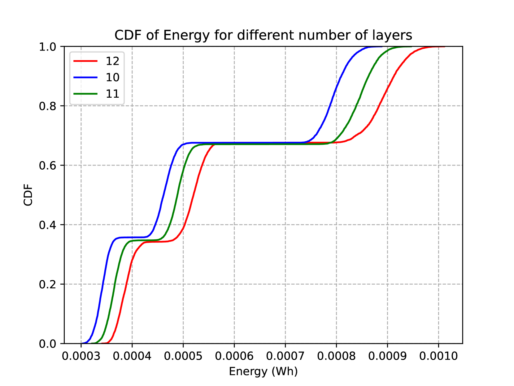
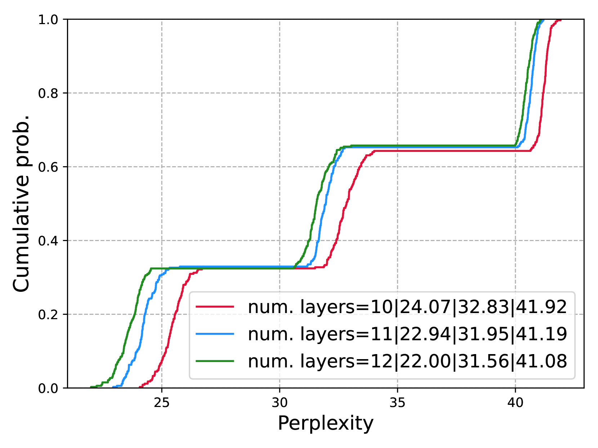
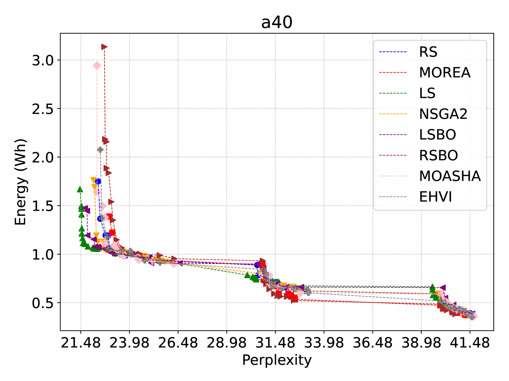
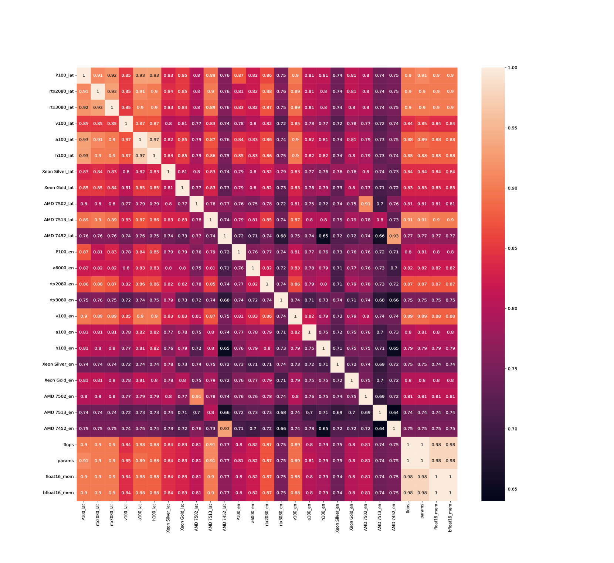
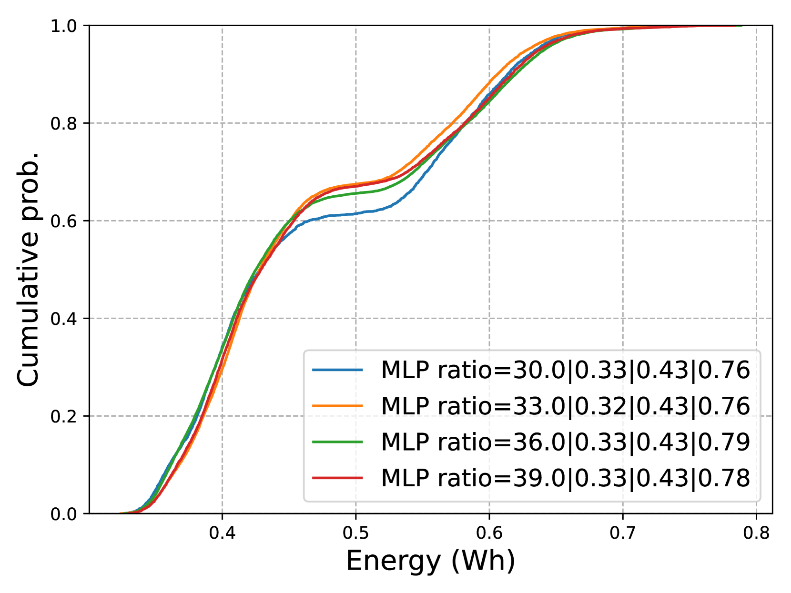
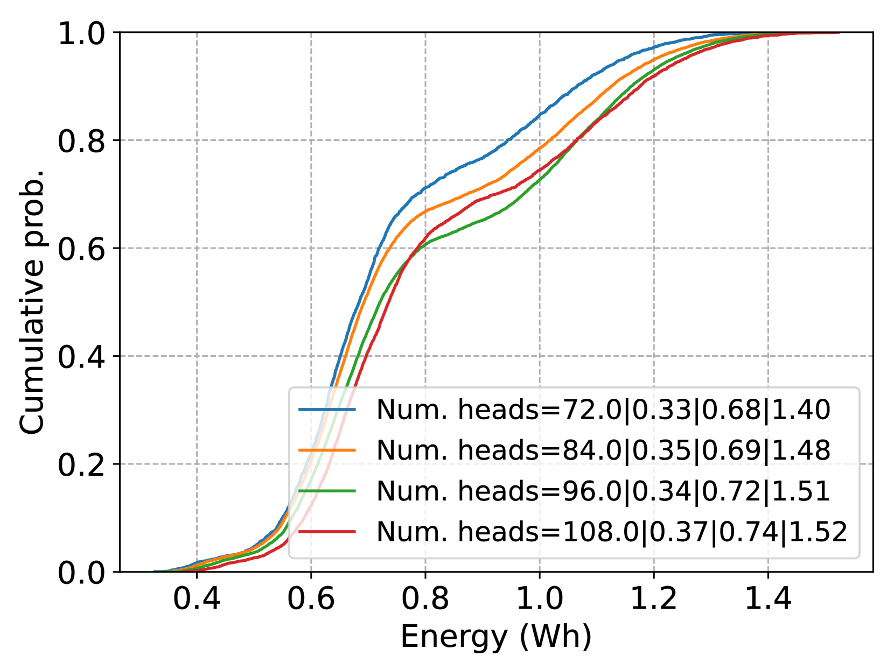
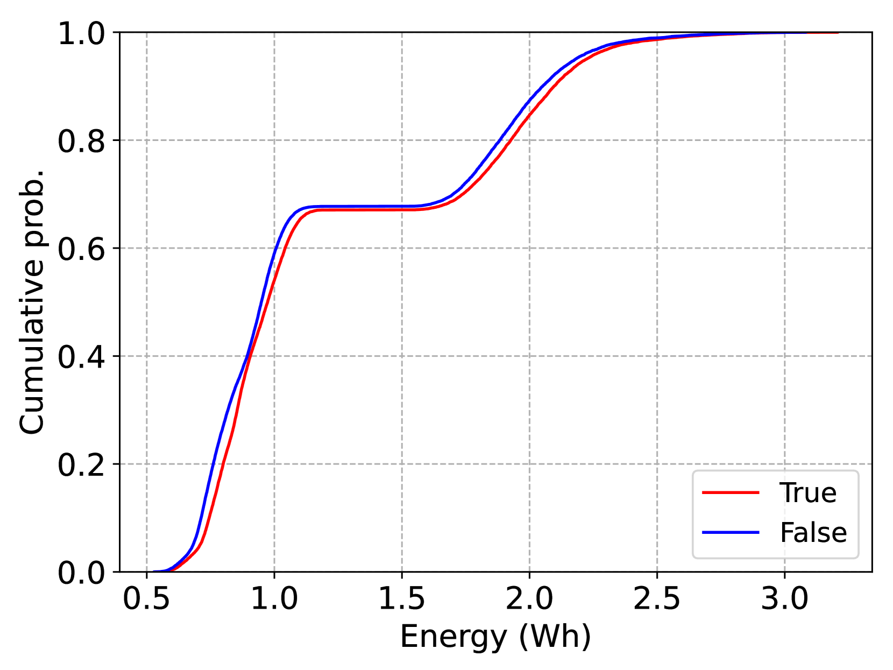
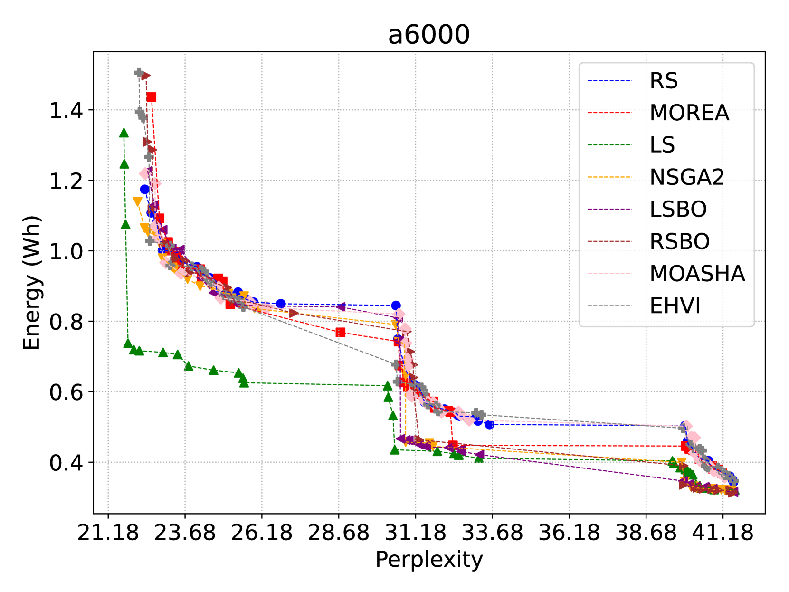

# HW-GPT-Bench：专为语言模型设计的硬件感知架构评测平台解释：在

发布时间：2024年05月16日

`LLM理论

这篇论文主要关注的是大型语言模型（LLM）在不同硬件上的性能优化问题，特别是通过硬件感知语言模型基准（HW-GPT-Bench）来探索模型规模、硬件指标和性能之间的权衡。它涉及了模型架构的优化，包括使用神经架构搜索（NAS）技术来找到在特定硬件限制下的最优模型配置。这属于LLM理论范畴，因为它探讨的是语言模型设计和优化的理论问题，而不是具体的应用场景或Agent的行为。同时，它也不直接涉及RAG（Retrieval-Augmented Generation）框架或Agent的设计与应用。` `硬件优化`

> HW-GPT-Bench: Hardware-Aware Architecture Benchmark for Language Models

# 摘要

> 随着语言模型规模的不断扩大，我们需要全面审视各种硬件指标间的权衡，如延迟、能耗、GPU内存使用和性能。为了在特定硬件限制下找到最优模型，人们正致力于为不同语言模型配置绘制Pareto前沿。然而，不同设备间的最优架构可能大相径庭，且全面评估众多架构在多样硬件上的表现计算成本高昂。为此，我们推出了HW-GPT-Bench，这是一个结合了NAS权重共享技术的硬件感知语言模型基准，它能在单一模型中高效训练包含不同规模语言模型的超网络。我们在13种设备上对模型进行了性能分析，涵盖5个硬件指标和3种模型规模。通过8种多目标NAS算法，我们展示了HW-GPT-Bench的实用性，并评估了其Pareto前沿的质量。我们的目标是借助这一基准，推动NAS多目标方法和大型语言模型结构剪枝的研究进程。

> The expanding size of language models has created the necessity for a comprehensive examination across various dimensions that reflect the desiderata with respect to the tradeoffs between various hardware metrics, such as latency, energy consumption, GPU memory usage, and performance. There is a growing interest in establishing Pareto frontiers for different language model configurations to identify optimal models with specified hardware constraints. Notably, architectures that excel in latency on one device may not perform optimally on another. However, exhaustive training and evaluation of numerous architectures across diverse hardware configurations is computationally prohibitive. To this end, we propose HW-GPT-Bench, a hardware-aware language model surrogate benchmark, where we leverage weight-sharing techniques from Neural Architecture Search (NAS) to efficiently train a supernet proxy, encompassing language models of varying scales in a single model. We conduct profiling of these models across 13 devices, considering 5 hardware metrics and 3 distinct model scales. Finally, we showcase the usability of HW-GPT-Bench using 8 different multi-objective NAS algorithms and evaluate the quality of the resultant Pareto fronts. Through this benchmark, our objective is to propel and expedite research in the advancement of multi-objective methods for NAS and structural pruning in large language models.

[Arxiv](https://arxiv.org/abs/2405.10299)