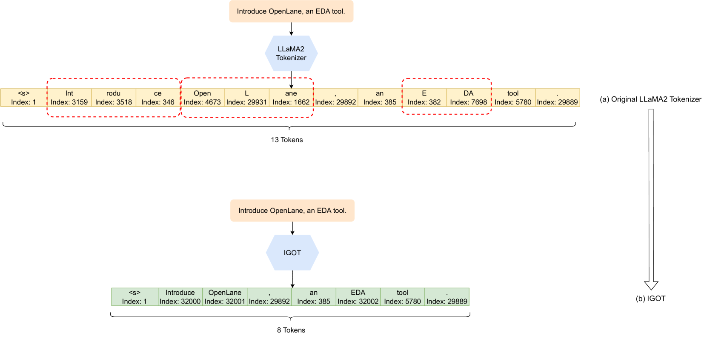
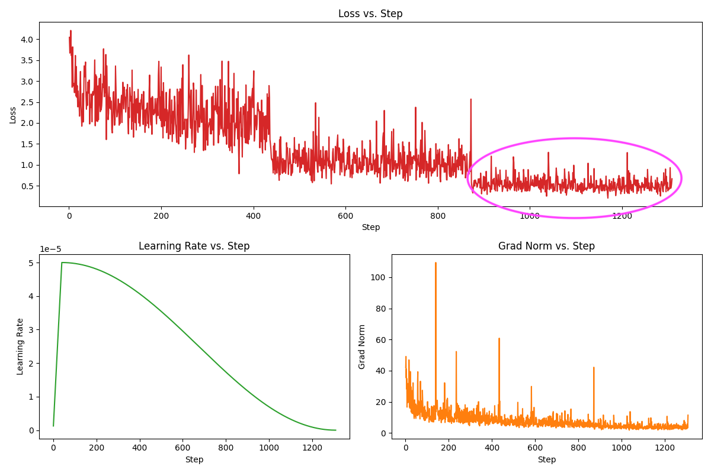
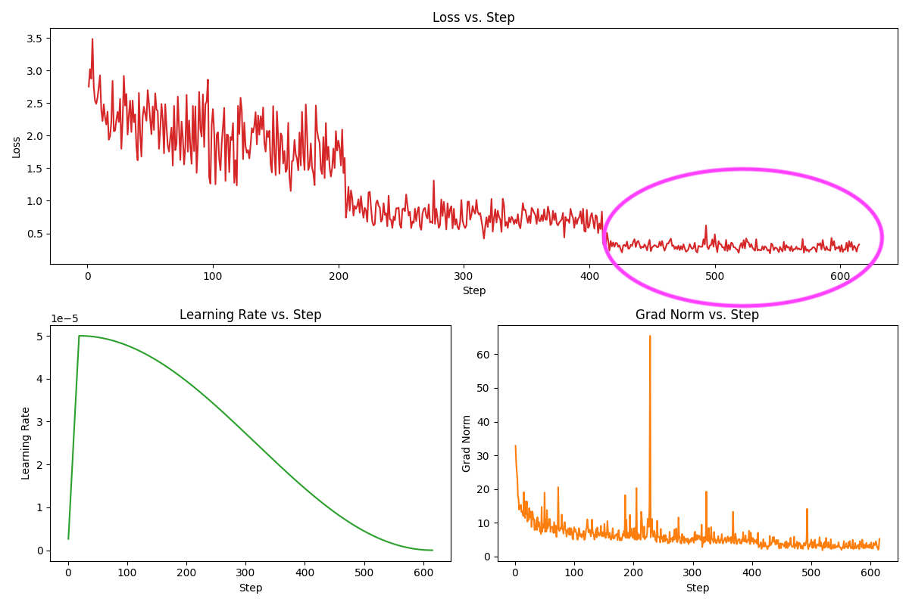
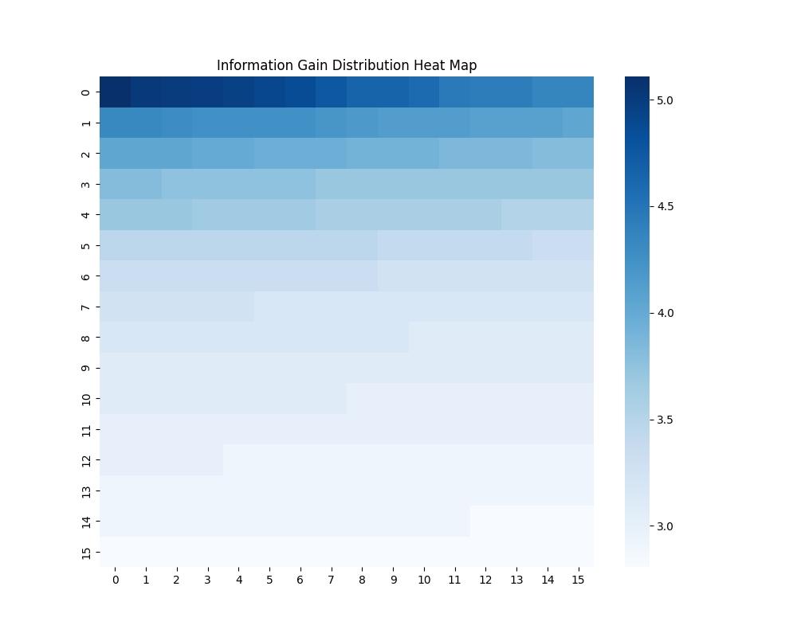
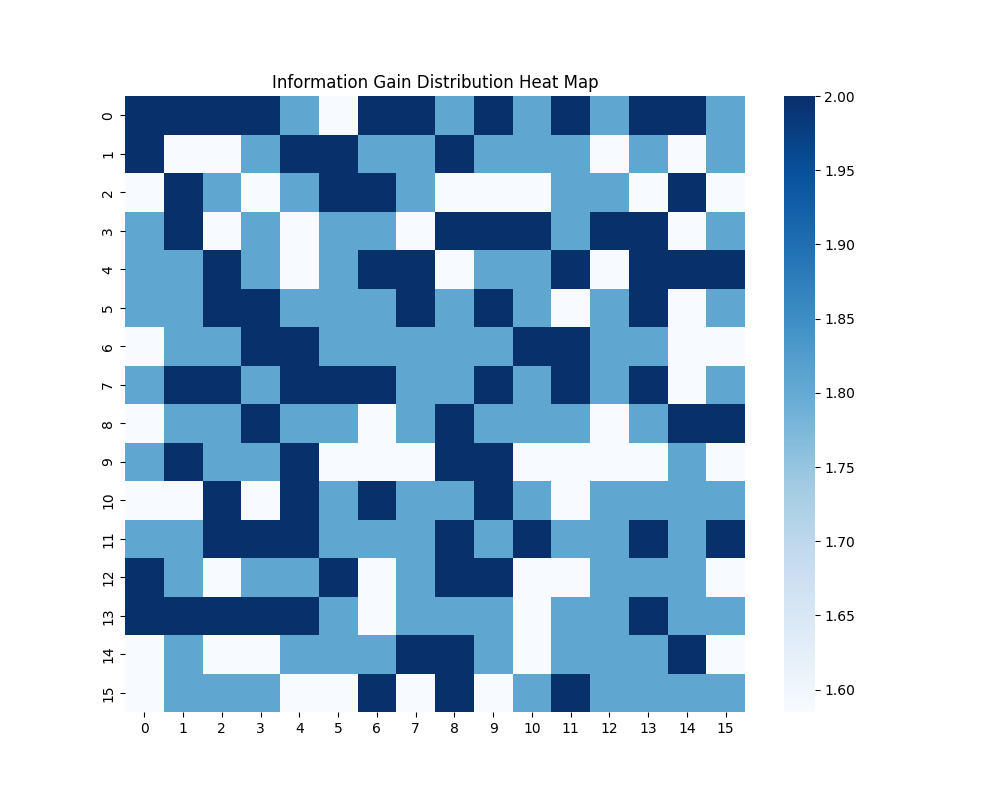

# IGOT：领域自适应预训练中的信息增益优化分词器在这项研究中，我们提出了IGOT，一种新颖的分词器，它通过最大化信息增益来优化领域自适应预训练过程。IGOT不仅提高了模型在特定领域任务上的性能，还增强了模型对领域内语言特性的捕捉能力。通过实验验证，IGOT在多个领域适应场景中均展现出了显著的性能提升。

发布时间：2024年05月16日

`LLM应用

这篇论文探讨了大型语言模型（LLM）在特定领域应用时的挑战，并提出了一种名为信息增益优化分词器（IGOT）的新方法，以提高领域适应预训练的效率。这种方法通过定制分词器来优化特定领域的预训练过程，从而在节省资源的同时提升性能。这与LLM的理论研究不同，因为它关注的是实际应用中的优化技术，而不是LLM的基础理论或模型本身。此外，它也不属于Agent或RAG分类，因为它不涉及代理系统的构建或检索增强生成（RAG）框架。因此，最合适的分类是LLM应用。` `人工智能`

> IGOT: Information Gain Optimized Tokenizer on Domain Adaptive Pretraining

# 摘要

> ChatGPT、Claude等预训练大型语言模型在自然语言生成领域展现了卓越能力，但在特定领域应用时仍面临挑战。通常，通过持续训练或微调向预训练模型注入新知识（如私有领域知识、最新信息）以处理下游任务。然而，领域适应训练是否存在通用模式尚无定论。本文提出信息增益优化分词器（IGOT），通过分析下游任务的特殊标记集，利用启发式函数$φ$构建包含特殊标记及其信息增益的新子集，进而打造领域特异性的分词器，并在下游数据上进行持续预训练。我们发现，IGOT定制的分词器在领域适应预训练中展现出显著优势，其效果超越了传统的数据收集和微调方法。实验表明，结合LLaMA-7B的IGOT在持续预训练中节省了11.9%的标记、12.2%的训练时间，以及5.8%的GPU内存使用，与T5模型结合时，训练时间节省高达31.5%，显著提升了将通用生成式AI应用于特定领域的效率。在特定领域任务中，监督下的$IGOT_τ$在持续预训练过程中有效缩小了收敛半径和收敛点，表现出色。

> Pretrained Large Language Models (LLM) such as ChatGPT, Claude, etc. have demonstrated strong capabilities in various fields of natural language generation. However, there are still many problems when using LLM in specialized domain-specific fields. When using generative AI to process downstream tasks, a common approach is to add new knowledge (e.g., private domain knowledge, cutting-edge information) to a pretrained model through continued training or fine-tuning. However, whether there is a universal paradigm for domain adaptation training is still an open question. In this article, we proposed Information Gain Optimized Tokenizer (IGOT), which analyzes the special token set of downstream tasks, constructs a new subset using heuristic function $φ$ with the special token and its information gain, to build new domain-specific tokenizer, and continues pretraining on the downstream task data. We explored the many positive effects of this method's customized tokenizer on domain-adaptive pretraining and verified this method can perform better than the ordinary method of just collecting data and fine-tuning. Based on our experiment, the continued pretraining process of IGOT with LLaMA-7B achieved 11.9\% token saving, 12.2\% training time saving, and 5.8\% maximum GPU VRAM usage saving, combined with the T5 model, we can even reach a 31.5\% of training time saving, making porting general generative AI to specific domains more effective than before. In domain-specific tasks, supervised $IGOT_τ$ shows great performance on reducing both the convergence radius and convergence point during keep pretraining.

[Arxiv](https://arxiv.org/abs/2405.09857)