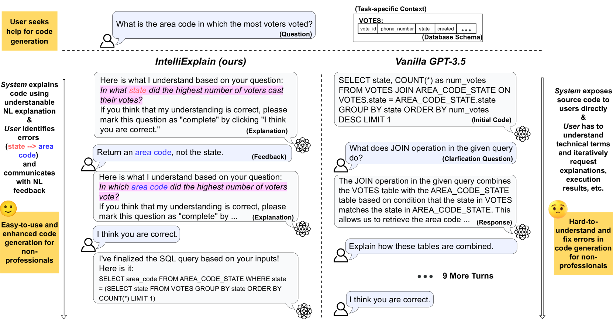
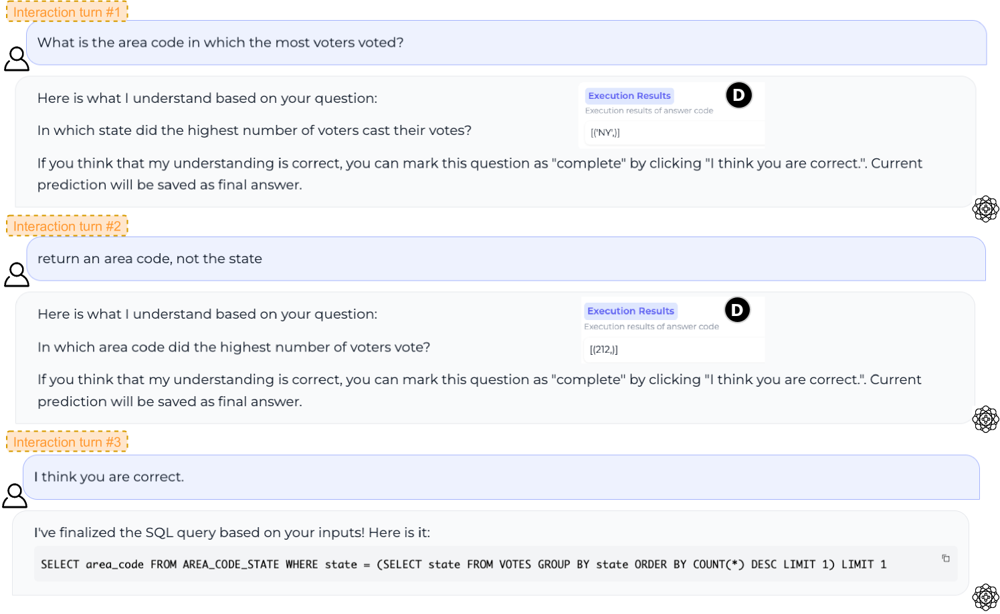
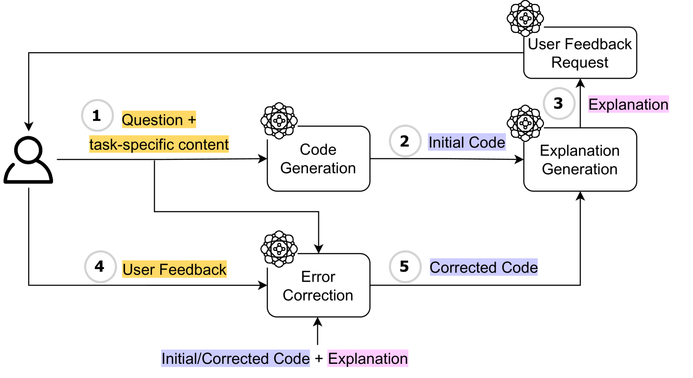
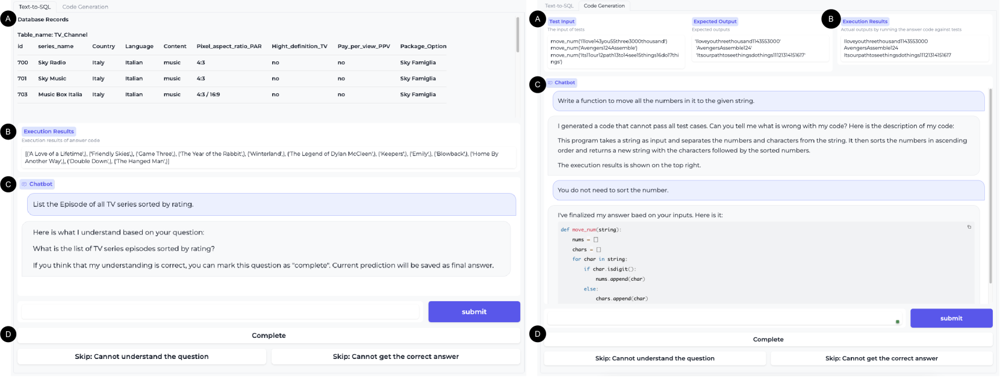
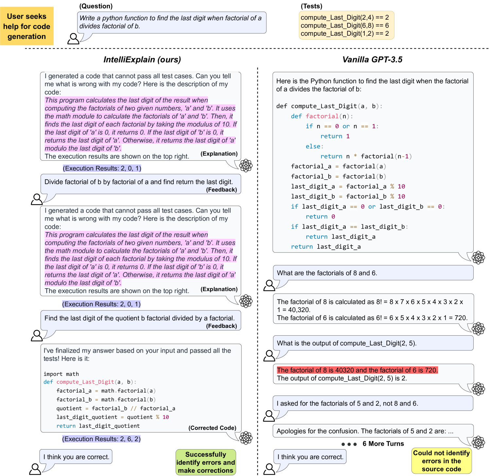

# IntelliExplain：为非专业程序员提供自然语言解释，以增强交互式代码生成的智能解释系统

发布时间：2024年05月16日

`Agent

这篇论文介绍了一种新型的人机交互系统IntelliExplain，它专注于通过自然语言解释帮助非专业程序员理解代码，并根据用户的自然语言反馈调整代码。这种系统可以被视为一个智能代理（Agent），因为它能够理解和响应用户的指令，并采取行动以满足用户的需求。因此，这篇论文属于Agent分类。` `软件开发` `教育技术`

> IntelliExplain: Enhancing Interactive Code Generation through Natural Language Explanations for Non-Professional Programmers

# 摘要

> 大型语言模型（LLMs）在自动生成代码方面表现出色，但现有交互模式往往要求用户具备专业调试知识，未充分考虑非专业程序员的需求。为此，我们推出了IntelliExplain，一种新型人机交互系统，它通过自然语言解释让非专业程序员更易理解代码。用户通过自然语言反馈纠正错误，系统据此调整代码，直至用户满意。实验表明，IntelliExplain在Text-to-SQL和Python任务中分别提高了11.6%和25.3%的成功率，同时节省了39.0%和15.6%的时间，显著优于GPT-3.5。

> Large language models (LLMs) have exhibited a strong promise in automatically generating executable code from natural language descriptions, particularly with interactive features that allow users to engage in the code-generation process by instructing the LLM with iterative feedback. However, existing interaction paradigms often assume that users have expert knowledge to debug source code and are not optimized for non-professional programmers' use. This raises challenges in making interactive code generation more accessible for individuals with varying levels of programming expertise. To tackle these challenges, we present IntelliExplain, which offers a novel human-LLM interaction paradigm to enhance non-professional programmers' experience by enabling them to interact with source code via natural language explanations. Users interact with IntelliExplain by providing natural language corrective feedback on errors they identify from the explanations. Feedback is used by the system to revise the code, until the user is satisfied with explanations by the system of the code. Our user study demonstrates that users with IntelliExplain achieve a significantly higher success rate 11.6% and 25.3% better than with vanilla GPT-3.5, while also requiring 39.0% and 15.6% less time in Text-to-SQL and Python code generation tasks, respectively.

[Arxiv](https://arxiv.org/abs/2405.10250)