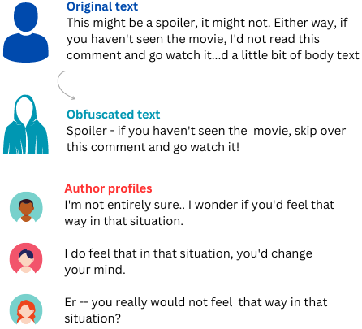
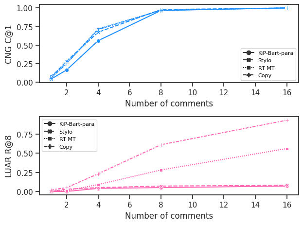
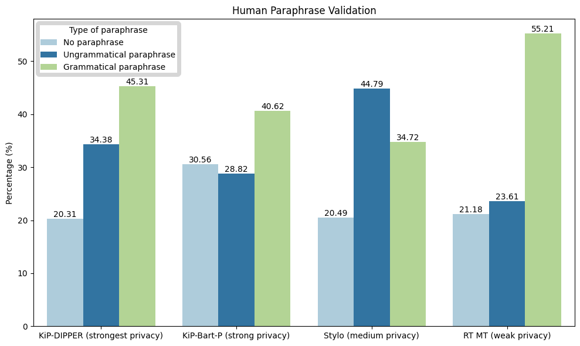
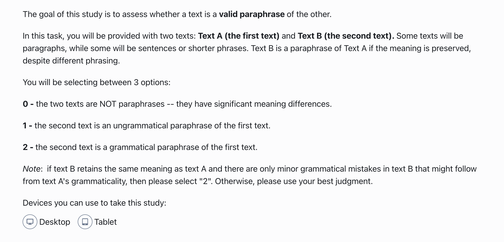
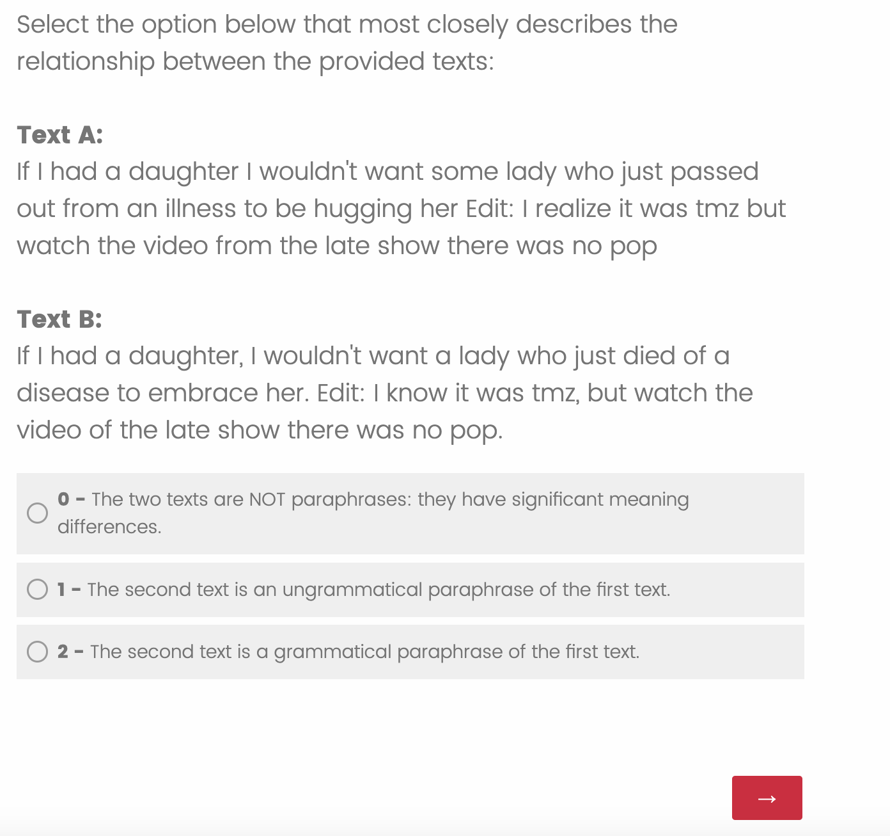
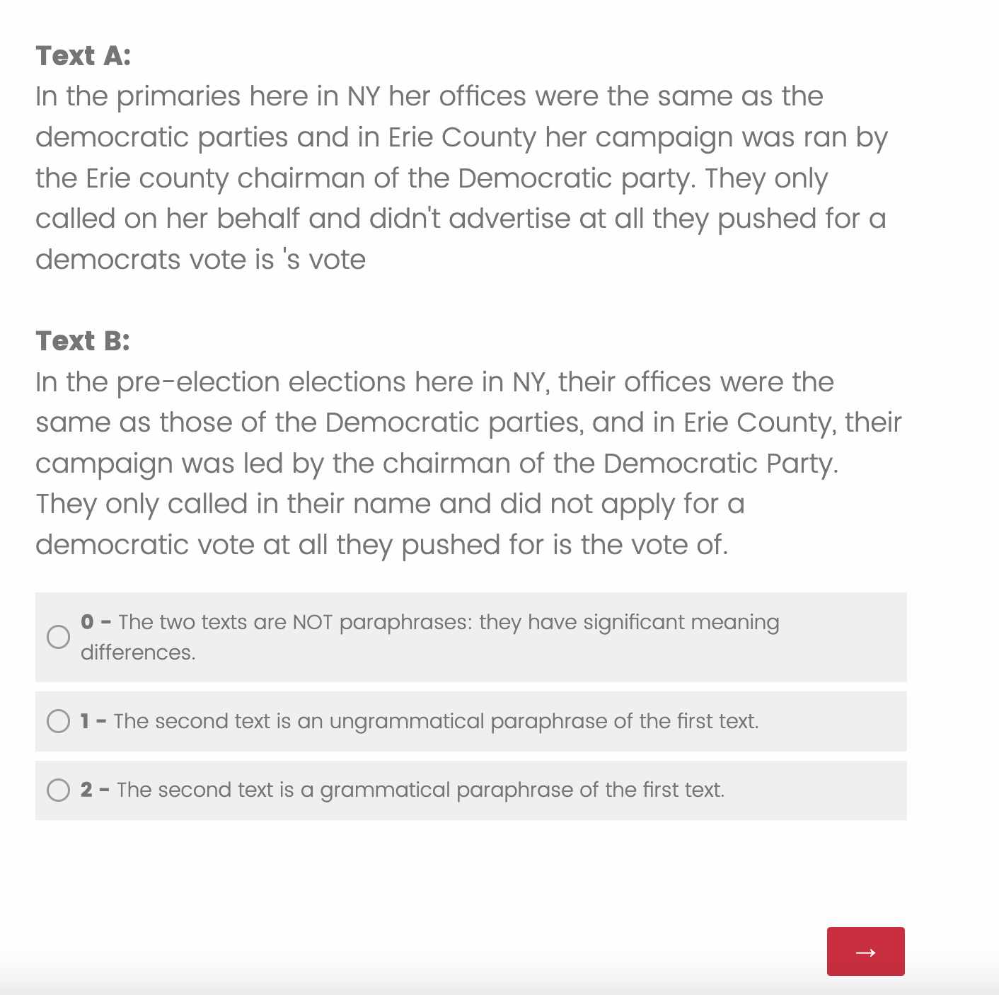

# 守护隐私：在线文本的无监督保密处理

发布时间：2024年05月16日

`Agent

这篇论文探讨了通过强化学习微调大型语言模型（LLM）来实现自动文本隐私化的框架，旨在生成既合理又保护隐私的重写文本。这种方法可以被视为一个智能代理（Agent），因为它能够自主地处理任务（文本重写以保护隐私），并且在这个过程中使用了强化学习这一人工智能技术。因此，这篇论文更符合Agent分类，而不是RAG（检索增强生成）、LLM应用或LLM理论，因为它主要关注的是应用LLM来解决实际问题，而不是LLM的理论研究或特定的应用场景。` `隐私保护` `在线通信`

> Keep It Private: Unsupervised Privatization of Online Text

# 摘要

> 作者身份混淆技术为在线通信中的隐私保护提供了新途径，通过自动重写文本以隐藏作者身份。然而，现有的混淆方法往往导致文本不自然。本研究提出了一种自动文本隐私化框架，通过强化学习微调大型语言模型，以生成既合理又保护隐私的重写文本。我们在包含68,000名作者的Reddit帖子测试集上进行了广泛评估，并探讨了不同评估条件下的性能变化。结果显示，我们的方法在保持文本质量的同时，成功抵御了多种自动作者身份识别攻击。

> Authorship obfuscation techniques hold the promise of helping people protect their privacy in online communications by automatically rewriting text to hide the identity of the original author. However, obfuscation has been evaluated in narrow settings in the NLP literature and has primarily been addressed with superficial edit operations that can lead to unnatural outputs. In this work, we introduce an automatic text privatization framework that fine-tunes a large language model via reinforcement learning to produce rewrites that balance soundness, sense, and privacy. We evaluate it extensively on a large-scale test set of English Reddit posts by 68k authors composed of short-medium length texts. We study how the performance changes among evaluative conditions including authorial profile length and authorship detection strategy. Our method maintains high text quality according to both automated metrics and human evaluation, and successfully evades several automated authorship attacks.

[Arxiv](https://arxiv.org/abs/2405.10260)