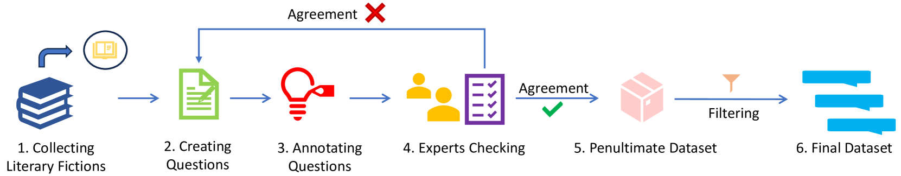
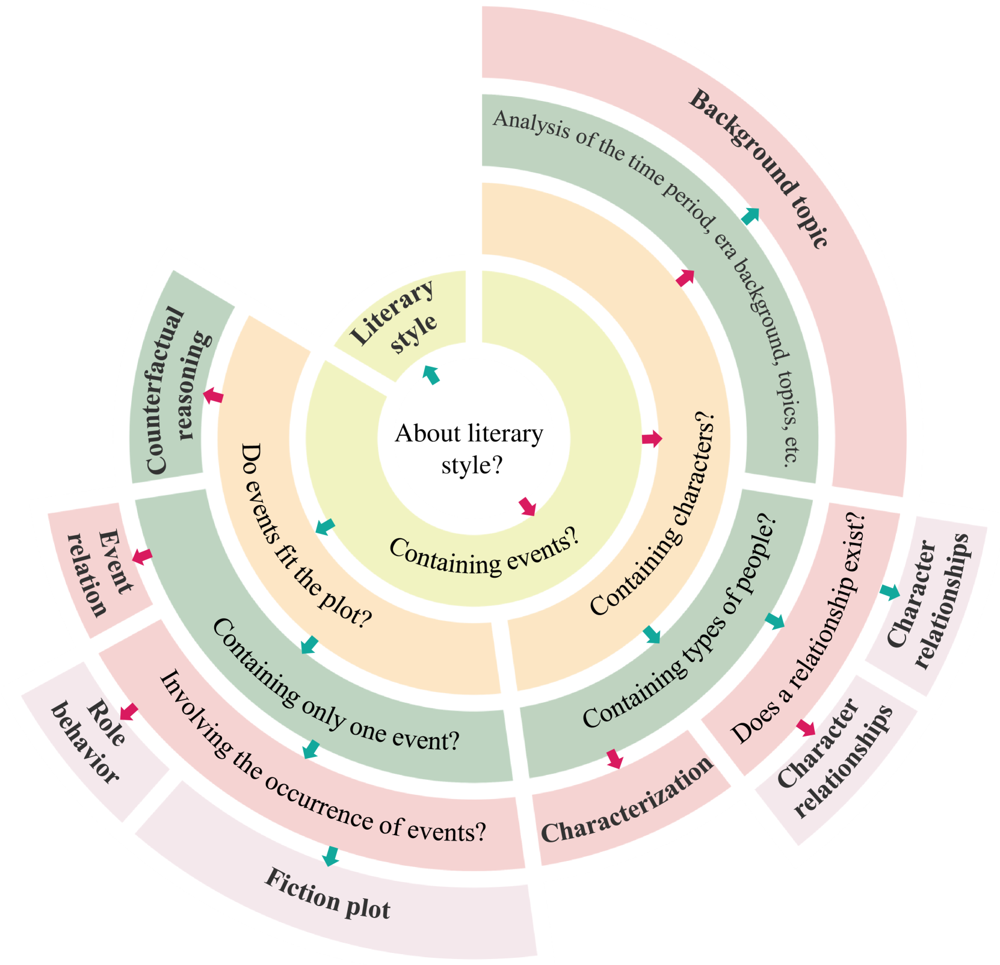
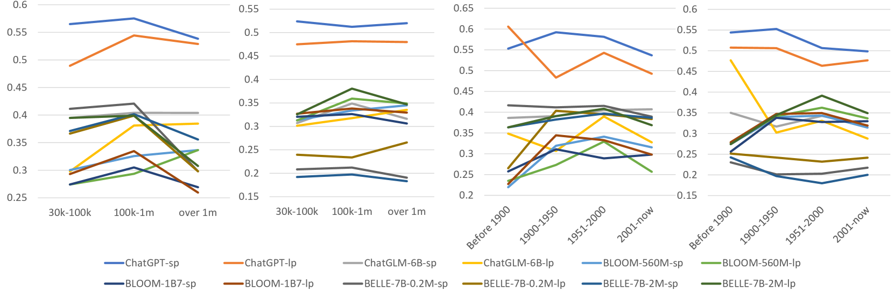
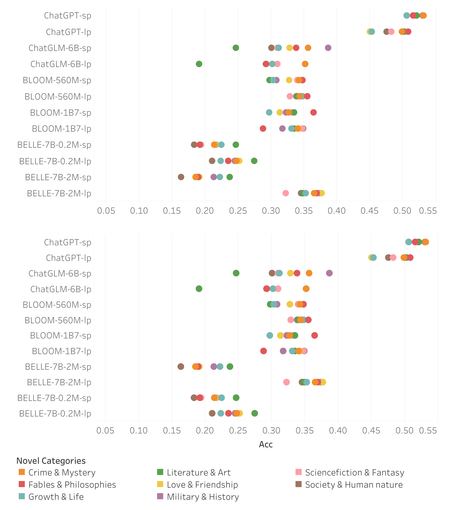

# LFED：大型语言模型的文学小说评鉴数据集

发布时间：2024年05月16日

`LLM应用

这篇论文介绍了LFED数据集，这是一个专门用于评估大型语言模型（LLMs）在长篇小说理解和推理能力方面的数据集。它通过构建一个包含8类问题的问答体系来评估LLMs的性能，并分析了文学小说的特定属性如何影响模型的表现。这表明该论文关注的是LLMs在特定应用场景（即文学小说理解）的性能评估，因此属于LLM应用类别。` `文学评估`

> LFED: A Literary Fiction Evaluation Dataset for Large Language Models

# 摘要

> 随着大型语言模型（LLMs）的迅猛发展，对其在多维度上的性能进行全面评估变得至关重要。本文介绍了LFED，一个专为评估LLMs在长篇小说理解和推理能力上的文学小说评估数据集。我们精选了95部中文原创或翻译的文学小说，跨越多个世纪，涵盖广泛主题。我们设计了一个包含8类问题的问答体系，用以构建1,304个问题。通过深入分析，我们探究了文学小说的特定属性（如类型、角色数量、出版年份）如何影响LLMs的评估表现。实验结果显示，即使是顶尖的LLMs，在处理文学小说相关问题时也面临挑战，ChatGPT在零-shot条件下仅达到57.08%的准确率。LFED数据集将在https://github.com/tjunlp-lab/LFED.git上公开发布，供研究者使用。

> The rapid evolution of large language models (LLMs) has ushered in the need for comprehensive assessments of their performance across various dimensions. In this paper, we propose LFED, a Literary Fiction Evaluation Dataset, which aims to evaluate the capability of LLMs on the long fiction comprehension and reasoning. We collect 95 literary fictions that are either originally written in Chinese or translated into Chinese, covering a wide range of topics across several centuries. We define a question taxonomy with 8 question categories to guide the creation of 1,304 questions. Additionally, we conduct an in-depth analysis to ascertain how specific attributes of literary fictions (e.g., novel types, character numbers, the year of publication) impact LLM performance in evaluations. Through a series of experiments with various state-of-the-art LLMs, we demonstrate that these models face considerable challenges in effectively addressing questions related to literary fictions, with ChatGPT reaching only 57.08% under the zero-shot setting. The dataset will be publicly available at https://github.com/tjunlp-lab/LFED.git

[Arxiv](https://arxiv.org/abs/2405.10166)