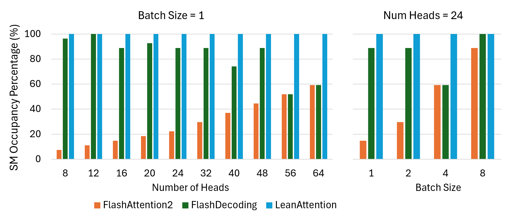

# 精益注意力：Transformer解码阶段中，一种兼顾硬件性能的可扩展注意力机制

发布时间：2024年05月16日

`LLM理论

理由：这篇论文主要关注的是大型语言模型（LLM）中的一个具体技术问题，即基于Transformer模型的自注意力机制在处理长上下文长度时的效率问题。论文提出了一种名为LeanAttention的新技术，专门针对解码器仅Transformer模型中令牌生成阶段的自注意力计算进行优化。这种技术通过重新设计计算流程和利用在线softmax的结合性质，实现了对长上下文长度注意力计算的并行化，从而提高了计算效率。这一研究是对LLM内部机制的深入探讨和优化，属于理论层面的研究，因此应归类为LLM理论。` `图像生成`

> Lean Attention: Hardware-Aware Scalable Attention Mechanism for the Decode-Phase of Transformers

# 摘要

> 基于Transformer的模型在自然语言处理、生成和图像生成领域广受欢迎，其规模已扩展至数十亿参数。这些巨型模型对内存需求极高，即便在先进的AI加速器如GPU上，推理延迟也相当显著。特别是，注意力操作的时间和内存复杂度与上下文长度（包括提示和输出令牌）成二次方关系。为此，研究者提出了键值张量缓存和FlashAttention等优化技术，以满足大型模型应用对低延迟的需求。然而，这些优化并未针对推理过程中不同阶段的计算特性进行定制。针对这一问题，我们开发了LeanAttention技术，专门用于解码器仅Transformer模型中令牌生成阶段的自注意力计算。通过重新设计解码阶段的执行流程，LeanAttention能够有效扩展注意力机制以应对长上下文长度的挑战。我们利用在线softmax的结合性质，将其视为一种归约操作，从而在这些大的上下文长度上实现注意力计算的并行化。通过将“流-K”风格的平铺计算归约应用于自注意力，我们实现了并行计算，平均比FlashAttention-2快2.6倍，对于512k的上下文长度，最高可达8.33倍加速。

> Transformer-based models have emerged as one of the most widely used architectures for natural language processing, natural language generation, and image generation. The size of the state-of-the-art models has increased steadily reaching billions of parameters. These huge models are memory hungry and incur significant inference latency even on cutting edge AI-accelerators, such as GPUs. Specifically, the time and memory complexity of the attention operation is quadratic in terms of the total context length, i.e., prompt and output tokens. Thus, several optimizations such as key-value tensor caching and FlashAttention computation have been proposed to deliver the low latency demands of applications relying on such large models. However, these techniques do not cater to the computationally distinct nature of different phases during inference.
  To that end, we propose LeanAttention, a scalable technique of computing self-attention for the token-generation phase (decode-phase) of decoder-only transformer models. LeanAttention enables scaling the attention mechanism implementation for the challenging case of long context lengths by re-designing the execution flow for the decode-phase. We identify that the associative property of online softmax can be treated as a reduction operation thus allowing us to parallelize the attention computation over these large context lengths. We extend the "stream-K" style reduction of tiled calculation to self-attention to enable parallel computation resulting in an average of 2.6x attention execution speedup over FlashAttention-2 and up to 8.33x speedup for 512k context lengths.

[Arxiv](https://arxiv.org/abs/2405.10480)