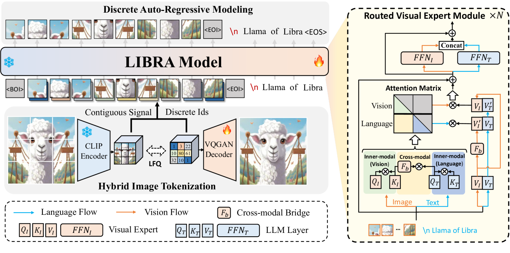
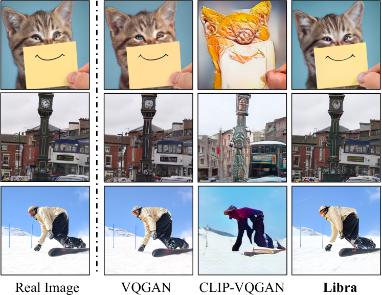
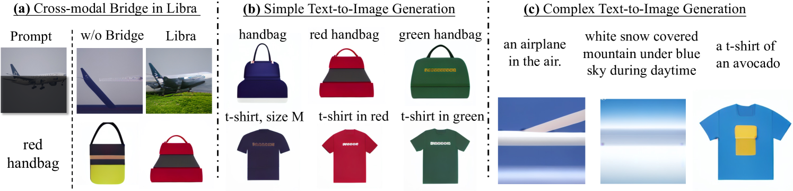
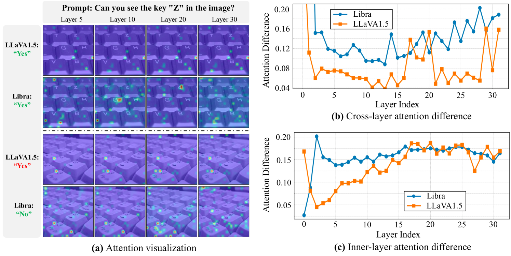
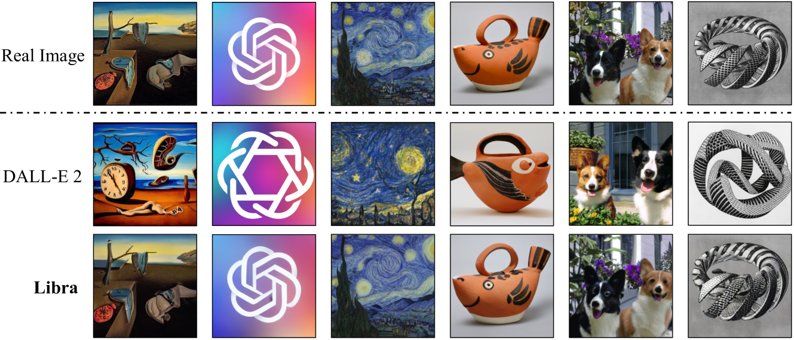
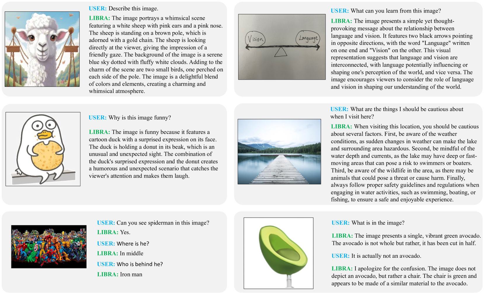
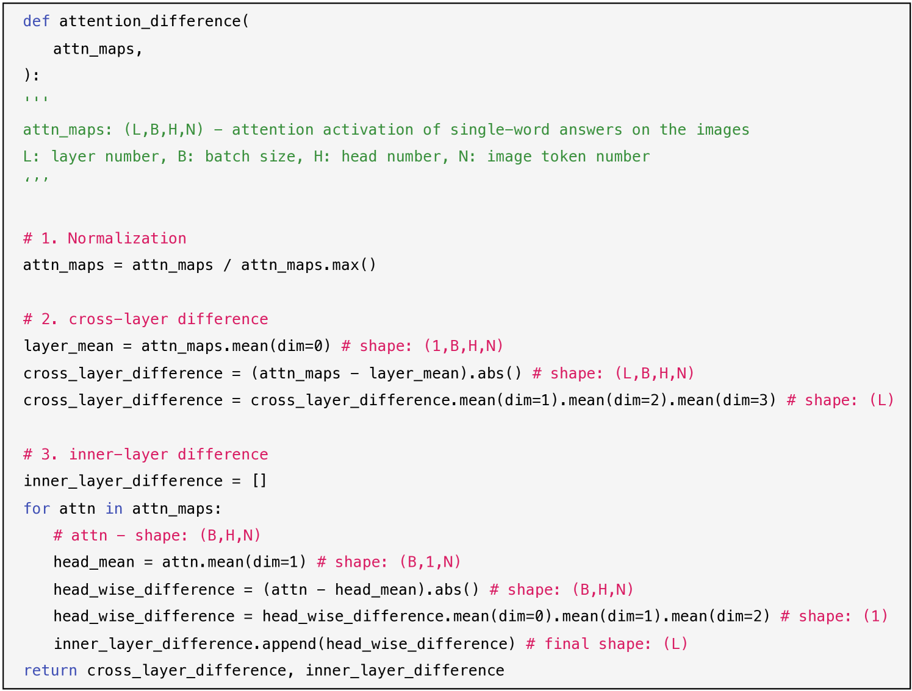

# 天秤座：打造大型语言模型上的视觉系统解耦架构

发布时间：2024年05月16日

`LLM应用

这篇论文介绍了一个名为Libra的新模型，它是一个多模态语言模型，集成了分离式视觉系统，并专注于优化视觉信息的处理和跨模态理解。它通过特定的模块设计，如路由视觉专家和跨模态桥梁模块，与预训练的大型语言模型（LLM）协同工作，以处理模态内和跨模态的交互。这种设计使得Libra模型在图像到文本的任务上表现出色，并且仅用有限的训练数据就能达到与现有技术相媲美的性能。因此，这篇论文属于LLM应用类别，因为它展示了如何将LLM应用于多模态任务，并提出了一个具体的模型来解决这些问题。` `多模态学习` `人工智能`

> Libra: Building Decoupled Vision System on Large Language Models

# 摘要

> 本研究推出了Libra模型，它在大语言模型上集成了一个分离式视觉系统，该系统巧妙地将模态内建模与跨模态交互分离，从而优化了视觉信息的处理和跨模态理解。通过离散自回归建模，Libra在视觉与语言的双重输入上进行训练。我们特别引入了路由视觉专家和跨模态桥梁模块，它们与预训练的LLM协同工作，确保在注意力计算过程中视觉与语言流的路由，以适应模态内与跨模态交互的不同注意力模式。实验证明，Libra的精妙设计使其成为了一个强大的多模态语言模型基准，仅用5000万训练数据就在图像到文本任务上与现有技术相抗衡，为多模态基础模型的未来发展开辟了新视野。相关代码已公开于https://github.com/YifanXu74/Libra。

> In this work, we introduce Libra, a prototype model with a decoupled vision system on a large language model (LLM). The decoupled vision system decouples inner-modal modeling and cross-modal interaction, yielding unique visual information modeling and effective cross-modal comprehension. Libra is trained through discrete auto-regressive modeling on both vision and language inputs. Specifically, we incorporate a routed visual expert with a cross-modal bridge module into a pretrained LLM to route the vision and language flows during attention computing to enable different attention patterns in inner-modal modeling and cross-modal interaction scenarios. Experimental results demonstrate that the dedicated design of Libra achieves a strong MLLM baseline that rivals existing works in the image-to-text scenario with merely 50 million training data, providing a new perspective for future multimodal foundation models. Code is available at https://github.com/YifanXu74/Libra.

[Arxiv](https://arxiv.org/abs/2405.10140)