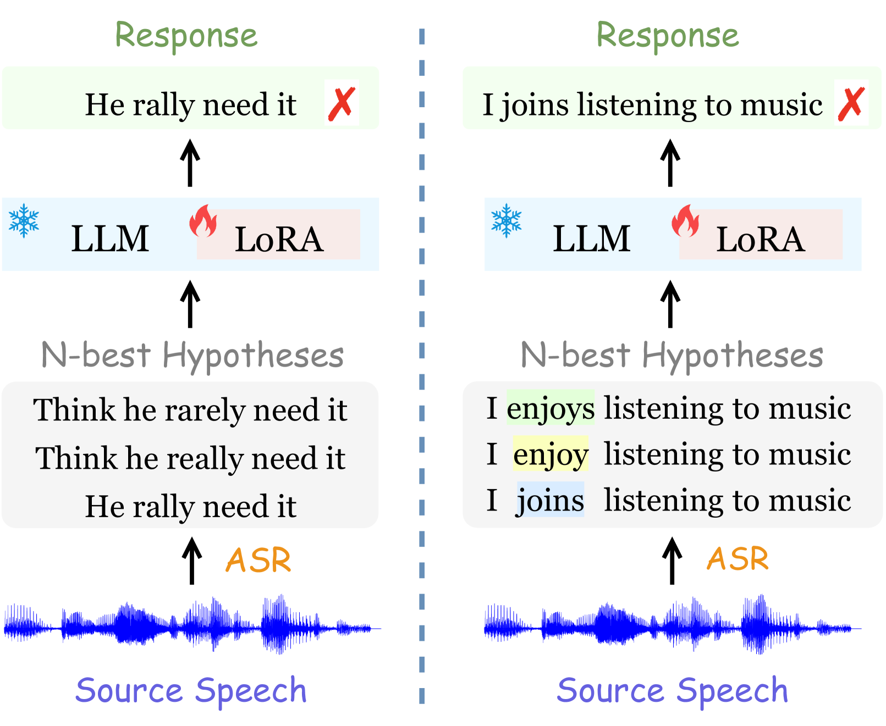
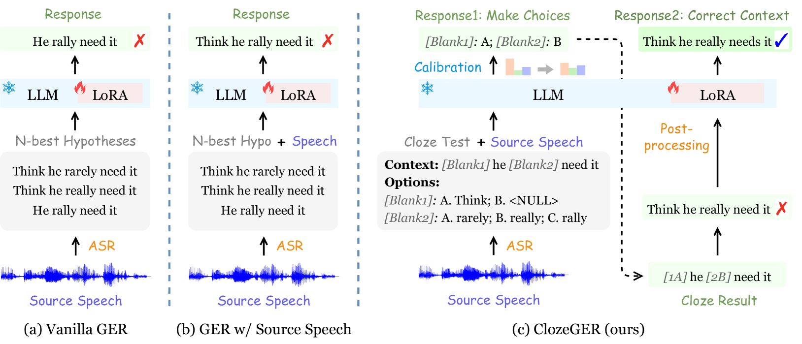
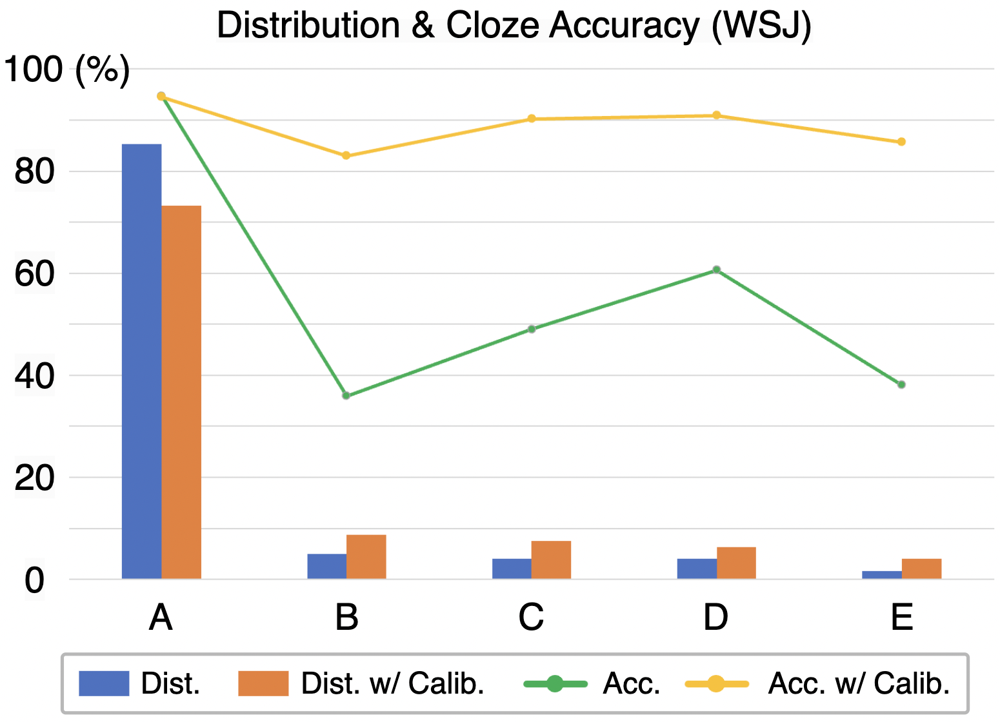
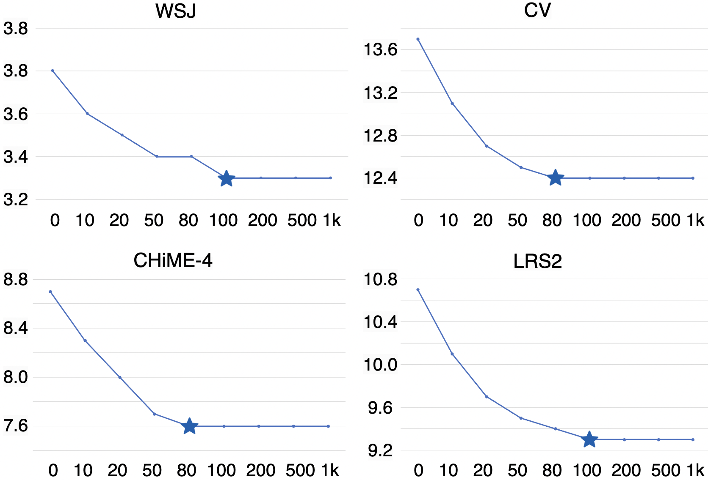
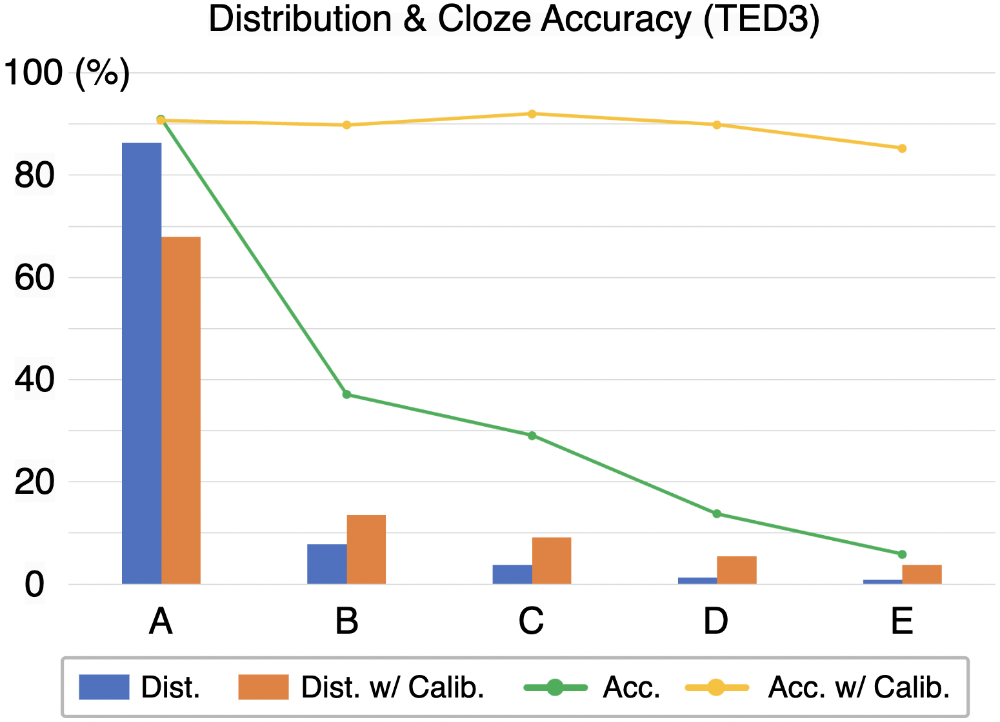

# 重听选答：大型语言模型驱动的新一代自动语音识别技术在这个新范式中，我们提出了一种基于大型语言模型的自动语音识别方法，该方法通过让模型“再次聆听”并自主选择最合适的转录答案，显著提高了识别的准确性和鲁棒性。这种方法不仅充分利用了大型语言模型的强大语义理解能力，还通过引入选择机制，使得模型能够更好地适应复杂的语音环境和多样化的说话风格。

发布时间：2024年05月16日

`LLM应用

这篇论文主要讨论了大型语言模型（LLM）在自动语音识别（ASR）中的应用，特别是在生成式错误校正（GER）方面的创新方法。论文提出了ClozeGER方法，通过引入多模态LLM（SpeechGPT）和将GER转化为完形填空形式来提高ASR的准确性。这与LLM的理论研究不同，因为它关注的是LLM在实际应用中的改进和优化，而不是LLM本身的理论基础。同时，它也不属于Agent或RAG的范畴，因为Agent通常指的是能够自主执行任务的智能实体，而RAG（Retrieval-Augmented Generation）通常指的是一种结合了检索和生成的模型架构，这篇论文并没有明确提及这些概念。因此，最合适的分类是LLM应用。` `自动语音识别` `语言模型校正`

> Listen Again and Choose the Right Answer: A New Paradigm for Automatic Speech Recognition with Large Language Models

# 摘要

> 大型语言模型的进步，推动了自动语音识别中生成式错误校正的发展，旨在从多个候选转录中精准预测正确文本。尽管LLMs的语言生成能力和N-最佳列表的信息丰富性使得GER在提升ASR质量上表现出色，但仍存在两个挑战：一是LLMs在修正过程中缺乏对原始语音的理解，可能导致语法正确但内容不符的错误；二是N-最佳假设的微小差异使得全部发送给GER显得冗余，可能导致LLMs在修正时产生混淆。为此，我们提出了ClozeGER，一种创新的ASR错误校正方法。首先，我们开发了SpeechGPT，一种能接收语音输入的多模态LLM，以增强校正的准确性。接着，我们将GER转化为完形填空形式，并通过对数校准简化流程，明确指导LLMs的关注点。实验结果显示，ClozeGER在9个主流ASR数据集上取得了显著的性能提升，超越了传统方法。

> Recent advances in large language models (LLMs) have promoted generative error correction (GER) for automatic speech recognition (ASR), which aims to predict the ground-truth transcription from the decoded N-best hypotheses. Thanks to the strong language generation ability of LLMs and rich information in the N-best list, GER shows great effectiveness in enhancing ASR results. However, it still suffers from two limitations: 1) LLMs are unaware of the source speech during GER, which may lead to results that are grammatically correct but violate the source speech content, 2) N-best hypotheses usually only vary in a few tokens, making it redundant to send all of them for GER, which could confuse LLM about which tokens to focus on and thus lead to increased miscorrection. In this paper, we propose ClozeGER, a new paradigm for ASR generative error correction. First, we introduce a multimodal LLM (i.e., SpeechGPT) to receive source speech as extra input to improve the fidelity of correction output. Then, we reformat GER as a cloze test with logits calibration to remove the input information redundancy and simplify GER with clear instructions. Experiments show that ClozeGER achieves a new breakthrough over vanilla GER on 9 popular ASR datasets.

[Arxiv](https://arxiv.org/abs/2405.10025)