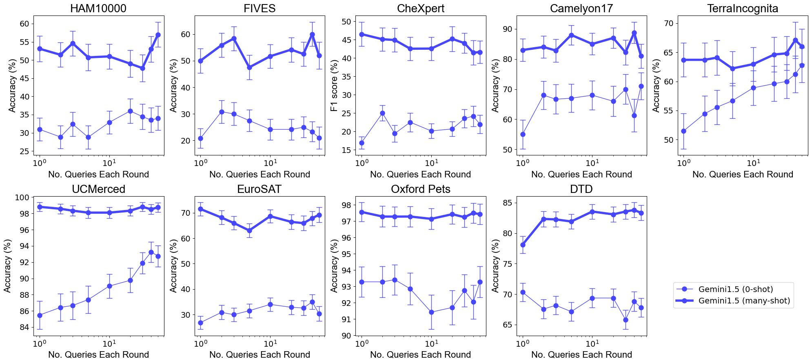

# 多模态基础模型中的多重上下文学习探索

发布时间：2024年05月16日

`LLM应用

这篇论文探讨了大型语言模型（LLM）在多模态基础模型中的应用，特别是在少样本到多样本上下文学习方面的性能评估。它通过在多个数据集上测试GPT-4o和Gemini 1.5 Pro的性能，展示了多样本上下文学习相对于少样本学习的优势，并研究了批量处理查询对性能和成本的影响。此外，论文还分析了模型的学习效率，并提出了多样本上下文学习作为将多模态基础模型应用于新领域的一种有效方式。这些内容与LLM的实际应用紧密相关，因此归类为LLM应用。` `机器学习` `多模态学习`

> Many-Shot In-Context Learning in Multimodal Foundation Models

# 摘要

> 大型语言模型在少样本上下文学习方面表现卓越。随着多模态基础模型的进步，我们有机会探索它们在更多示例下执行上下文学习的能力。本研究评估了多模态基础模型从少样本到多样本上下文学习的性能，并在多个领域和任务的10个数据集上对GPT-4o和Gemini 1.5 Pro进行了测试。结果显示，包含近2000个示例的多样本上下文学习在所有数据集上均优于少样本学习。Gemini 1.5 Pro的性能在多个数据集上持续提升。考虑到多样本学习的高成本，我们还研究了批量处理查询的影响，发现这能提高性能并降低成本。我们还测量了模型的学习效率，发现Gemini 1.5 Pro在大多数数据集上比GPT-4o更高效。这表明多样本上下文学习可能是将多模态基础模型应用于新领域的有效方式。我们的研究代码已公开。

> Large language models are well-known to be effective at few-shot in-context learning (ICL). Recent advancements in multimodal foundation models have enabled unprecedentedly long context windows, presenting an opportunity to explore their capability to perform ICL with many more demonstrating examples. In this work, we evaluate the performance of multimodal foundation models scaling from few-shot to many-shot ICL. We benchmark GPT-4o and Gemini 1.5 Pro across 10 datasets spanning multiple domains (natural imagery, medical imagery, remote sensing, and molecular imagery) and tasks (multi-class, multi-label, and fine-grained classification). We observe that many-shot ICL, including up to almost 2,000 multimodal demonstrating examples, leads to substantial improvements compared to few-shot (<100 examples) ICL across all of the datasets. Further, Gemini 1.5 Pro performance continues to improve log-linearly up to the maximum number of tested examples on many datasets. Given the high inference costs associated with the long prompts required for many-shot ICL, we also explore the impact of batching multiple queries in a single API call. We show that batching up to 50 queries can lead to performance improvements under zero-shot and many-shot ICL, with substantial gains in the zero-shot setting on multiple datasets, while drastically reducing per-query cost and latency. Finally, we measure ICL data efficiency of the models, or the rate at which the models learn from more demonstrating examples. We find that while GPT-4o and Gemini 1.5 Pro achieve similar zero-shot performance across the datasets, Gemini 1.5 Pro exhibits higher ICL data efficiency than GPT-4o on most datasets. Our results suggest that many-shot ICL could enable users to efficiently adapt multimodal foundation models to new applications and domains. Our codebase is publicly available at https://github.com/stanfordmlgroup/ManyICL .

[Arxiv](https://arxiv.org/abs/2405.09798)