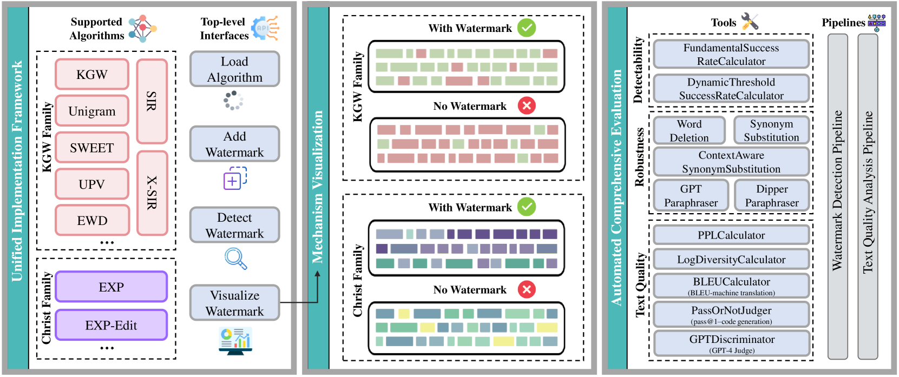
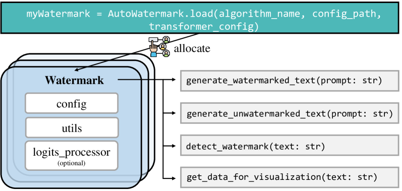
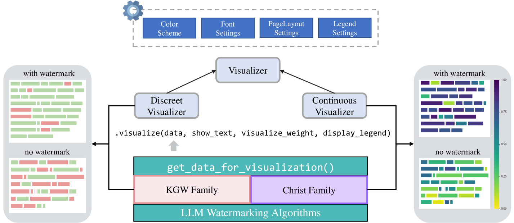
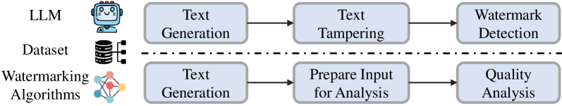
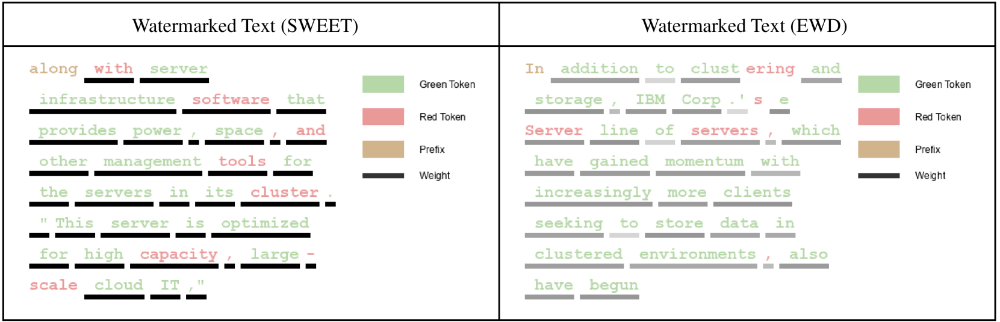

# MarkLLM：大型语言模型水印的开源利器在人工智能的浪潮中，大型语言模型（LLM）如璀璨星辰，引领着智能对话的潮流。然而，星辰虽美，却需标记以辨真伪。MarkLLM，这一开源工具包，便是为LLM添上独特水印的巧匠，确保每一段智能对话的纯净与真实。它不仅是一套工具，更是一把钥匙，解锁了LLM安全与信任的新篇章。

发布时间：2024年05月16日

`LLM理论

这篇论文介绍了一个名为MarkLLM的开源工具包，专注于LLM水印技术的应用和评估。水印技术是LLM理论研究中的一个重要分支，旨在通过在模型输出中嵌入特定信号来防止模型的滥用。MarkLLM工具包的设计和实现，以及它提供的统一框架和用户友好的界面，都是为了促进LLM水印技术的研究和应用。因此，这篇论文更符合LLM理论的分类，因为它涉及的是LLM技术的基础研究和工具开发，而不是具体的Agent行为、RAG（检索增强生成）技术或LLM的实际应用案例。` `人工智能安全` `版权保护`

> MarkLLM: An Open-Source Toolkit for LLM Watermarking

# 摘要

> LLM水印技术，通过在模型输出中嵌入难以察觉但算法上可检测的信号来识别LLM生成的文本，已成为防止大型语言模型滥用的关键手段。然而，众多复杂的水印算法及其评估过程给研究者和社区带来了挑战。为此，我们推出了MarkLLM，一个开源的LLM水印工具包，它提供了一个统一且可扩展的框架，以及用户友好的界面，使得水印技术的应用和理解变得更加简单。MarkLLM还支持算法机制的自动可视化，帮助用户深入理解。在评估方面，MarkLLM提供了一套包含12种工具的全面解决方案，涵盖三个评估视角，以及两种自动化评估流程。我们的目标是借助MarkLLM，不仅支持研究者，也提升公众对LLM水印技术的认识和参与，共同推动研究和应用的进步。我们的代码已公开在https://github.com/THU-BPM/MarkLLM。

> LLM watermarking, which embeds imperceptible yet algorithmically detectable signals in model outputs to identify LLM-generated text, has become crucial in mitigating the potential misuse of large language models. However, the abundance of LLM watermarking algorithms, their intricate mechanisms, and the complex evaluation procedures and perspectives pose challenges for researchers and the community to easily experiment with, understand, and assess the latest advancements. To address these issues, we introduce MarkLLM, an open-source toolkit for LLM watermarking. MarkLLM offers a unified and extensible framework for implementing LLM watermarking algorithms, while providing user-friendly interfaces to ensure ease of access. Furthermore, it enhances understanding by supporting automatic visualization of the underlying mechanisms of these algorithms. For evaluation, MarkLLM offers a comprehensive suite of 12 tools spanning three perspectives, along with two types of automated evaluation pipelines. Through MarkLLM, we aim to support researchers while improving the comprehension and involvement of the general public in LLM watermarking technology, fostering consensus and driving further advancements in research and application. Our code is available at https://github.com/THU-BPM/MarkLLM.

[Arxiv](https://arxiv.org/abs/2405.10051)