# ROCOv2：升级版放射学对象多模态图像数据集，旨在提供更丰富的上下文信息，以促进医学影像领域的研究与应用。

发布时间：2024年05月16日

`LLM应用

这篇论文介绍了ROCOv2数据集，这是一个结合了放射学图像与医学概念和标题的多模态数据集，旨在解决自动医疗图像分析系统对高质量标注训练数据的需求问题。该数据集的开发和应用涉及到大型语言模型（LLM）的使用，特别是在医学领域的图像-标题对的标注模型训练、多标签图像分类、预训练资源以及多任务学习深度学习模型的评估等方面。因此，这篇论文的内容与LLM在特定应用场景（即医疗图像分析）中的应用紧密相关，属于LLM应用类别。` `医学影像` `数据集

解释：该论文介绍了ROCOv2数据集` `这是一个结合了放射学图像与医学概念和标题的多模态数据集` `用于自动医疗图像分析系统的训练和评估。因此` `标签“医学影像”和“数据集”准确地反映了该论文的应用领域。`

> ROCOv2: Radiology Objects in COntext Version 2, an Updated Multimodal Image Dataset

# 摘要

> 自动医疗图像分析系统对大量高质量标注训练数据的需求巨大，但这些数据的获取既费时又费力。本文推出的ROCOv2数据集，是一个结合了放射学图像与医学概念和标题的多模态宝库，源自PMC开放获取子集。作为2018年ROCO数据集的升级版，ROCOv2新增了35,705张图像，并精心整理了针对X射线的解剖和方向性概念。拥有79,789张图像的ROCOv2，在ImageCLEFmedical Caption 2023中用于概念检测和标题预测任务，经过微调后更显其价值。它不仅适用于基于图像-标题对的标注模型训练，还能通过UMLS概念进行多标签图像分类。此外，ROCOv2亦可作为医学领域模型的预训练资源，以及评估多任务学习深度学习模型的试金石。

> Automated medical image analysis systems often require large amounts of training data with high quality labels, which are difficult and time consuming to generate. This paper introduces Radiology Object in COntext version 2 (ROCOv2), a multimodal dataset consisting of radiological images and associated medical concepts and captions extracted from the PMC Open Access subset. It is an updated version of the ROCO dataset published in 2018, and adds 35,705 new images added to PMC since 2018. It further provides manually curated concepts for imaging modalities with additional anatomical and directional concepts for X-rays. The dataset consists of 79,789 images and has been used, with minor modifications, in the concept detection and caption prediction tasks of ImageCLEFmedical Caption 2023. The dataset is suitable for training image annotation models based on image-caption pairs, or for multi-label image classification using Unified Medical Language System (UMLS) concepts provided with each image. In addition, it can serve for pre-training of medical domain models, and evaluation of deep learning models for multi-task learning.

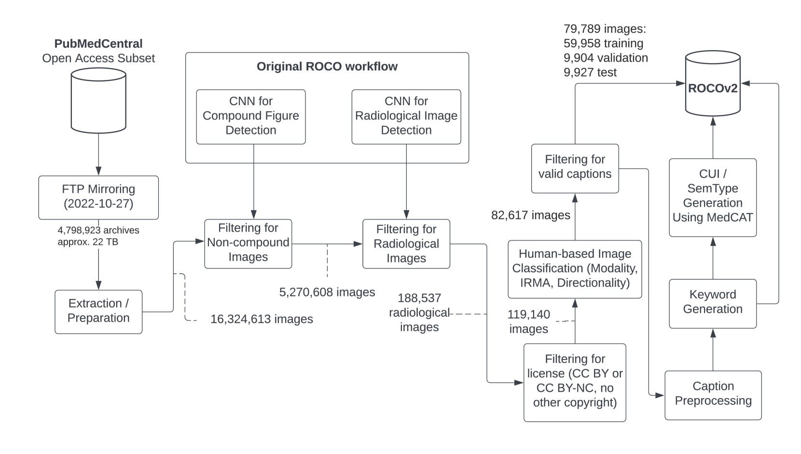

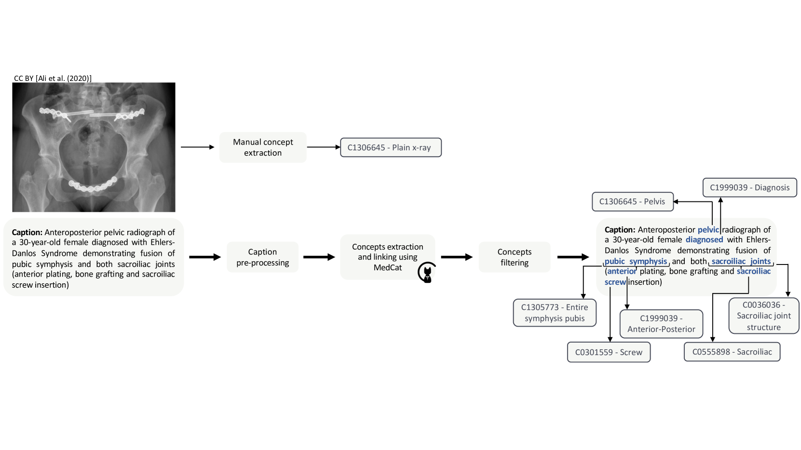

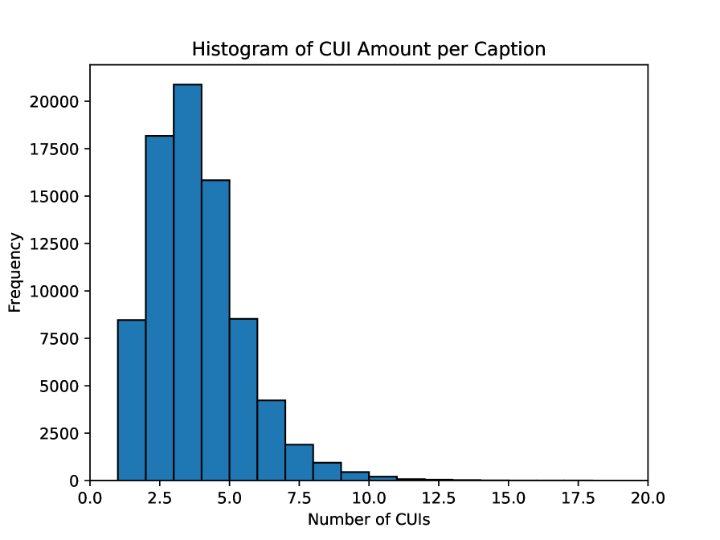

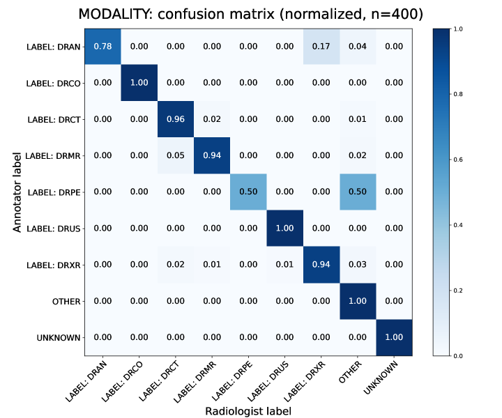

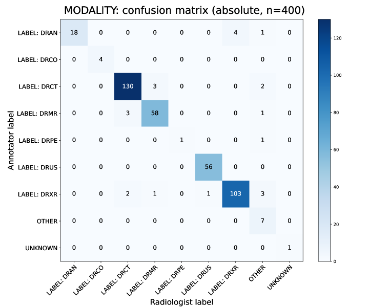

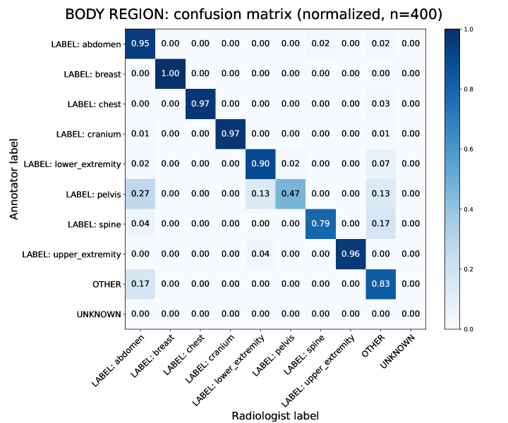

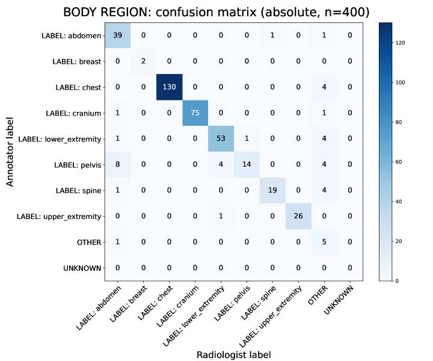

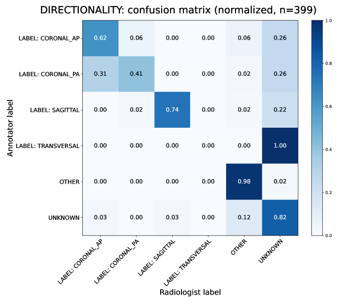

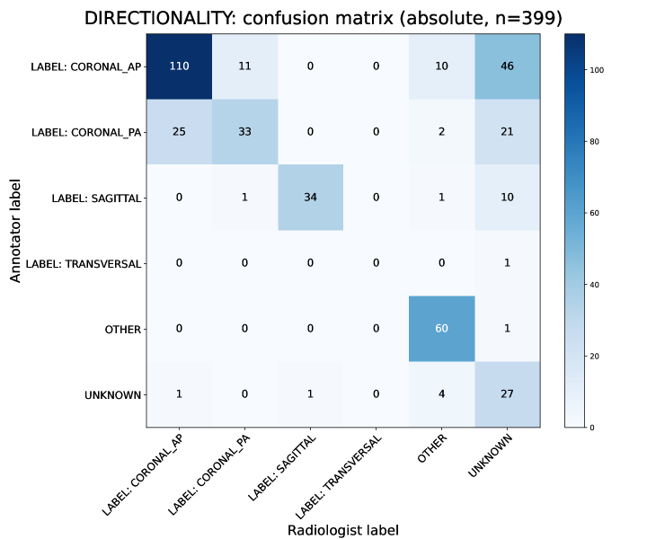

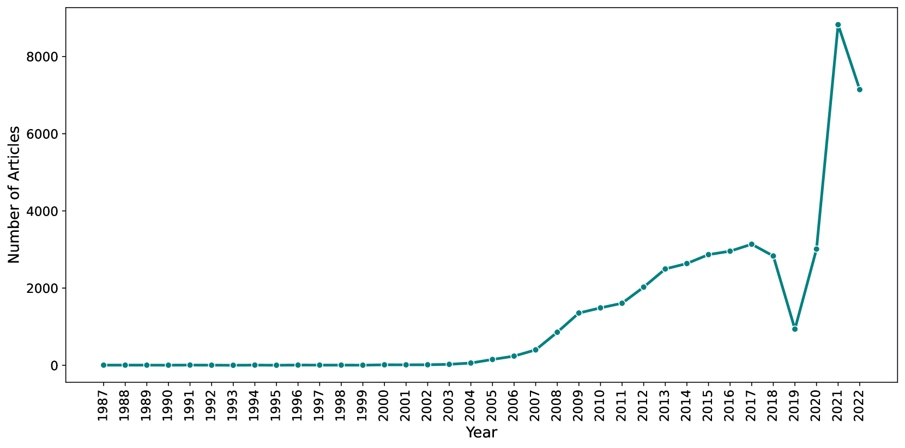

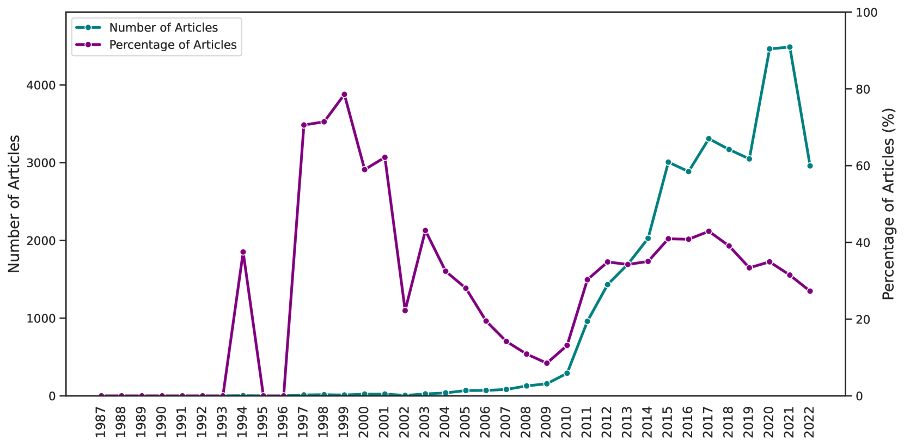

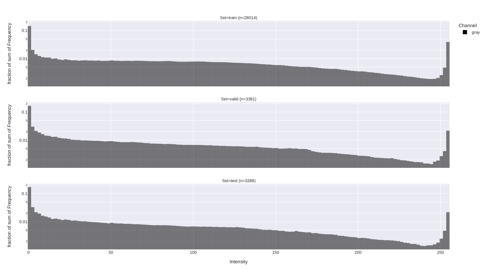

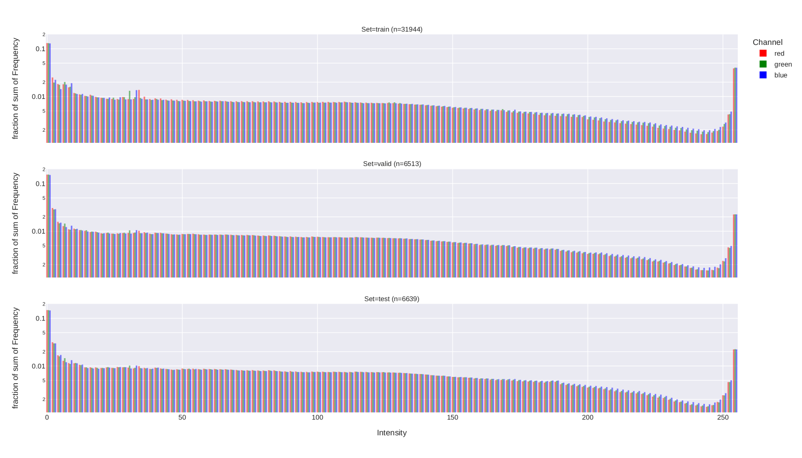

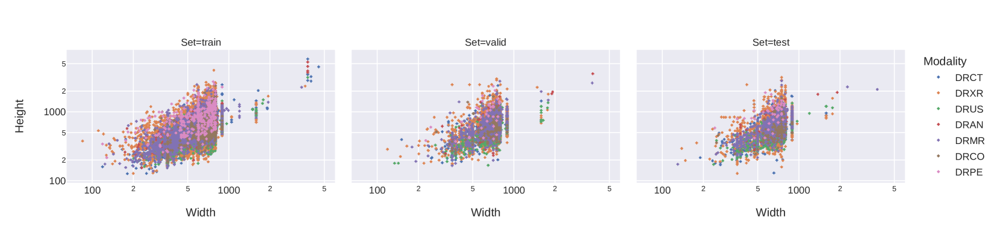

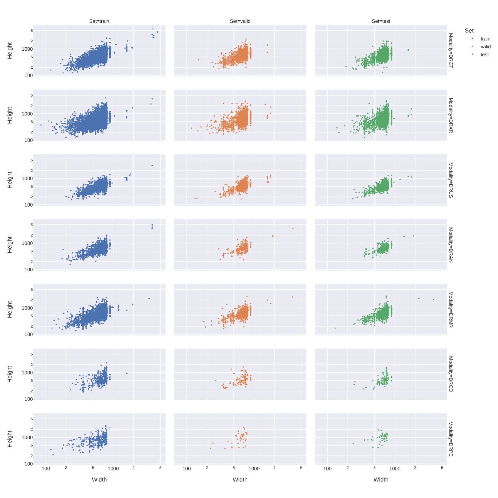

[Arxiv](https://arxiv.org/abs/2405.10004)