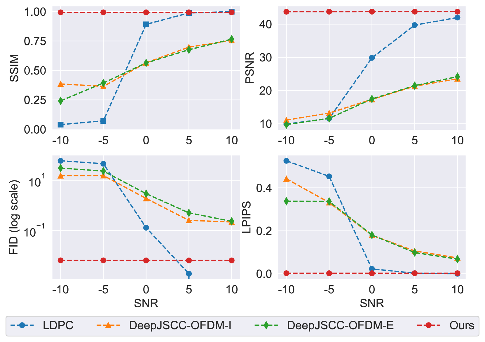

# 深度生成模型下的多用户语义通信再探在深度生成模型的引领下，我们对多用户语义通信的认知正经历一场深刻的反思。这一领域的发展，不仅拓宽了通信技术的边界，更在多用户交互的语义层面上，开启了全新的探索之旅。

发布时间：2024年05月16日

`LLM应用

这篇论文探讨了将大型语言模型（LLM）和扩散模型应用于多用户语义通信框架的创新方法。它提出了一个专门为多用户环境设计的生成式语义通信框架，并展示了如何利用扩散模型在接收端填补信息缺失。这与LLM的应用相关，因为它展示了LLM在通信领域的实际应用，特别是在提高信息传输质量和效率方面。虽然论文可能涉及一些理论基础，但其主要焦点是提出和验证一个实际的通信框架，因此更适合归类为LLM应用。` `通信技术` `人工智能`

> Rethinking Multi-User Semantic Communications with Deep Generative Models

# 摘要

> 随着连接设备激增，信息传输质量提升，新兴的通信策略应运而生。语义通信与尖端深度生成模型（如大型语言模型或扩散模型）的结合，尤其在从高度压缩的语义信息中重建内容方面，展现出巨大潜力。尽管如此，多数研究仍局限于单用户通信，且依赖于传统通信架构。本文提出了一种创新的生成式语义通信框架，专为多用户环境量身定制。该框架允许信道分配给多个用户，并利用扩散模型在接收端填补信息缺失。在这种新颖的视角下，OFDMA系统不再追求信息的最大化传输，而是专注于传输生成模型再生缺失信息所必需的比特。实验结果充分证明了新型扩散模型的强大功能和所提框架的实效性，预示着基于生成式人工智能的通信新时代的到来。

> In recent years, novel communication strategies have emerged to face the challenges that the increased number of connected devices and the higher quality of transmitted information are posing. Among them, semantic communication obtained promising results especially when combined with state-of-the-art deep generative models, such as large language or diffusion models, able to regenerate content from extremely compressed semantic information. However, most of these approaches focus on single-user scenarios processing the received content at the receiver on top of conventional communication systems. In this paper, we propose to go beyond these methods by developing a novel generative semantic communication framework tailored for multi-user scenarios. This system assigns the channel to users knowing that the lost information can be filled in with a diffusion model at the receivers. Under this innovative perspective, OFDMA systems should not aim to transmit the largest part of information, but solely the bits necessary to the generative model to semantically regenerate the missing ones. The thorough experimental evaluation shows the capabilities of the novel diffusion model and the effectiveness of the proposed framework, leading towards a GenAI-based next generation of communications.

[Arxiv](https://arxiv.org/abs/2405.09866)