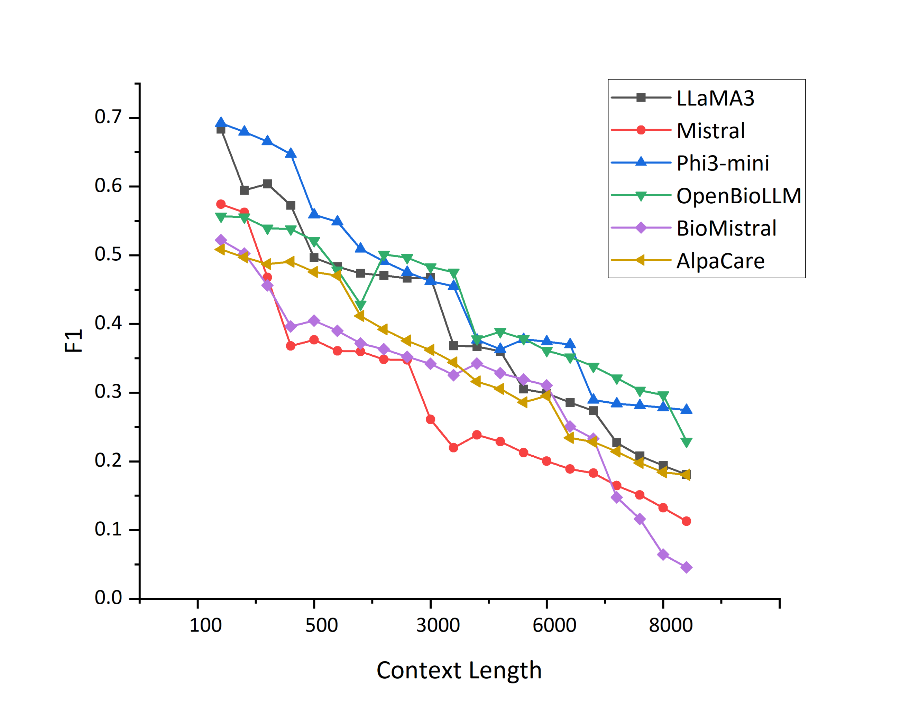

# 检索与精炼：大型语言模型助力罕见疾病识别的混合框架

发布时间：2024年05月16日

`RAG

理由：这篇论文主要探讨了如何结合传统的基于字典的NLP工具与大型语言模型（LLMs）来提升从临床笔记中识别罕见疾病的能力。特别提到了使用检索增强生成技术（RAG）来增强LLMs的理解和推理能力。因此，这篇论文更符合RAG分类，因为它专注于使用RAG技术来改进NLP应用，尤其是在医疗领域的应用。`

> Retrieving and Refining: A Hybrid Framework with Large Language Models for Rare Disease Identification

# 摘要

> 罕见疾病的临床表现多样且不常见，往往导致诊断不足，并被排除在结构化数据集之外。因此，全面分析需要依赖非结构化文本数据。但手动从临床报告中识别疾病既费力又主观。本研究提出了一种创新的混合方法，它巧妙结合了传统的基于字典的NLP工具与大型语言模型的强大功能，以提升从临床笔记中识别罕见疾病的能力。我们针对六种不同规模和领域的LLMs，全面评估了多种提示策略，包括零-shot、少-shot和检索增强生成技术，旨在增强LLMs对患者报告中的上下文信息的理解和推理能力。研究结果表明，该方法在罕见疾病识别上效果显著，揭示了从临床笔记中发现未确诊患者的新潜力。

> The infrequency and heterogeneity of clinical presentations in rare diseases often lead to underdiagnosis and their exclusion from structured datasets. This necessitates the utilization of unstructured text data for comprehensive analysis. However, the manual identification from clinical reports is an arduous and intrinsically subjective task. This study proposes a novel hybrid approach that synergistically combines a traditional dictionary-based natural language processing (NLP) tool with the powerful capabilities of large language models (LLMs) to enhance the identification of rare diseases from unstructured clinical notes. We comprehensively evaluate various prompting strategies on six large language models (LLMs) of varying sizes and domains (general and medical). This evaluation encompasses zero-shot, few-shot, and retrieval-augmented generation (RAG) techniques to enhance the LLMs' ability to reason about and understand contextual information in patient reports. The results demonstrate effectiveness in rare disease identification, highlighting the potential for identifying underdiagnosed patients from clinical notes.

[Arxiv](https://arxiv.org/abs/2405.10440)