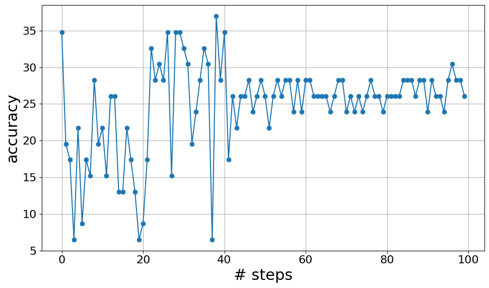

# 再探OPRO：小规模LLM作为优化器的局限性

发布时间：2024年05月16日

`LLM理论

这篇论文主要探讨了提示优化（OPRO）方法在小型大型语言模型（LLMs）中的应用效果，并提出了对未来自动提示设计的建议。它关注的是LLMs的性能优化和推理能力的局限性，这属于对LLMs理论层面的研究和分析。因此，它更适合归类于LLM理论。` `机器学习优化`

> Revisiting OPRO: The Limitations of Small-Scale LLMs as Optimizers

# 摘要

> 近期众多研究致力于通过策略性提示提升大型语言模型（LLMs）的效能。其中，通过提示优化（OPRO）方法，利用LLMs作为优化器，旨在寻找能够最大化任务准确性的指令，从而达到业界领先水平。本文重新评估了OPRO在小规模LLMs（如LLaMa-2系列和Mistral 7B）中的应用，发现其在这些模型中的效果有限，推理能力的局限性影响了优化过程。因此，我们建议未来的自动提示设计应兼顾模型性能与计算成本。对于小规模LLMs，我们提倡使用明确阐述目标与方法的直接指令作为坚实的基础，以确保在未来的研究中实现高效且有效的提示设计。

> Numerous recent works aim to enhance the efficacy of Large Language Models (LLMs) through strategic prompting. In particular, the Optimization by PROmpting (OPRO) approach provides state-of-the-art performance by leveraging LLMs as optimizers where the optimization task is to find instructions that maximize the task accuracy. In this paper, we revisit OPRO for automated prompting with relatively small-scale LLMs, such as LLaMa-2 family and Mistral 7B. Our investigation reveals that OPRO shows limited effectiveness in small-scale LLMs, with limited inference capabilities constraining optimization ability. We suggest future automatic prompting engineering to consider both model capabilities and computational costs. Additionally, for small-scale LLMs, we recommend direct instructions that clearly outline objectives and methodologies as robust prompt baselines, ensuring efficient and effective prompt engineering in ongoing research.

[Arxiv](https://arxiv.org/abs/2405.10276)