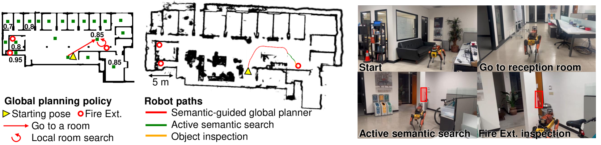

# 探索语义推理：在现实世界的检查任务中，引领物体目标导航的新篇章在这项研究中，我们探索了语义推理在现实世界检查任务中对物体目标导航的作用。通过深入分析，我们揭示了语义推理如何帮助智能体在复杂环境中精准定位目标物体，从而提高导航效率和准确性。这一发现为智能导航技术的发展开辟了新的道路，预示着未来在各种检查任务中，智能体将能够更加智能、高效地完成任务。

发布时间：2024年05月16日

`Agent

这篇论文探讨了机器人自主导航至目标对象的问题，并提出了SEEK框架，该框架赋予机器人利用环境历史信息和常识推理的能力。这涉及到机器人的自主行为和决策，因此属于Agent的范畴。虽然文中提到了基于LLMs的方法，但这并不是论文的主要焦点，而是作为对比的基准方法。因此，这篇论文更侧重于机器人的自主性和智能行为，而不是LLM的理论或应用。` `机器人导航` `自主检查`

> SEEK: Semantic Reasoning for Object Goal Navigation in Real World Inspection Tasks

# 摘要

> 本文探讨了在现实世界中自主检查时机器人如何高效导航至目标对象的问题。现有的机器人检查方法未能达到人类水平，因为它们缺乏人类利用先前知识和常识的能力。为此，我们提出了SEEK框架，它赋予机器人利用环境历史信息和常识推理的能力，以更高效地定位目标。SEEK结合了动态场景图和关系语义网络，后者是一种精简模型，用于预测目标在空间中的可能位置。我们开发了一种基于概率的规划方法，利用语义关系知识来指导搜索。模拟实验显示，SEEK在目标导航任务上超越了传统规划和基于LLMs的方法。我们在城市环境中对腿式机器人进行了实地测试，证明了SEEK在实际检查任务中的高效性和实用性。

> This paper addresses the problem of object-goal navigation in autonomous inspections in real-world environments. Object-goal navigation is crucial to enable effective inspections in various settings, often requiring the robot to identify the target object within a large search space. Current object inspection methods fall short of human efficiency because they typically cannot bootstrap prior and common sense knowledge as humans do. In this paper, we introduce a framework that enables robots to use semantic knowledge from prior spatial configurations of the environment and semantic common sense knowledge. We propose SEEK (Semantic Reasoning for Object Inspection Tasks) that combines semantic prior knowledge with the robot's observations to search for and navigate toward target objects more efficiently. SEEK maintains two representations: a Dynamic Scene Graph (DSG) and a Relational Semantic Network (RSN). The RSN is a compact and practical model that estimates the probability of finding the target object across spatial elements in the DSG. We propose a novel probabilistic planning framework to search for the object using relational semantic knowledge. Our simulation analyses demonstrate that SEEK outperforms the classical planning and Large Language Models (LLMs)-based methods that are examined in this study in terms of efficiency for object-goal inspection tasks. We validated our approach on a physical legged robot in urban environments, showcasing its practicality and effectiveness in real-world inspection scenarios.

[Arxiv](https://arxiv.org/abs/2405.09822)