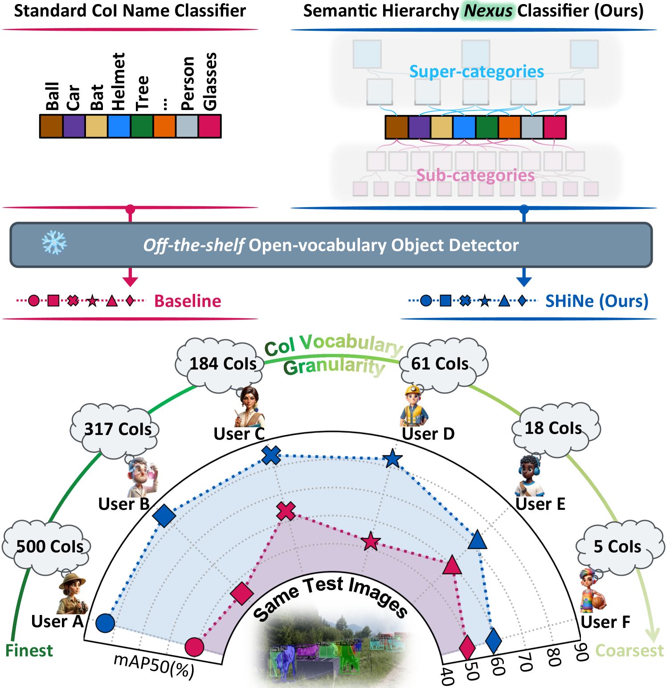
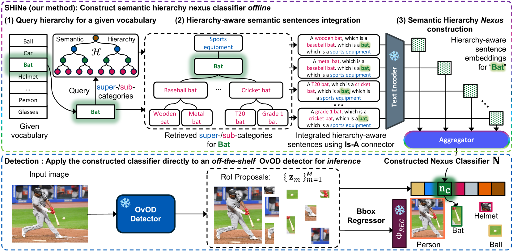
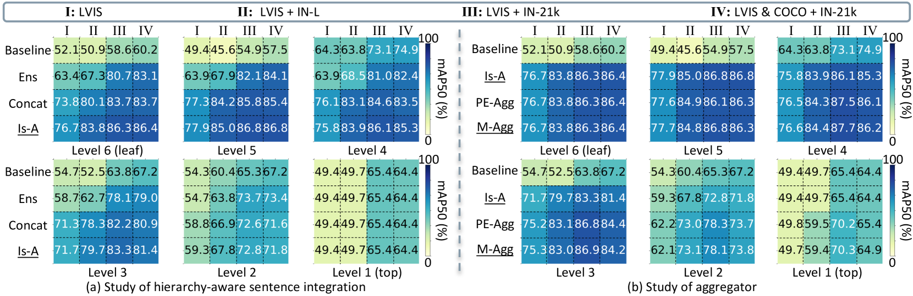
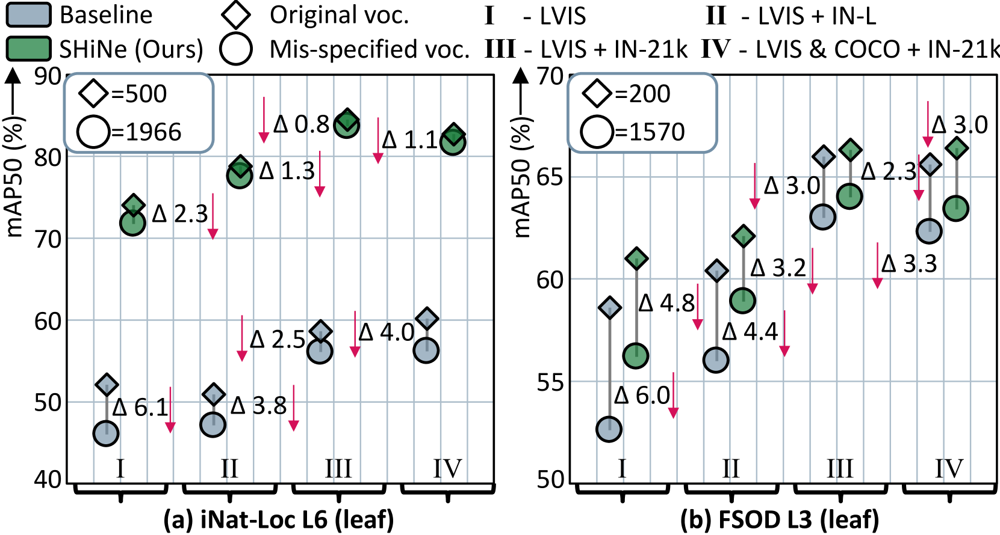
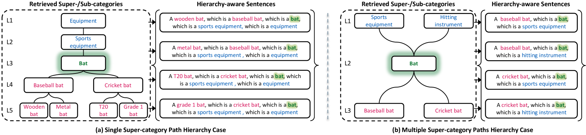
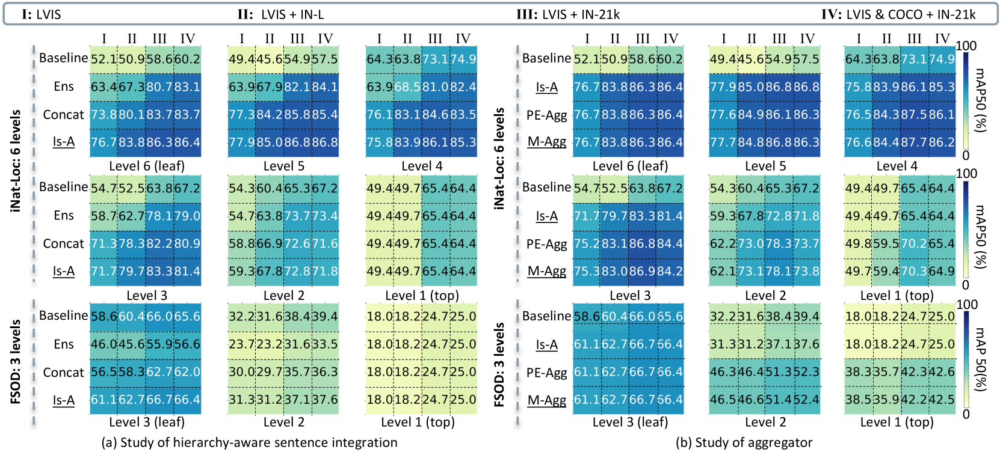
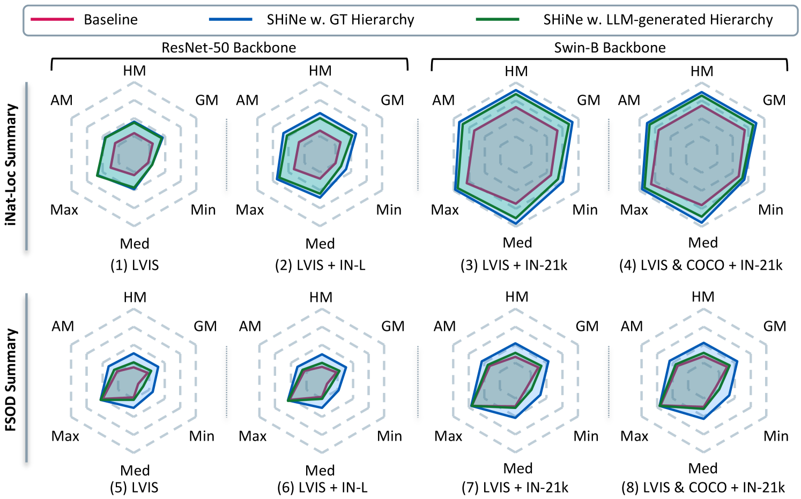

# SHiNe：开放词汇对象检测的语义层级纽带在这项研究中，我们提出了SHiNe，一种新颖的框架，旨在通过构建语义层次结构的纽带来提升开放词汇对象检测的能力。SHiNe不仅能够识别已知类别中的对象，还能够通过其层次结构推理机制，对未知类别进行合理的分类和检测。我们的方法通过整合不同层次的语义信息，实现了对复杂场景中对象的更准确理解和分类。通过一系列实验，我们证明了SHiNe在开放词汇对象检测任务中的有效性和优越性。

发布时间：2024年05月16日

`LLM应用

这篇论文探讨了开放词汇对象检测（OvOD）中的一个具体问题，即现有检测器在处理不同语义层次的词汇时的不稳定表现。作者提出了一种名为语义层次纽带（SHiNe）的新型分类器，该分类器利用了类别层次语义知识，并通过融合句子嵌入生成纽带分类器向量。这种方法在实验中显示出了性能的提升，并且可以轻松集成到现有的OvOD检测器中，不会增加推理时的计算负担。由于这项工作是关于如何应用大型语言模型（LLM）来改进对象检测器的性能，因此它属于LLM应用类别。` `计算机视觉` `对象检测`

> SHiNe: Semantic Hierarchy Nexus for Open-vocabulary Object Detection

# 摘要

> 开放词汇对象检测（OvOD）赋予了用户在推理时自由定义类别词汇的能力，但现有检测器在处理不同语义层次的词汇时表现不稳定，这限制了其在实际应用中的可靠性。为此，我们提出了语义层次纽带（SHiNe），一种利用类别层次语义知识的新型分类器。SHiNe通过三个步骤离线运作：首先，为每个目标类别检索相关的超类和子类；其次，将这些类别融入具有层次感知性的句子；最后，融合句子嵌入生成纽带分类器向量。我们的实验在多个检测基准上展示了SHiNe在不同词汇粒度上的鲁棒性提升，最高可达+31.9%的mAP50，同时保持了使用大型语言模型生成的层次结构带来的增益。在ImageNet-1k的开放词汇分类任务中，SHiNe将CLIP零-shot基线的准确率提升了+2.8%。SHiNe无需额外训练，可轻松集成到现有的OvOD检测器中，且不会增加推理时的计算负担。我们的代码已开源。

> Open-vocabulary object detection (OvOD) has transformed detection into a language-guided task, empowering users to freely define their class vocabularies of interest during inference. However, our initial investigation indicates that existing OvOD detectors exhibit significant variability when dealing with vocabularies across various semantic granularities, posing a concern for real-world deployment. To this end, we introduce Semantic Hierarchy Nexus (SHiNe), a novel classifier that uses semantic knowledge from class hierarchies. It runs offline in three steps: i) it retrieves relevant super-/sub-categories from a hierarchy for each target class; ii) it integrates these categories into hierarchy-aware sentences; iii) it fuses these sentence embeddings to generate the nexus classifier vector. Our evaluation on various detection benchmarks demonstrates that SHiNe enhances robustness across diverse vocabulary granularities, achieving up to +31.9% mAP50 with ground truth hierarchies, while retaining improvements using hierarchies generated by large language models. Moreover, when applied to open-vocabulary classification on ImageNet-1k, SHiNe improves the CLIP zero-shot baseline by +2.8% accuracy. SHiNe is training-free and can be seamlessly integrated with any off-the-shelf OvOD detector, without incurring additional computational overhead during inference. The code is open source.

[Arxiv](https://arxiv.org/abs/2405.10053)