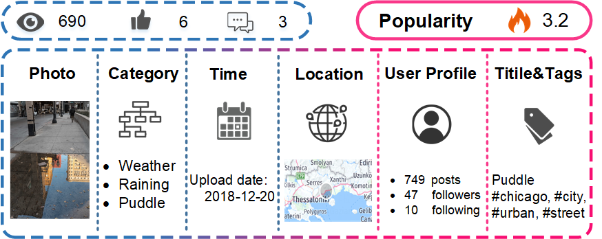
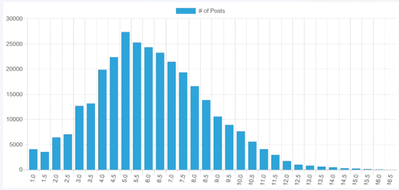
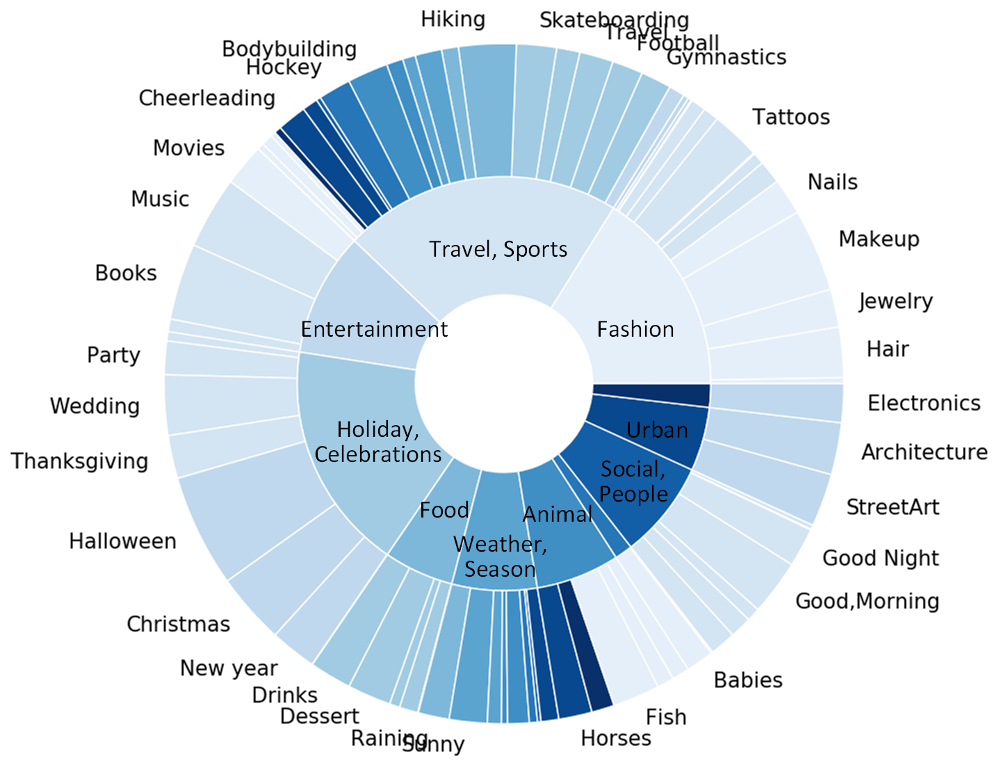
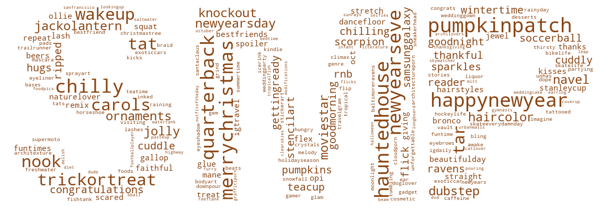

# 社交媒体预测挑战综述与分析：探索SMP挑战的深度与广度。

发布时间：2024年05月16日

`RAG

理由：这篇论文主要关注的是社交媒体人气预测（SMPP）任务，这是一个涉及多模态数据分析和预测模型的应用问题。虽然它涉及到数据分析和预测模型，但主要焦点在于如何通过分析社交媒体数据来预测帖子的流行度，这与RAG（检索增强生成）的范畴更为接近，因为RAG通常涉及从大量数据中提取信息并用于生成或预测任务。此外，论文中提到的“大规模SMPD基准”和“解决方案和趋势分析”也与RAG中对数据集和模型评估的关注相符。因此，将其归类为RAG更为合适。` `社交媒体` `数据分析`

> SMP Challenge: An Overview and Analysis of Social Media Prediction Challenge

# 摘要

> 社交媒体人气预测（SMPP）任务至关重要，它通过分析社交媒体上的海量多模态数据，自动预测帖子未来的流行度。这一研究对于推动在线应用的发展至关重要，它要求我们开发出全面分析、多模态理解和精准预测的新方法。SMP挑战赛作为一项年度研究盛事，极大地促进了该领域的学术探索。本文概述了挑战赛的核心任务、数据集及研究进展。我们发布了一个包含约50万篇帖子、由70万用户创作的大规模SMPD基准，为评估和基准测试预测模型提供了关键资源。此外，我们对近年来的解决方案和趋势进行了全面分析，并通过SMP挑战赛网站（www.smp-challenge.com）持续更新最新动态。

> Social Media Popularity Prediction (SMPP) is a crucial task that involves automatically predicting future popularity values of online posts, leveraging vast amounts of multimodal data available on social media platforms. Studying and investigating social media popularity becomes central to various online applications and requires novel methods of comprehensive analysis, multimodal comprehension, and accurate prediction.
  SMP Challenge is an annual research activity that has spurred academic exploration in this area. This paper summarizes the challenging task, data, and research progress. As a critical resource for evaluating and benchmarking predictive models, we have released a large-scale SMPD benchmark encompassing approximately half a million posts authored by around 70K users. The research progress analysis provides an overall analysis of the solutions and trends in recent years. The SMP Challenge website (www.smp-challenge.com) provides the latest information and news.

[Arxiv](https://arxiv.org/abs/2405.10497)