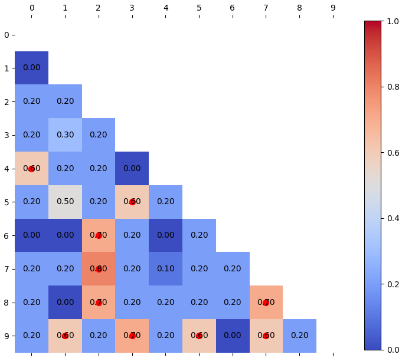
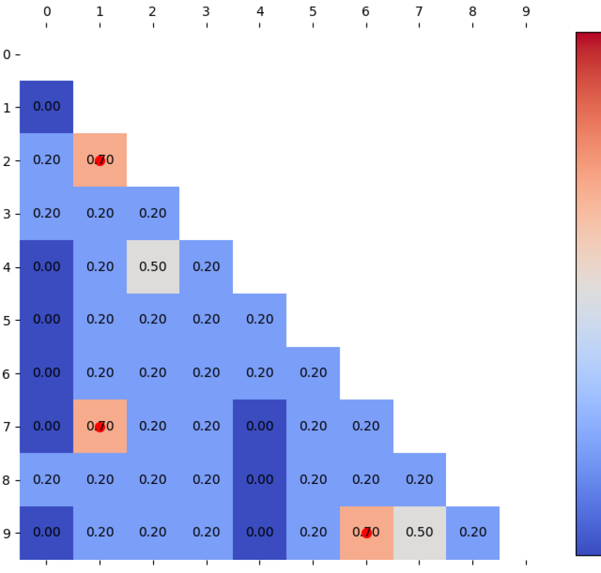

# SciQAG：细粒度评估下的自动生成科学问答数据集框架在

发布时间：2024年05月16日

`LLM应用

这篇论文介绍了一个自动生成科学问答（SciQAG）框架，该框架能够从科学文献中自动生成并评估QA对。这个框架利用了大型语言模型（LLM）进行微调，以生成科学领域的QA对，并提供了一套评价体系来衡量这些QA对的质量。这个工作展示了LLM在特定应用场景（即科学文献的问答生成）中的应用，因此属于LLM应用分类。` `科学研究` `教育技术`

> SciQAG: A Framework for Auto-Generated Scientific Question Answering Dataset with Fine-grained Evaluation

# 摘要

> 问答（QA）对在LLMs的训练和评估中备受瞩目，但基于科学文献的QA数据集却寥寥无几。为此，我们推出了自动生成科学问答（SciQAG）框架，该框架能从科学文献中自动生成并评估QA对。通过微调开源LLM，我们生成了96万条科学QA对，并提出了一套五维评价体系来衡量其质量。评估结果显示，这些QA对在五个维度上的平均得分高达2.5分（满分3分），证明了我们的框架能高效提炼论文知识，生成高质量的QA对。我们已将相关数据集、模型和评估工具公开，供大家使用。

> The use of question-answer (QA) pairs for training and evaluating large language models (LLMs) has attracted considerable attention. Yet few available QA datasets are based on knowledge from the scientific literature. Here we bridge this gap by presenting Automatic Generation of Scientific Question Answers (SciQAG), a framework for automatic generation and evaluation of scientific QA pairs sourced from published scientific literature. We fine-tune an open-source LLM to generate \num{960000} scientific QA pairs from full-text scientific papers and propose a five-dimensional metric to evaluate the quality of the generated QA pairs. We show via LLM-based evaluation that the generated QA pairs consistently achieve an average score of 2.5 out of 3 across five dimensions, indicating that our framework can distill key knowledge from papers into high-quality QA pairs at scale. We make the dataset, models, and evaluation codes publicly available.

[Arxiv](https://arxiv.org/abs/2405.09939)