# 语义手势创造者：融合语义的共语手势生成艺术

发布时间：2024年05月16日

`Agent

这篇论文介绍了一个名为Semantic Gesticulator的框架，它能够生成与语音紧密相关的现实手势。这个框架基于大型语言模型，并且能够智能检索和生成与语音相匹配的手势。它还包含了一个GPT模型和一种语义对齐技术，以确保手势与语音的自然同步。这个系统可以被视为一个智能代理（Agent），因为它能够根据输入的语音生成相应的手势，并且在非言语沟通中发挥作用。因此，这篇论文属于Agent分类。` `人机交互` `虚拟现实`

> Semantic Gesticulator: Semantics-Aware Co-Speech Gesture Synthesis

# 摘要

> 我们推出了Semantic Gesticulator，这一创新框架能够生成与语音紧密相关的现实手势。在非言语沟通中，语义手势至关重要，但它们往往属于人类动作的罕见类别。这使得深度学习系统难以在有限数据集上捕捉手势与语音之间的联系。为此，我们构建了一个基于大型语言模型的生成框架，它能从动作库中智能检索与语音相匹配的手势。我们的动作库基于语言学研究，收录了丰富的手势数据。我们还开发了一个GPT模型，它能根据音频生成逼真的手势，并设计了一种语义对齐技术，确保手势与语音的自然同步。实验证明，我们的系统生成的手势不仅节奏协调，而且语义清晰。用户研究也证实了我们的系统在手势的语义适当性上超越了现有技术。

> In this work, we present Semantic Gesticulator, a novel framework designed to synthesize realistic gestures accompanying speech with strong semantic correspondence. Semantically meaningful gestures are crucial for effective non-verbal communication, but such gestures often fall within the long tail of the distribution of natural human motion. The sparsity of these movements makes it challenging for deep learning-based systems, trained on moderately sized datasets, to capture the relationship between the movements and the corresponding speech semantics. To address this challenge, we develop a generative retrieval framework based on a large language model. This framework efficiently retrieves suitable semantic gesture candidates from a motion library in response to the input speech. To construct this motion library, we summarize a comprehensive list of commonly used semantic gestures based on findings in linguistics, and we collect a high-quality motion dataset encompassing both body and hand movements. We also design a novel GPT-based model with strong generalization capabilities to audio, capable of generating high-quality gestures that match the rhythm of speech. Furthermore, we propose a semantic alignment mechanism to efficiently align the retrieved semantic gestures with the GPT's output, ensuring the naturalness of the final animation. Our system demonstrates robustness in generating gestures that are rhythmically coherent and semantically explicit, as evidenced by a comprehensive collection of examples. User studies confirm the quality and human-likeness of our results, and show that our system outperforms state-of-the-art systems in terms of semantic appropriateness by a clear margin.

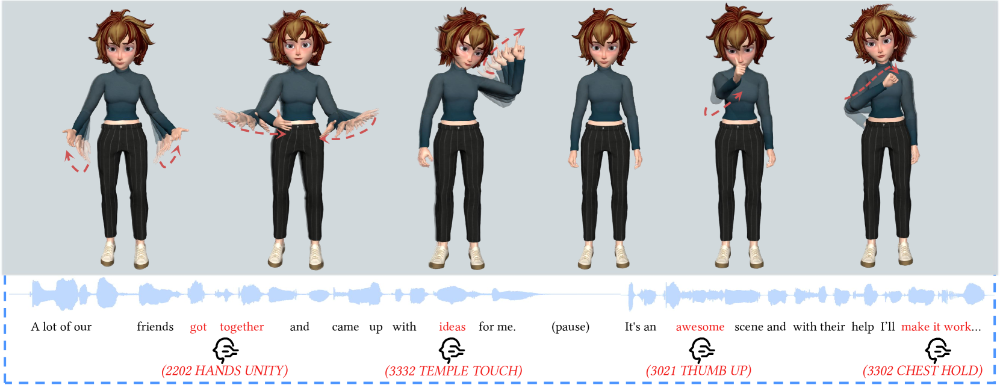

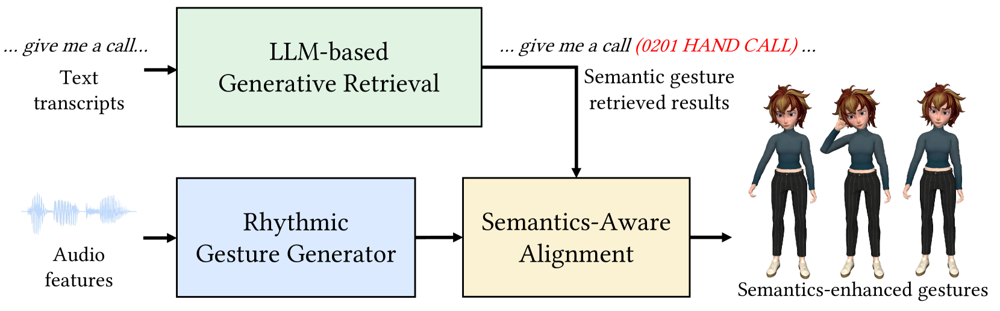

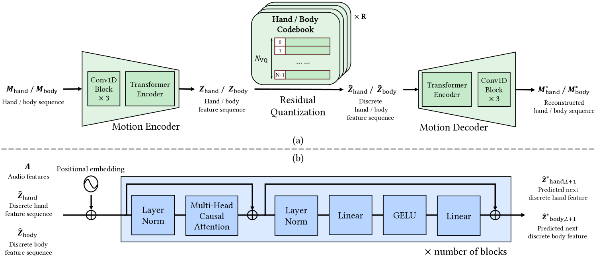

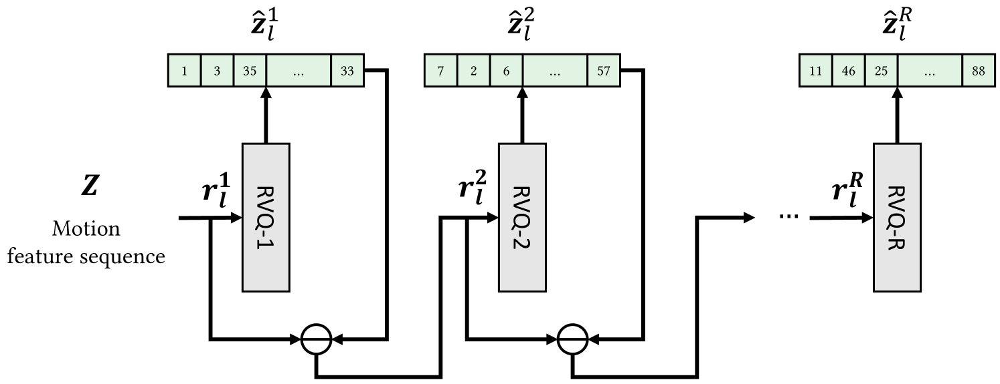

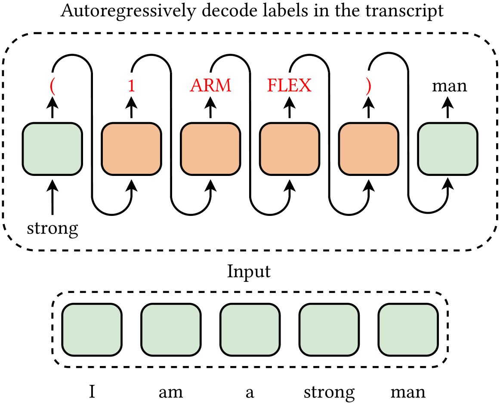

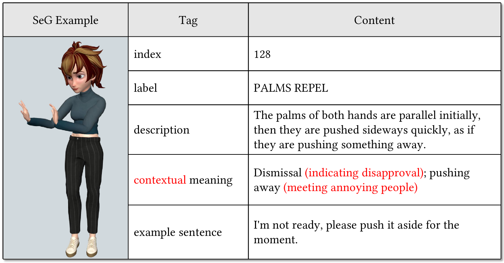

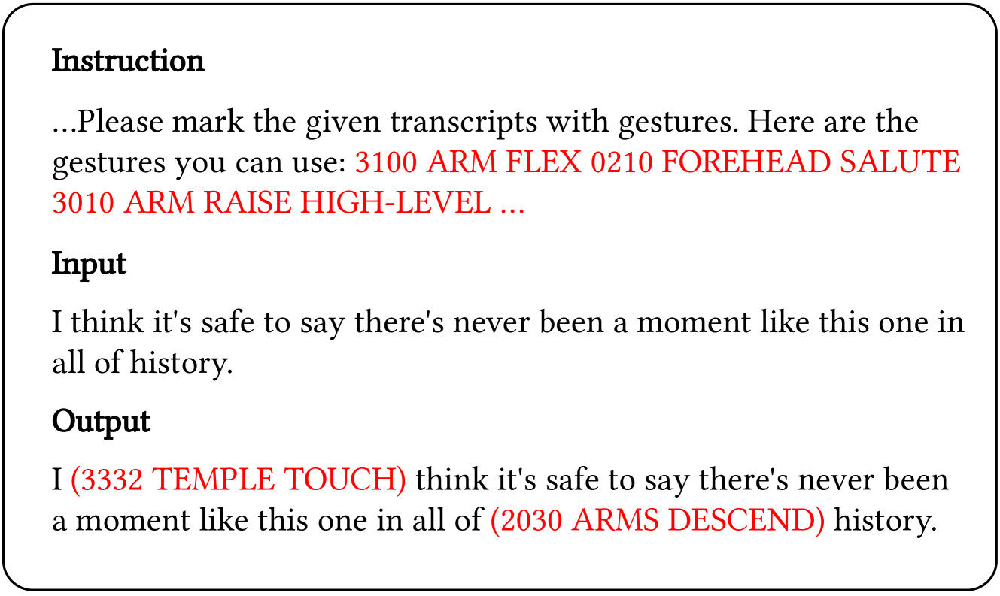

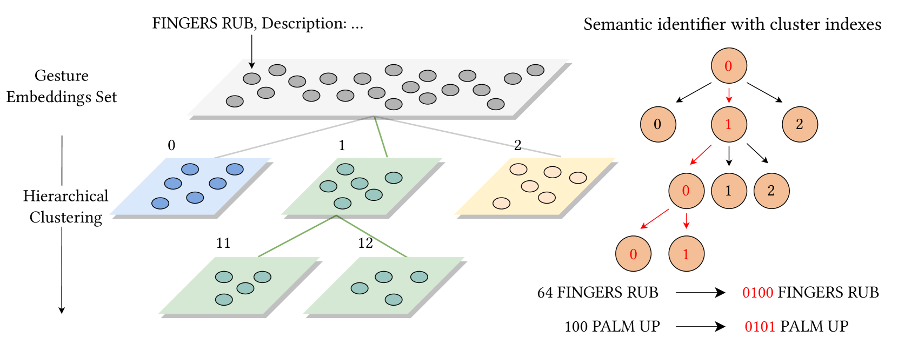

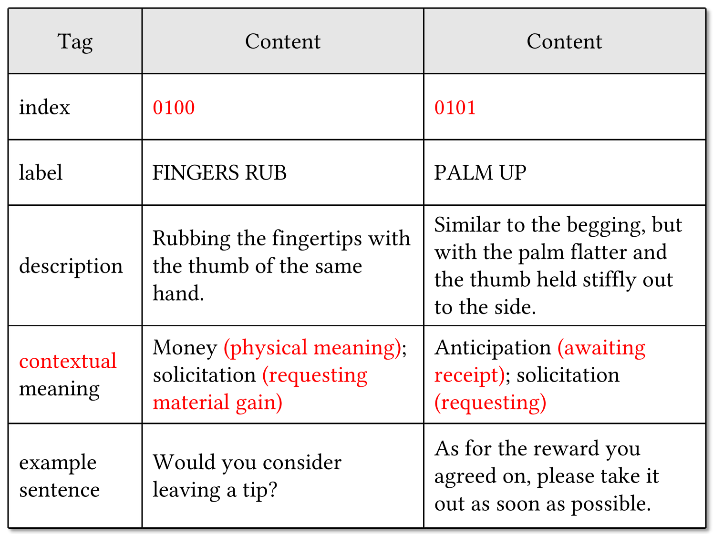

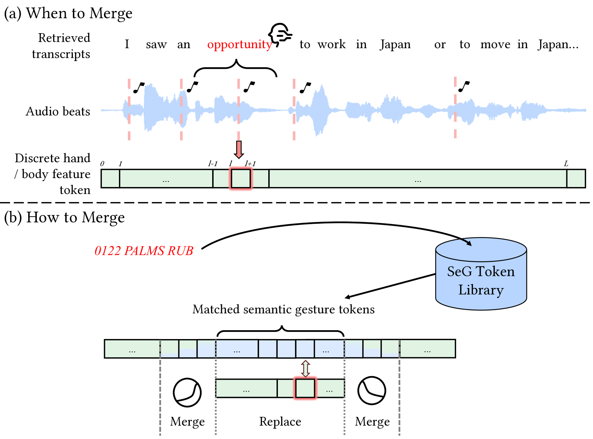

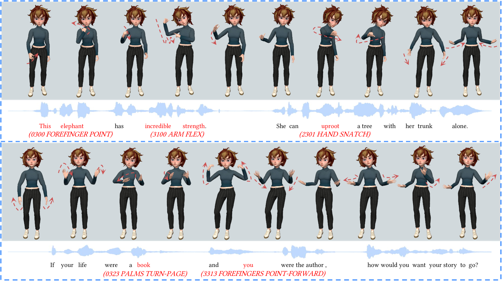

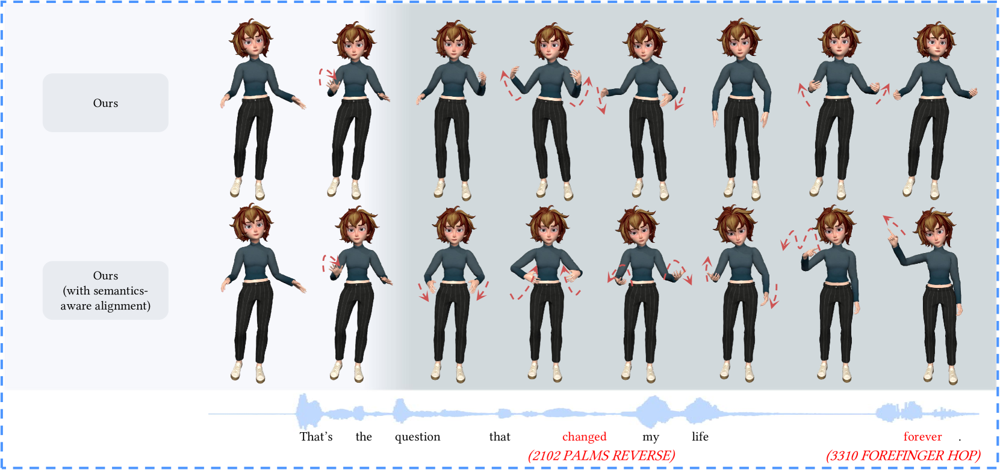

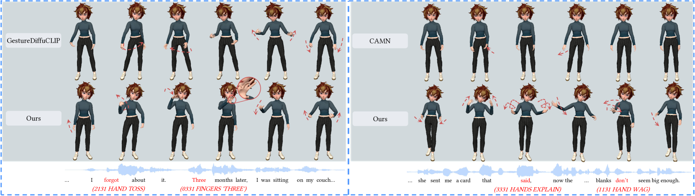

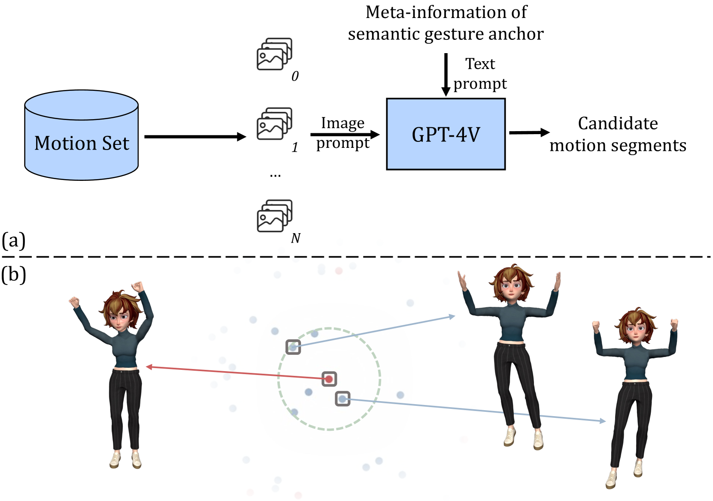

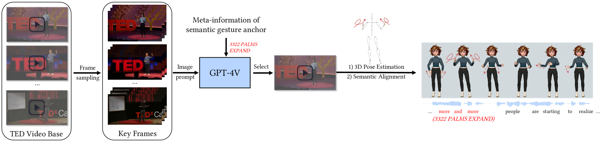

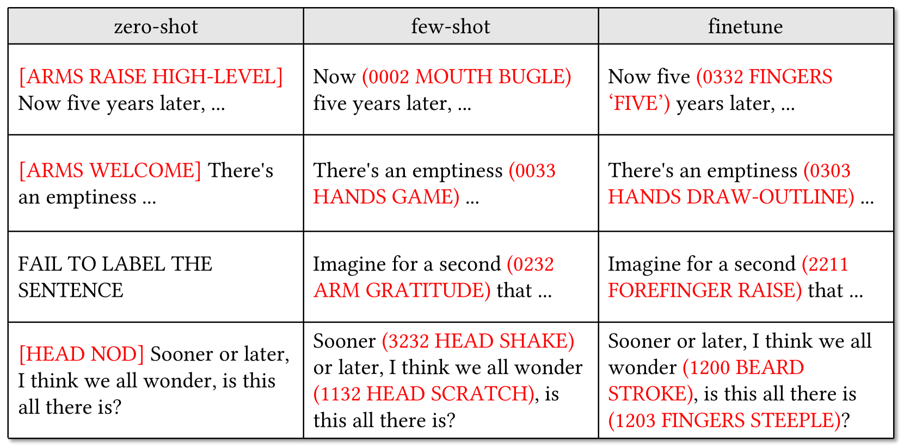

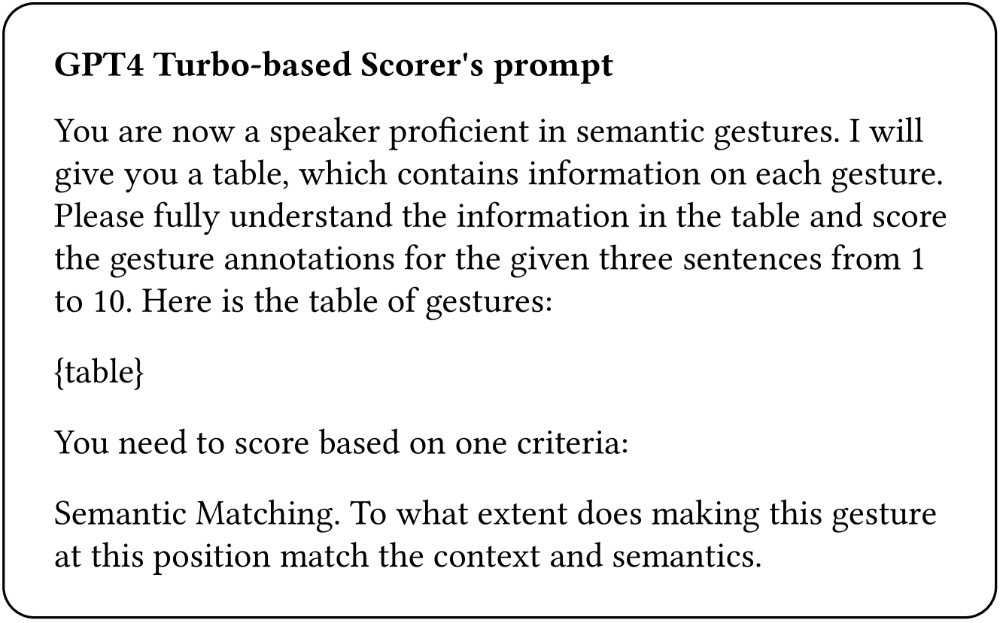

[Arxiv](https://arxiv.org/abs/2405.09814)