# 掩蔽而非优化提示：微调 LLMs 进行同时翻译的新范式

发布时间：2024年05月16日

`LLM应用

这篇论文摘要描述了一种针对大型语言模型（LLMs）在同声传译领域的应用进行微调的新方法——SimulMask。该方法通过创新的注意力掩码技术，在微调阶段根据特定决策策略屏蔽注意力连接，以提高同声传译的性能。这种方法解决了现有微调方法中存在的数据增强和提示结构调整带来的问题，如训练集过度膨胀、计算效率低下等。通过在Falcon LLM上实施SimulMask处理IWSLT 2017数据集的实验，证明了该方法在提升翻译质量和降低计算成本方面的有效性。因此，这篇论文属于LLM应用分类。` `同声传译` `语言处理`

> Simultaneous Masking, Not Prompting Optimization: A Paradigm Shift in Fine-tuning LLMs for Simultaneous Translation

# 摘要

> 大型语言模型（LLMs）在各类语言处理任务中表现卓越，推动了其在同声传译领域的应用。现有的LLMs同声传译微调方法多依赖于数据增强或提示结构调整，但这些方法面临训练集过度膨胀、计算效率低下、提示规模增大及决策策略单一等问题。为此，我们创新性地提出了SimulMask这一新微调范式，它通过一种新颖的注意力掩码技术，在微调阶段依据特定决策策略屏蔽注意力连接，从而实现同声传译的模拟。在Falcon LLM上实施SimulMask处理IWSLT 2017数据集，我们发现相较于当前顶尖的提示优化策略，在三种语言对上平均四种延迟制度下，翻译质量显著提升，同时计算成本得以降低。

> Large language models (LLMs) have achieved state-of-the-art performance in various language processing tasks, motivating their adoption in simultaneous translation. Current fine-tuning methods to adapt LLMs for simultaneous translation focus on prompting optimization strategies using either data augmentation or prompt structure modifications. However, these methods suffer from several issues, such as an unnecessarily expanded training set, computational inefficiency from dumping the KV cache, increased prompt sizes, or restriction to a single decision policy. To eliminate these issues, we propose a new paradigm in fine-tuning LLMs for simultaneous translation, called SimulMask. It utilizes a novel attention mask technique that models simultaneous translation during fine-tuning by masking attention connections under a desired decision policy. Applying the proposed SimulMask on a Falcon LLM for the IWSLT 2017 dataset, we have observed a significant translation quality improvement compared to state-of-the-art prompting optimization strategies on three language pairs when averaged across four different latency regimes while reducing the computational cost.

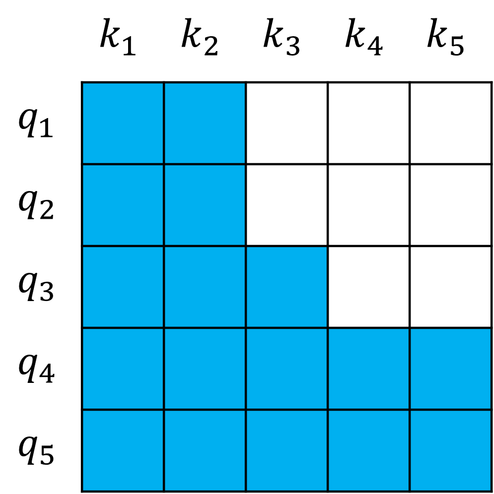

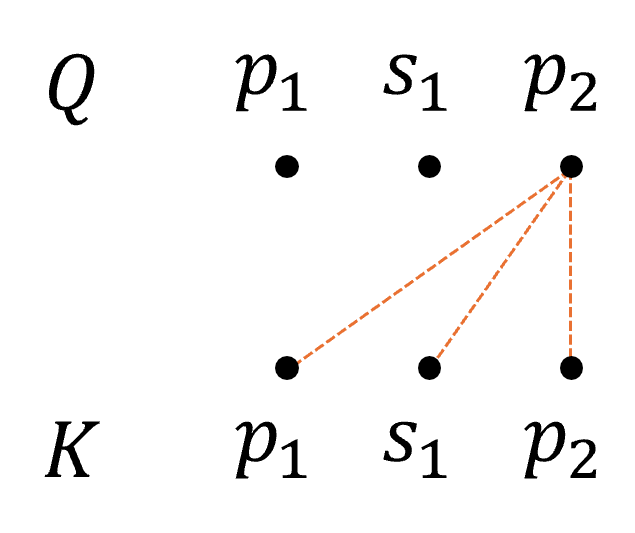

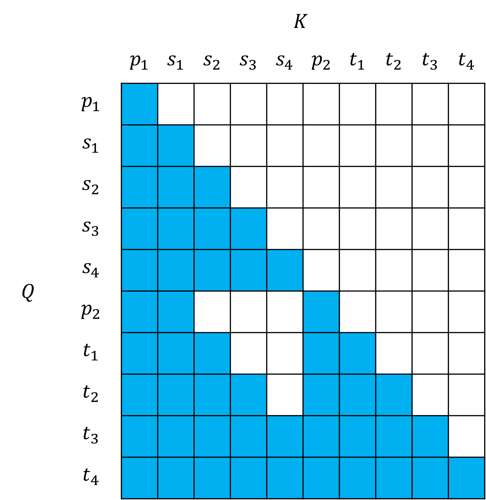

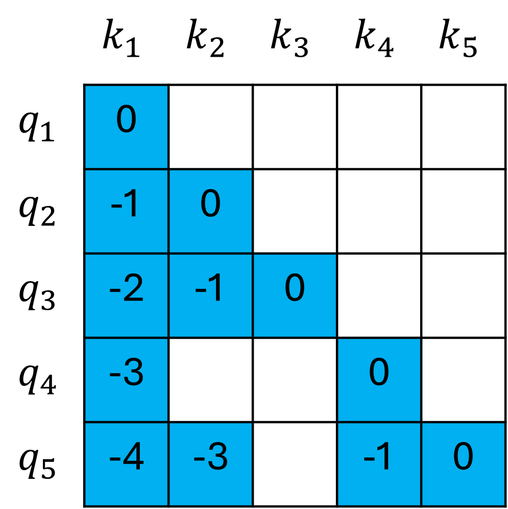

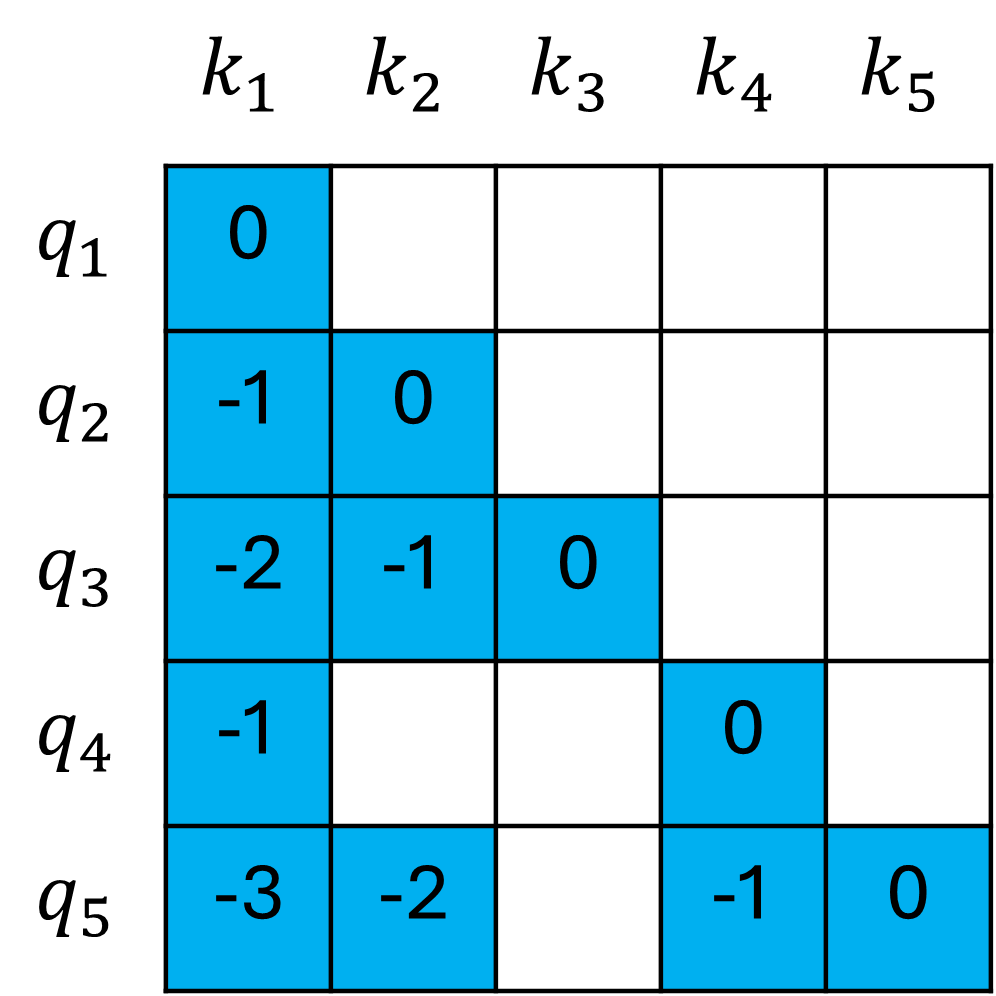

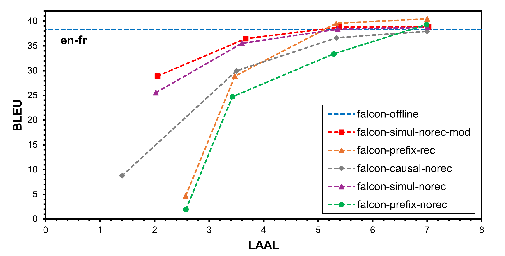

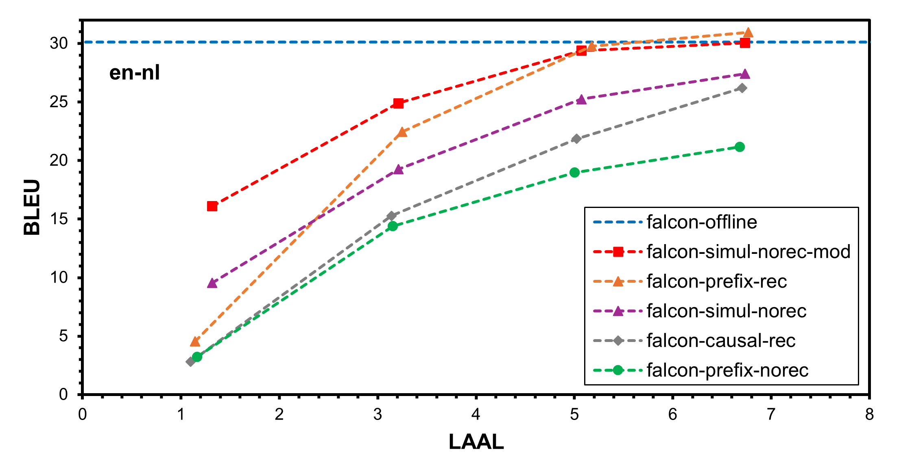

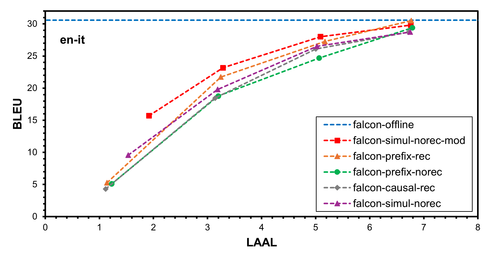

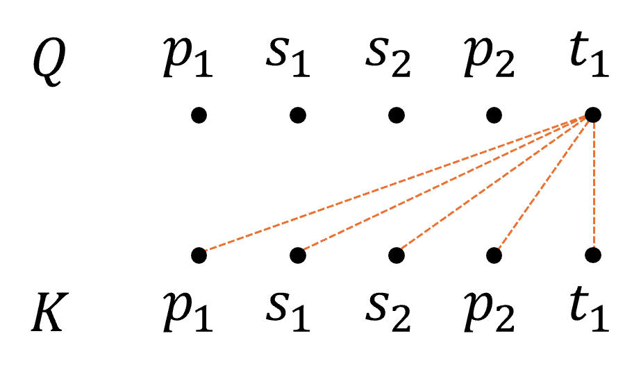

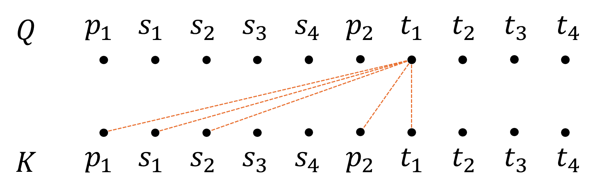

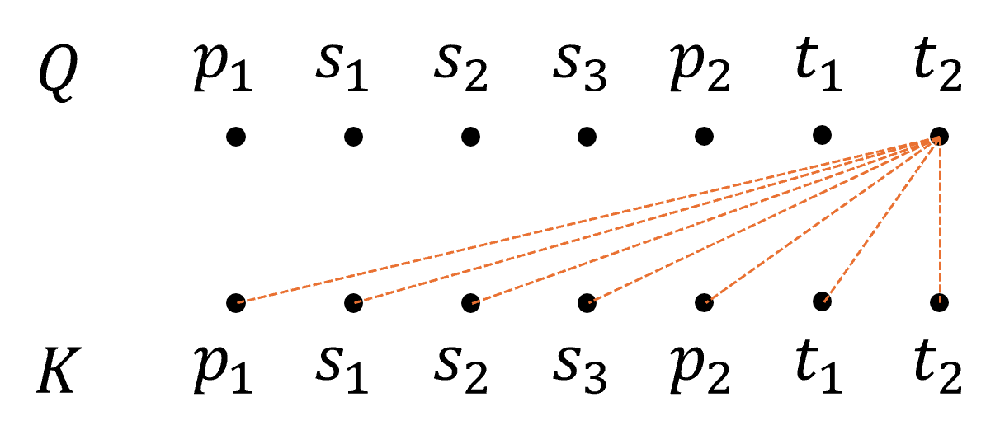

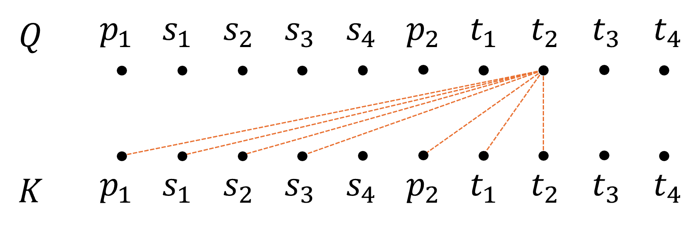

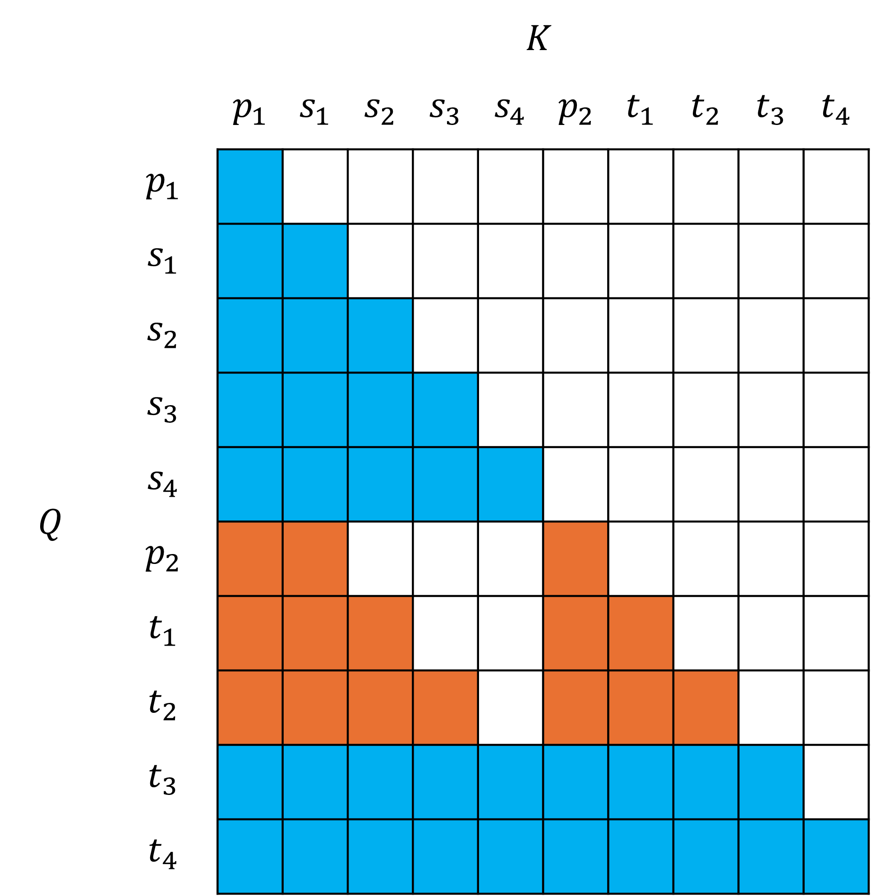

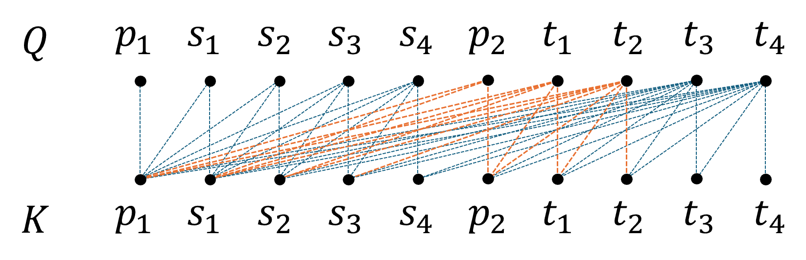

[Arxiv](https://arxiv.org/abs/2405.10443)