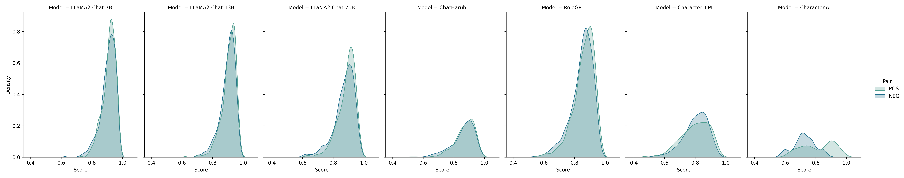
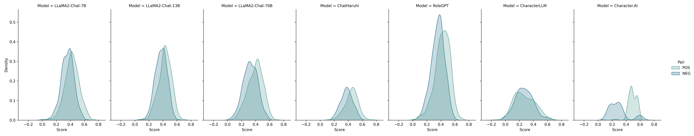
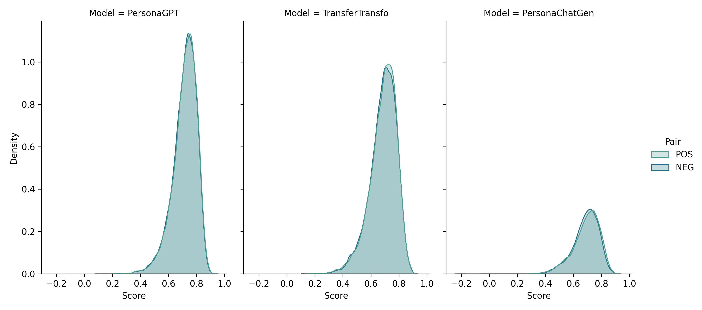

# 代理对话中的说话人验证技术在代理生成的对话中，说话人验证技术扮演着至关重要的角色。它不仅确保了对话的真实性和安全性，还提升了用户体验。然而，这项技术的实现面临着多重挑战，包括语音识别的准确性、环境噪声的干扰以及不同说话人声音的相似性。本研究将深入探讨这些挑战，并提出创新的解决方案，以期在代理对话领域推动说话人验证技术的发展。

发布时间：2024年05月16日

`Agent

这篇论文探讨了大型语言模型（LLMs）在个性化角色扮演对话代理中的应用，特别关注了如何根据说话者的独特风格和特征定制交流。研究提出了一个评估挑战，即在代理生成的对话中进行说话者验证，并构建了一个大型数据集来评估模型在个性化对话生成方面的能力。这与Agent分类相关，因为它涉及到了基于LLM的对话代理的开发和评估，特别是这些代理如何模仿和适应特定说话者的风格。` `对话系统` `个性化技术`

> Speaker Verification in Agent-Generated Conversations

# 摘要

> 大型语言模型（LLMs）的崛起激发了对个性化角色扮演对话代理的开发热情，旨在根据说话者的独特风格和特征定制交流，以提升其在各类对话任务中的表现。然而，将对话内容个性化至特定说话者的研究尚显不足。为此，我们提出了一项创新评估挑战：在代理生成的对话中进行说话者验证，旨在确认两组对话是否出自同一说话者。我们构建了一个庞大的数据集，涵盖了数千名说话者的对话样本，并开发了说话者验证模型进行实验评估。通过这些模型，我们进一步检验了基于LLM的角色扮演模型的个性化能力。实验结果揭示，当前模型在模仿说话者方面存在缺陷，主要归咎于其固有的语言特征限制。

> The recent success of large language models (LLMs) has attracted widespread interest to develop role-playing conversational agents personalized to the characteristics and styles of different speakers to enhance their abilities to perform both general and special purpose dialogue tasks. However, the ability to personalize the generated utterances to speakers, whether conducted by human or LLM, has not been well studied. To bridge this gap, our study introduces a novel evaluation challenge: speaker verification in agent-generated conversations, which aimed to verify whether two sets of utterances originate from the same speaker. To this end, we assemble a large dataset collection encompassing thousands of speakers and their utterances. We also develop and evaluate speaker verification models under experiment setups. We further utilize the speaker verification models to evaluate the personalization abilities of LLM-based role-playing models. Comprehensive experiments suggest that the current role-playing models fail in accurately mimicking speakers, primarily due to their inherent linguistic characteristics.

[Arxiv](https://arxiv.org/abs/2405.10150)