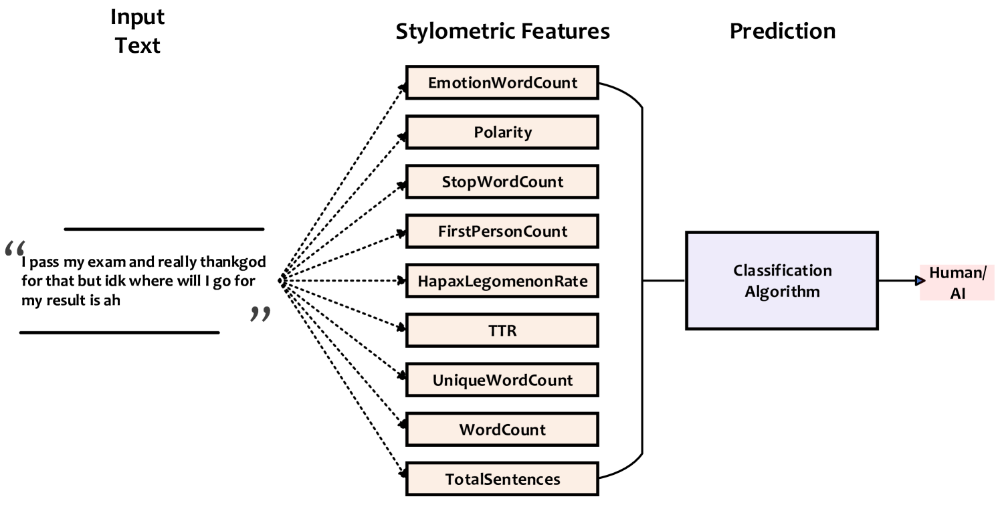
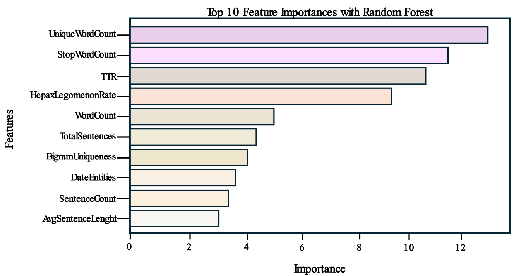

# StyloAI：以文体分析之眼，辨识AI创作之迹

发布时间：2024年05月16日

`LLM应用

这篇论文探讨了大型语言模型（LLMs）生成的文本与人类创作文本之间的区别，并提出了一种名为StyloAI的模型来区分这两者。该模型通过特定的文体特征和分类器实现了高准确率，这表明它在应用层面上对LLMs的输出进行识别和区分。因此，这篇论文的内容与LLM的应用相关，特别是在检测和区分AI生成内容与人类创作内容方面。` `内容鉴别` `人工智能伦理`

> StyloAI: Distinguishing AI-Generated Content with Stylometric Analysis

# 摘要

> 大型语言模型（LLMs）的逼真文本和图像生成能力引发了广泛伦理担忧。为此，研究者们正致力于开发方法，以区分AI创作与人类作品。本研究提出的StyloAI模型，通过31项文体特征和随机森林分类器，在多领域数据集上实现了高达98%的准确率，有效识别AI生成文本。StyloAI不仅超越了现有技术，还揭示了AI与人类创作文本之间的微妙差异，为深入理解提供了新视角。

> The emergence of large language models (LLMs) capable of generating realistic texts and images has sparked ethical concerns across various sectors. In response, researchers in academia and industry are actively exploring methods to distinguish AI-generated content from human-authored material. However, a crucial question remains: What are the unique characteristics of AI-generated text? Addressing this gap, this study proposes StyloAI, a data-driven model that uses 31 stylometric features to identify AI-generated texts by applying a Random Forest classifier on two multi-domain datasets. StyloAI achieves accuracy rates of 81% and 98% on the test set of the AuTextification dataset and the Education dataset, respectively. This approach surpasses the performance of existing state-of-the-art models and provides valuable insights into the differences between AI-generated and human-authored texts.

[Arxiv](https://arxiv.org/abs/2405.10129)