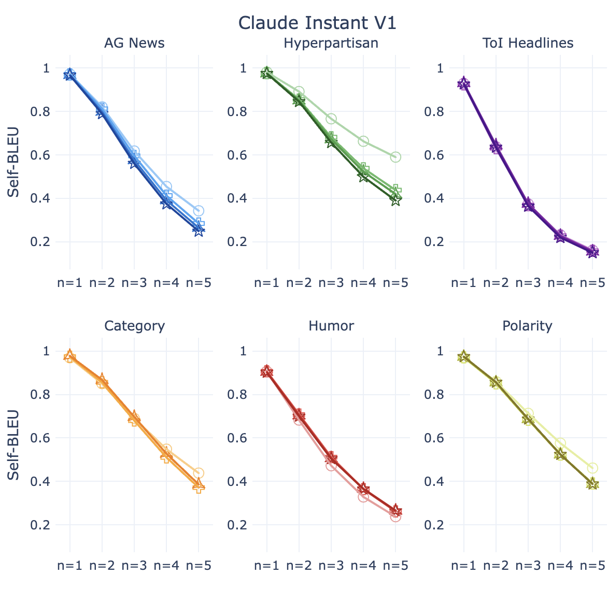

# SynthesizRR：借助检索增强技术，打造多样化数据集的生成器

发布时间：2024年05月16日

`RAG

这篇论文探讨了如何通过检索增强生成（Retrieval-Augmented Generation, RAG）的方法来改进大型语言模型（LLMs）在数据集合成任务中的表现，特别是在提高多样性和提升提炼性能方面。这种方法涉及使用LLM生成多样化的示例，并通过检索机制引入额外的信息来增强生成过程。因此，它与RAG的概念紧密相关，RAG是一种结合了检索和生成的方法，用于提高语言模型的性能。这篇论文并不直接涉及Agent的行为或LLM的理论基础，而是关注于LLM的应用，特别是通过RAG方法来改进数据集合成。因此，将其归类为RAG是合适的。` `机器学习`

> SynthesizRR: Generating Diverse Datasets with Retrieval Augmentation

# 摘要

> 大型语言模型（LLMs）的多功能性使其能够应对多种任务，但为了提高计算效率，我们通常希望将它们的能力浓缩到更小的学生模型中。对于分类任务，数据集合成是一种有效方法，它通过LLM生成每个标签的示例来实现。然而，传统的少样本提示方法存在重复、偏向流行实体和风格与人类文本不符的问题。为此，我们提出了SynthesizRR方法，通过检索增强引入多样性，使LLM能够生成更多样化的示例。我们研究了六个不同领域的数据集合成，发现SynthesizRR在提高词汇和语义多样性、增强与人类文本的相似性以及提升提炼性能方面，均优于传统的32次提示和六个基线方法。

> Large language models (LLMs) are versatile and can address many tasks, but for computational efficiency, it is often desirable to distill their capabilities into smaller student models. One way to do this for classification tasks is via dataset synthesis, which can be accomplished by generating examples of each label from the LLM. Prior approaches to synthesis use few-shot prompting, which relies on the LLM's parametric knowledge to generate usable examples. However, this leads to issues of repetition, bias towards popular entities, and stylistic differences from human text. In this work, we propose Synthesize by Retrieval and Refinement (SynthesizRR), which uses retrieval augmentation to introduce variety into the dataset synthesis process: as retrieved passages vary, the LLM is "seeded" with different content to generate its examples. We empirically study the synthesis of six datasets, covering topic classification, sentiment analysis, tone detection, and humor, requiring complex synthesis strategies. We find SynthesizRR greatly improves lexical and semantic diversity, similarity to human-written text, and distillation performance, when compared to standard 32-shot prompting and six baseline approaches.

[Arxiv](https://arxiv.org/abs/2405.10040)