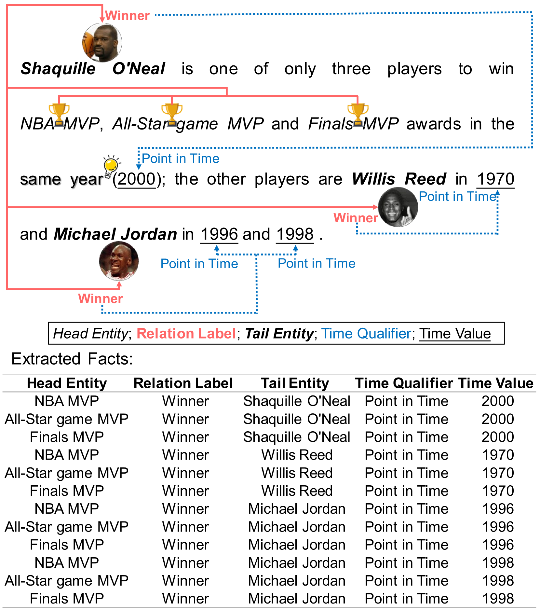
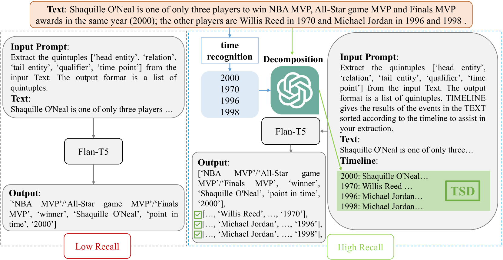

# 运用上下文学习的时间线句子分解技术，助力时间事实提取在这项研究中，我们提出了一种新颖的方法，即基于时间线的句子分解结合上下文学习，用于提取文本中的时间相关事实。通过这种方法，我们能够更准确地捕捉和理解文本中的时间信息，从而提高时间事实提取的效率和准确性。

发布时间：2024年05月16日

`LLM应用

这篇论文探讨了如何利用大型语言模型（LLMs）来提高从自然语言文本中提取时间事实的效率和准确性。它提出了一种新的方法，即基于时间线的句子分解策略，并引入了TSDRE方法来结合LLMs的分解能力和小型预训练语言模型（PLMs）的微调。这种方法的应用性质和对LLMs在特定任务（时间事实提取）中的应用，使得这篇论文适合归类于“LLM应用”类别。` `知识图谱`

> Timeline-based Sentence Decomposition with In-Context Learning for Temporal Fact Extraction

# 摘要

> 构建知识图谱的关键在于事实提取，而随着下游任务对时间事实的需求日益增长，时间事实提取成为新兴任务。本文聚焦于从自然语言文本中提取时间事实，指出以往研究在处理复杂句子中时间与事实对应关系方面的不足。为此，我们提出了一种基于时间线的句子分解策略，利用具有上下文学习的大型语言模型（LLMs），以确保对时间线的精细理解。尽管LLMs直接提取时间事实的性能不尽如人意，但我们引入了TSDRE方法，将LLMs的分解能力融入小型预训练语言模型（PLMs）的微调中。为了评估，我们创建了ComplexTRED数据集。实验结果显示，TSDRE在HyperRED-Temporal和ComplexTRED上均取得了领先成果。

> Facts extraction is pivotal for constructing knowledge graphs. Recently, the increasing demand for temporal facts in downstream tasks has led to the emergence of the task of temporal fact extraction. In this paper, we specifically address the extraction of temporal facts from natural language text. Previous studies fail to handle the challenge of establishing time-to-fact correspondences in complex sentences. To overcome this hurdle, we propose a timeline-based sentence decomposition strategy using large language models (LLMs) with in-context learning, ensuring a fine-grained understanding of the timeline associated with various facts. In addition, we evaluate the performance of LLMs for direct temporal fact extraction and get unsatisfactory results. To this end, we introduce TSDRE, a method that incorporates the decomposition capabilities of LLMs into the traditional fine-tuning of smaller pre-trained language models (PLMs). To support the evaluation, we construct ComplexTRED, a complex temporal fact extraction dataset. Our experiments show that TSDRE achieves state-of-the-art results on both HyperRED-Temporal and ComplexTRED datasets.

[Arxiv](https://arxiv.org/abs/2405.10288)