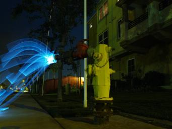
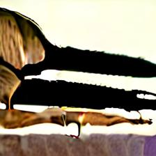

# UniRAG：赋能多模态大语言模型，实现通用检索增强在这项研究中，我们提出了UniRAG，这是一种创新的方法，旨在通过通用检索增强技术来提升多模态大型语言模型的性能。UniRAG不仅能够处理文本信息，还能够整合图像、视频等多种模态的数据，从而在理解和生成任务中展现出更强的能力。我们的方法通过智能检索和整合多源信息，使得模型能够更好地理解复杂的上下文，并在多模态环境中提供更准确的响应。

发布时间：2024年05月16日

`RAG

这篇论文介绍了UniRAG技术，这是一种与模型无关的方法，旨在通过在推理时将检索到的相关信息作为少样本示例融入提示中，来提升多模态大型语言模型（MM-LLMs）的输出质量。这种方法特别强调了检索增强（RA）在提升模型性能方面的有效性，不仅限于罕见实体，也适用于常见实体。因此，它与RAG（检索增强生成）的概念紧密相关，RAG是一种结合了检索和生成的方法，用于改进语言模型的性能。` `多模态学习` `人工智能辅助

解释：
- 多模态学习：论文中提到的MM-LLMs（多模态大型语言模型）表明该研究涉及处理多种类型的数据（如文本和图像）` `这是多模态学习领域的特点。
- 人工智能辅助：UniRAG技术旨在提升模型的输出质量` `通过检索增强来辅助模型推理` `这表明该技术可以用于辅助各种人工智能应用` `尤其是在需要高质量输出的场景中。`

> UniRAG: Universal Retrieval Augmentation for Multi-Modal Large Language Models

# 摘要

> 近期，多模态大型语言模型（MM-LLMs）在处理复杂任务方面取得了突破，这些任务需要模型具备多模态理解和生成能力，如图像标注和视觉问答。为了提升MM-LLMs的输出质量，我们推出了UniRAG技术，这是一种与模型无关的方法，它能在推理时将检索到的相关信息作为少样本示例融入提示中。我们的研究结果挑战了检索增强（RA）仅对罕见实体有效的主流观点，在MSCOCO数据集上，即使是常见实体，GPT4、Gemini-Pro等专有模型以及Llava、LaVIT、Emu2等开源模型，在输入提示经过UniIR模型检索增强后，其生成质量均有显著提升。

> Recently, Multi-Modal(MM) Large Language Models(LLMs) have unlocked many complex use-cases that require MM understanding (e.g., image captioning or visual question answering) and MM generation (e.g., text-guided image generation or editing) capabilities. To further improve the output fidelity of MM-LLMs we introduce the model-agnostic UniRAG technique that adds relevant retrieved information to prompts as few-shot examples during inference. Unlike the common belief that Retrieval Augmentation (RA) mainly improves generation or understanding of uncommon entities, our evaluation results on the MSCOCO dataset with common entities show that both proprietary models like GPT4 and Gemini-Pro and smaller open-source models like Llava, LaVIT, and Emu2 significantly enhance their generation quality when their input prompts are augmented with relevant information retrieved by MM retrievers like UniIR models.

[Arxiv](https://arxiv.org/abs/2405.10311)