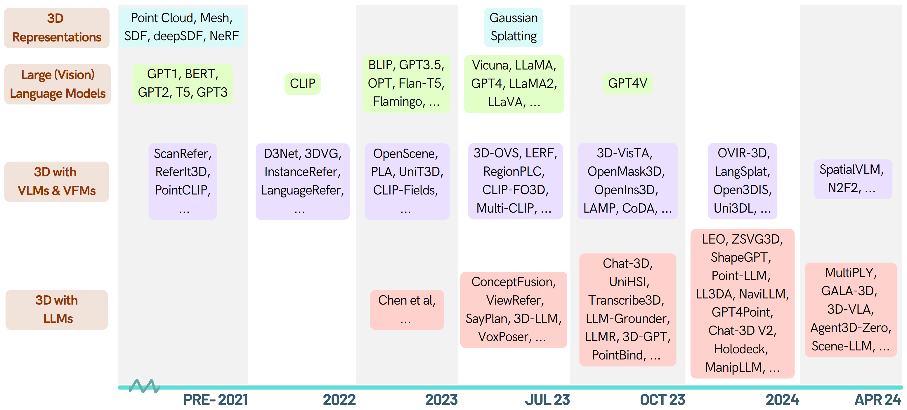
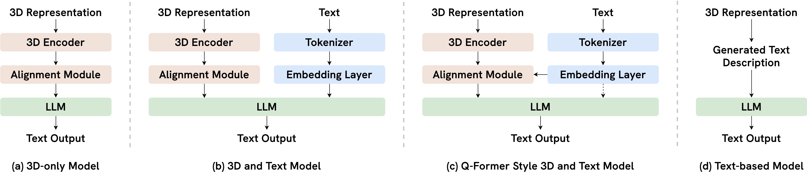
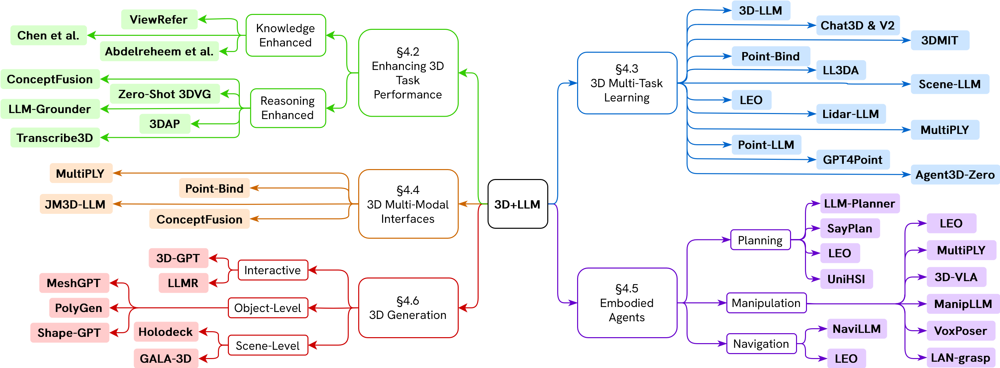
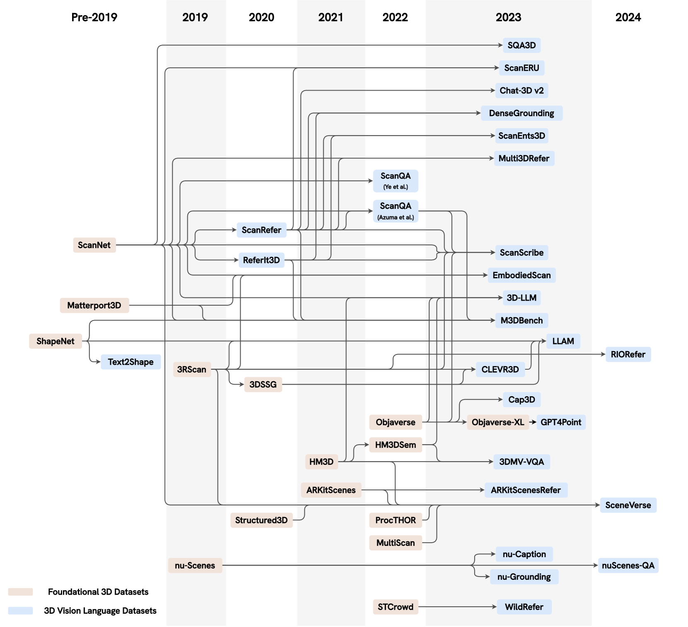

# 大型语言模型探索3D世界：多模态大型语言模型在3D任务领域的调查与深度分析

发布时间：2024年05月16日

`Agent

这篇论文主要探讨了大型语言模型（LLMs）与3D空间数据的融合，即3D-LLMs，并强调了它们在提升具身AI系统空间智能方面的潜力。论文讨论了LLMs在处理、理解和生成3D数据方面的应用，包括3D场景理解、标题生成、问答和对话等任务，以及基于LLM的智能体在空间推理、规划和导航中的应用。这些内容与Agent分类相关，因为它们涉及到了智能体在3D环境中的行为和决策过程。虽然论文也提到了LLMs的理论优势，如上下文学习、逐步推理、开放词汇能力及丰富世界知识，但其重点在于LLMs在3D环境中的应用和智能体的实际操作，因此更适合归类于Agent。` `人工智能` `三维视觉`

> When LLMs step into the 3D World: A Survey and Meta-Analysis of 3D Tasks via Multi-modal Large Language Models

# 摘要

> 随着大型语言模型（LLMs）的演进，它们与3D空间数据的融合（3D-LLMs）正迅速发展，为理解和与物理世界的互动开辟了新天地。本综述全面概述了使LLMs能够处理、理解和生成3D数据的方法，强调了LLMs在上下文学习、逐步推理、开放词汇能力及丰富世界知识方面的独特优势，并指出它们在提升具身AI系统空间智能方面的巨大潜力。我们的研究跨越了从点云到神经辐射场（NeRFs）的多种3D数据表示，探讨了它们与LLMs的结合，应用于3D场景理解、标题生成、问答和对话等任务，以及基于LLM的智能体在空间推理、规划和导航中的应用。此外，本文简要回顾了其他3D与语言结合的方法。元分析揭示了显著进展，同时强调了开发新方法以充分挖掘3D-LLMs潜力的必要性。因此，本文旨在为未来研究指明方向，探索并拓展3D-LLMs在理解和与复杂3D世界互动方面的能力。为支持此综述，我们创建了一个项目页面，整理并列出了相关论文：https://github.com/ActiveVisionLab/Awesome-LLM-3D。

> As large language models (LLMs) evolve, their integration with 3D spatial data (3D-LLMs) has seen rapid progress, offering unprecedented capabilities for understanding and interacting with physical spaces. This survey provides a comprehensive overview of the methodologies enabling LLMs to process, understand, and generate 3D data. Highlighting the unique advantages of LLMs, such as in-context learning, step-by-step reasoning, open-vocabulary capabilities, and extensive world knowledge, we underscore their potential to significantly advance spatial comprehension and interaction within embodied Artificial Intelligence (AI) systems. Our investigation spans various 3D data representations, from point clouds to Neural Radiance Fields (NeRFs). It examines their integration with LLMs for tasks such as 3D scene understanding, captioning, question-answering, and dialogue, as well as LLM-based agents for spatial reasoning, planning, and navigation. The paper also includes a brief review of other methods that integrate 3D and language. The meta-analysis presented in this paper reveals significant progress yet underscores the necessity for novel approaches to harness the full potential of 3D-LLMs. Hence, with this paper, we aim to chart a course for future research that explores and expands the capabilities of 3D-LLMs in understanding and interacting with the complex 3D world. To support this survey, we have established a project page where papers related to our topic are organized and listed: https://github.com/ActiveVisionLab/Awesome-LLM-3D.

[Arxiv](https://arxiv.org/abs/2405.10255)