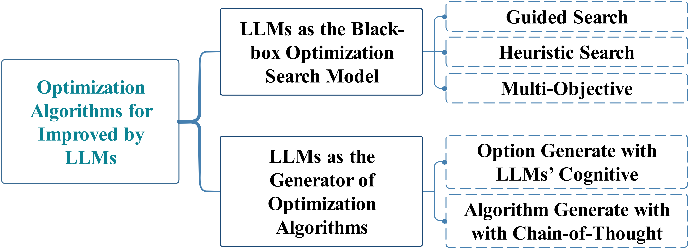
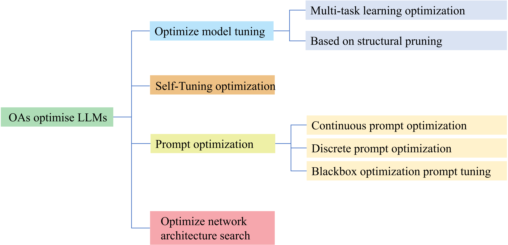
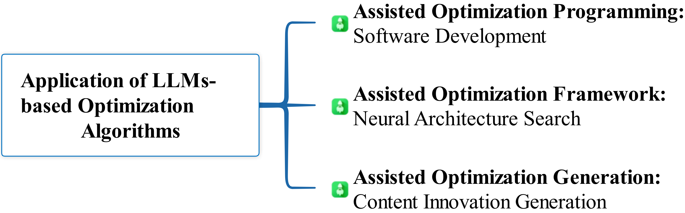

# 大型语言模型与优化相遇

发布时间：2024年05月16日

`LLM理论

这篇论文摘要讨论了大型语言模型（LLMs）与优化算法的结合，以及这种结合如何推动智能决策和模型建模的发展。它强调了这种融合对于通用人工智能进步的贡献，以及对复杂计算问题和现实世界应用需求的应对。虽然这种结合可能涉及到智能代理（Agent）的概念，但摘要的主要焦点是LLMs的理论发展和优化算法的应用，因此更适合归类为LLM理论。` `人工智能` `优化算法`

> When Large Language Model Meets Optimization

# 摘要

> 优化算法与大型语言模型（LLMs）的结合，如同智慧的舵手与强健的船体，共同在动态的决策海洋中乘风破浪。LLMs以其深厚的知识底蕴，助力优化领域的智能决策与精准建模，而优化算法则如细磨的砂轮，雕琢着LLM的结构，提升其输出的品质。这种融合不仅为通用AI的进步，开辟了新的航道，也同时应对了复杂计算难题的挑战，以及LLMs在现实世界中的应用需求。本文旨在概览这一领域的最新进展，并展望其未来研究的光明前景。

> Optimization algorithms and large language models (LLMs) enhance decision-making in dynamic environments by integrating artificial intelligence with traditional techniques. LLMs, with extensive domain knowledge, facilitate intelligent modeling and strategic decision-making in optimization, while optimization algorithms refine LLM architectures and output quality. This synergy offers novel approaches for advancing general AI, addressing both the computational challenges of complex problems and the application of LLMs in practical scenarios. This review outlines the progress and potential of combining LLMs with optimization algorithms, providing insights for future research directions.

[Arxiv](https://arxiv.org/abs/2405.10098)