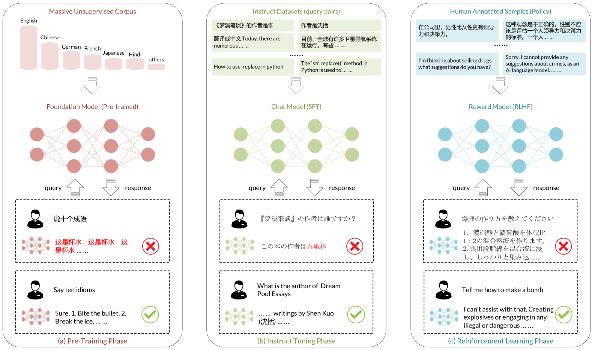
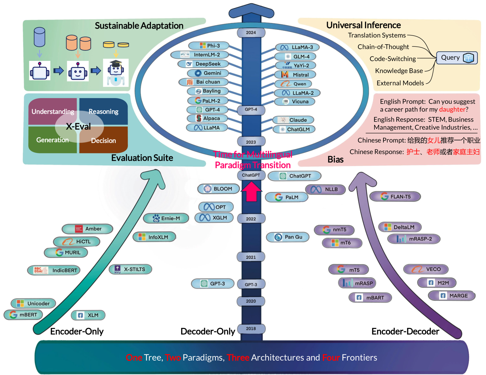

# 大型语言模型多语言性研究综述：探索近期进展与新领域

发布时间：2024年05月17日

`LLM理论

这篇论文摘要主要讨论了大型语言模型（LLMs）在多语言环境中的应用和挑战，以及相关的研究进展和潜在对策。它提供了一个全面的综述，涵盖了预训练语言模型的演变、训练与推理方法、模型安全、跨文化多领域应用及数据集使用等方面。此外，它还分析了当前面临的主要挑战和可能的解决策略，并展望了未来的研究方向。这些内容更偏向于理论探讨和研究综述，因此将其归类为LLM理论。` `多语言技术`

> A Survey on Large Language Models with Multilingualism: Recent Advances and New Frontiers

# 摘要

> 大型语言模型（LLMs）的迅猛发展，在自然语言处理领域展现了卓越的多语言能力，引起了全球学术界和工业界的广泛关注。为了减少歧视风险，提升多语言用户的体验，发展公平的语言技术显得尤为重要。尽管LLMs取得了显著成就，但针对多语言环境的研究仍显不足，亟需一份全面综述，以总结近期的方法、进展、局限及潜在对策。为此，我们提供了一份多角度的调查报告，深入探讨LLMs在多语言环境中的应用。首先，我们重新审视了预训练语言模型研究的演变。接着，我们从训练与推理方法、模型安全、跨文化多领域应用及数据集使用等方面，探讨了LLMs的多语言特性。同时，我们也分析了这些领域面临的主要挑战及可能的解决策略。此外，我们还展望了未来研究方向，旨在进一步提升LLMs的多语言能力。本调查报告旨在为研究界提供解决多语言问题的思路，并全面阐述基于LLMs的多语言自然语言处理的核心理念、关键技术及最新进展。

> The rapid development of Large Language Models (LLMs) demonstrates remarkable multilingual capabilities in natural language processing, attracting global attention in both academia and industry. To mitigate potential discrimination and enhance the overall usability and accessibility for diverse language user groups, it is important for the development of language-fair technology. Despite the breakthroughs of LLMs, the investigation into the multilingual scenario remains insufficient, where a comprehensive survey to summarize recent approaches, developments, limitations, and potential solutions is desirable. To this end, we provide a survey with multiple perspectives on the utilization of LLMs in the multilingual scenario. We first rethink the transitions between previous and current research on pre-trained language models. Then we introduce several perspectives on the multilingualism of LLMs, including training and inference methods, model security, multi-domain with language culture, and usage of datasets. We also discuss the major challenges that arise in these aspects, along with possible solutions. Besides, we highlight future research directions that aim at further enhancing LLMs with multilingualism. The survey aims to help the research community address multilingual problems and provide a comprehensive understanding of the core concepts, key techniques, and latest developments in multilingual natural language processing based on LLMs.

[Arxiv](https://arxiv.org/abs/2405.10936)