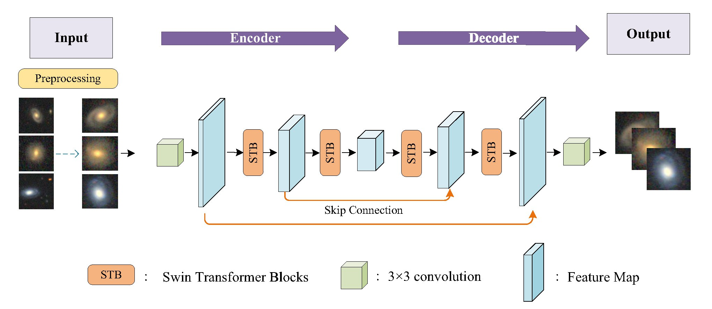
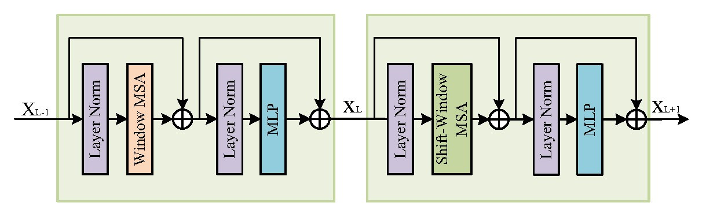
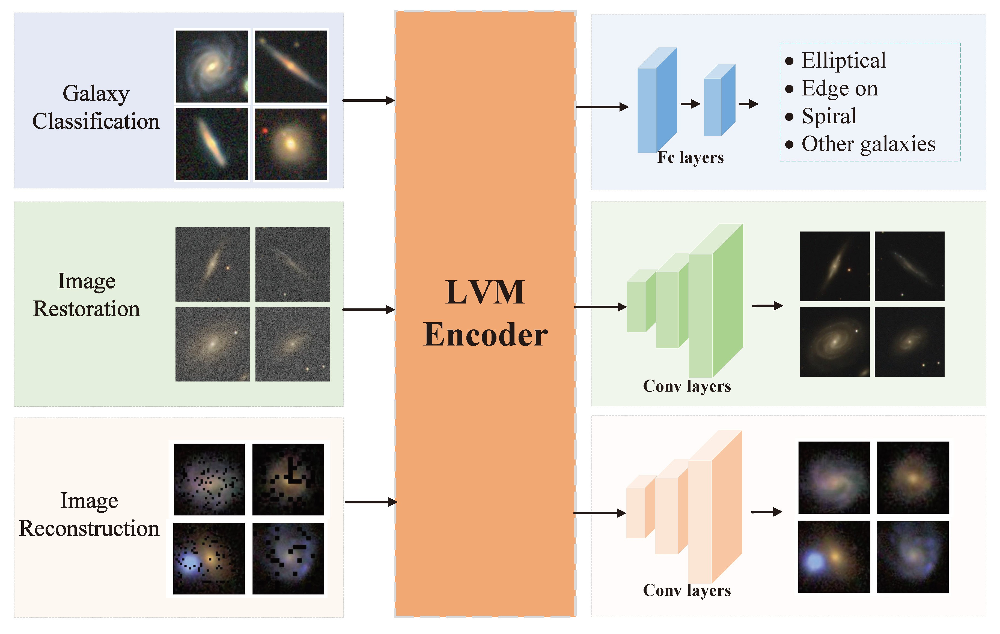
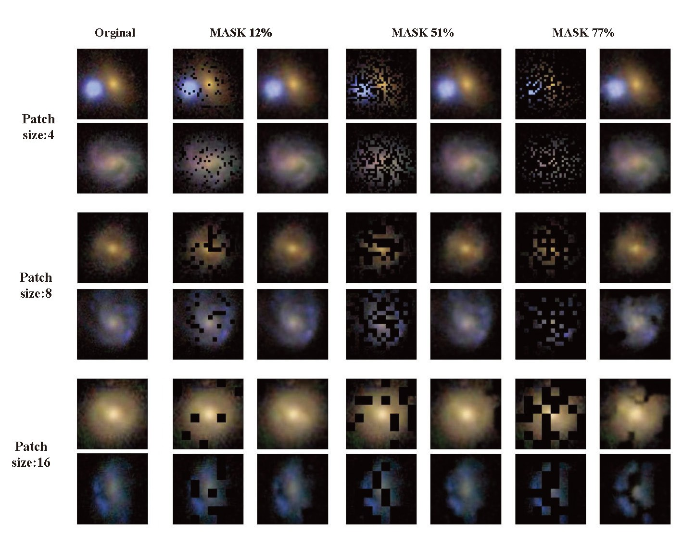
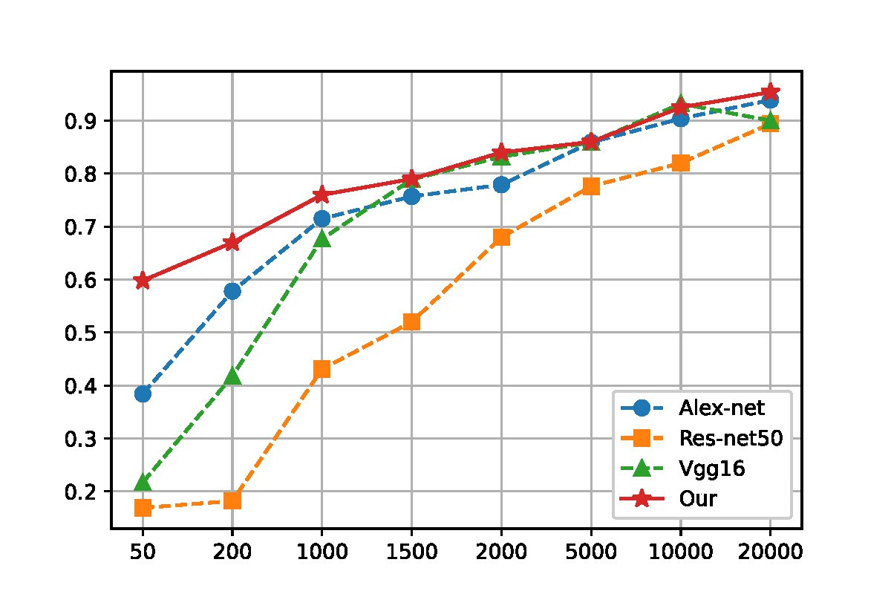
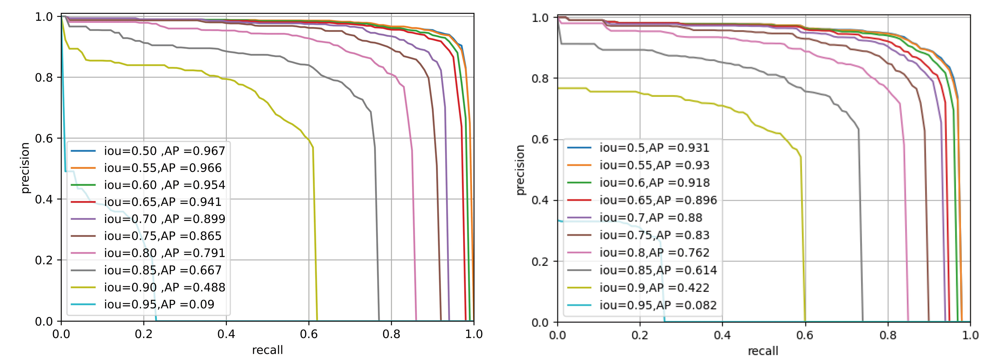
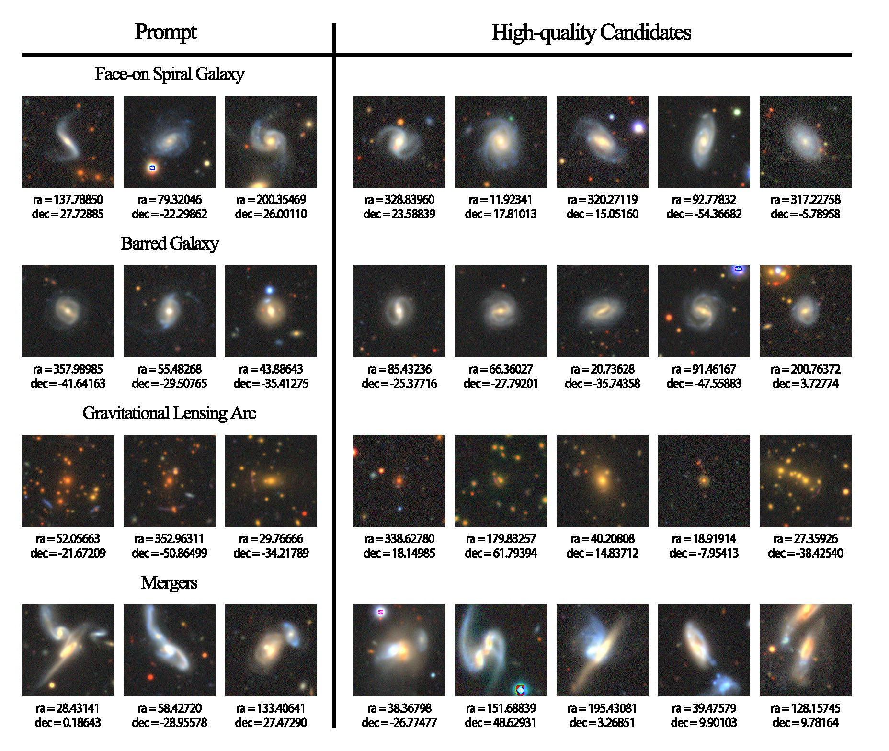
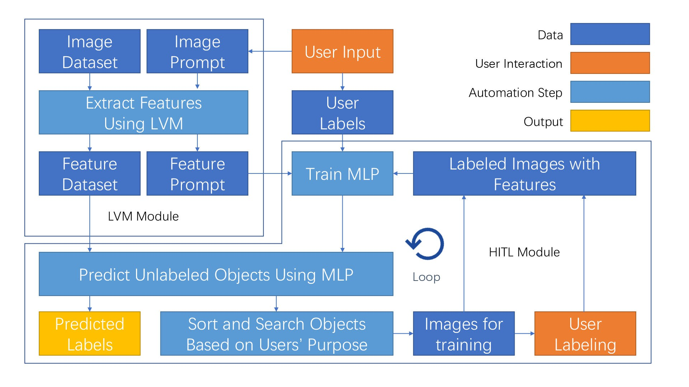
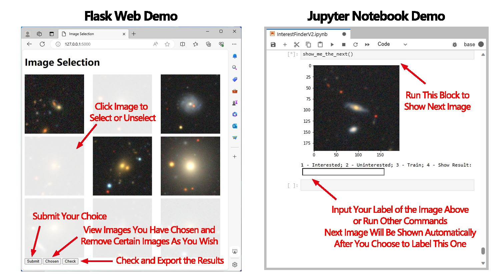
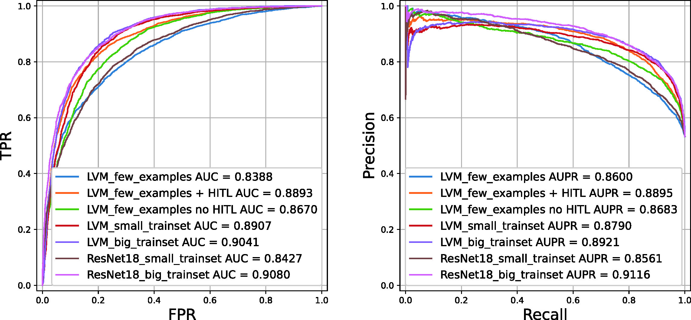

# 本研究提出了一种灵活的框架，通过在大规模视觉模型中引入人机交互，以分析星系图像数据。

发布时间：2024年05月17日

`Agent

理由：这篇论文介绍了一个基于大型视觉模型（LVM）与下游任务（DST）的星系图像通用分析框架，该框架通过引入人机交互（HITL）模块，利用人类智慧提升图像处理的可靠性与可解释性。这种结合了机器学习和人类智能的系统可以被视为一个智能代理（Agent），它能够处理复杂的任务并适应不同的环境。因此，这篇论文更适合归类为Agent。` `天文学` `数据分析`

> A Versatile Framework for Analyzing Galaxy Image Data by Implanting Human-in-the-loop on a Large Vision Model

# 摘要

> 天文数据的爆炸性增长为人类探索宇宙提供了新机遇，但如何高效分析这些海量数据却是一大挑战。天文学家正利用深度学习技术应对，但这些方法因受限于特定训练集而产生大量重复劳动。为此，我们开发了一个基于大型视觉模型（LVM）与下游任务（DST）的星系图像通用分析框架，涵盖形态分类、图像修复、目标检测等多项任务。鉴于星系图像信噪比低及类别分布不均，我们引入了人机交互（HITL）模块，以人类智慧提升图像处理的可靠性与可解释性。该框架在DESI遗产成像调查的星系图像上展现了出色的少样本学习能力和广泛的任务适应性。例如，在目标检测上，我们的DST结合LVM，仅用1000个样本就达到了96.7%的准确率，远超ResNet50与Mask R-CNN的93.1%；在形态分类上，为达到约0.9的AUC，所需训练集仅为ResNet18的1/50。此外，多模态数据的整合预示着跨领域数据集联合分析的新时代，为多信息天文学的发展带来无限可能。

> The exponential growth of astronomical datasets provides an unprecedented opportunity for humans to gain insight into the Universe. However, effectively analyzing this vast amount of data poses a significant challenge. Astronomers are turning to deep learning techniques to address this, but the methods are limited by their specific training sets, leading to considerable duplicate workloads too. Hence, as an example to present how to overcome the issue, we built a framework for general analysis of galaxy images, based on a large vision model (LVM) plus downstream tasks (DST), including galaxy morphological classification, image restoration, object detection, parameter extraction, and more. Considering the low signal-to-noise ratio of galaxy images and the imbalanced distribution of galaxy categories, we have incorporated a Human-in-the-loop (HITL) module into our large vision model, which leverages human knowledge to enhance the reliability and interpretability of processing galaxy images interactively. The proposed framework exhibits notable few-shot learning capabilities and versatile adaptability to all the abovementioned tasks on galaxy images in the DESI legacy imaging surveys. Expressly, for object detection, trained by 1000 data points, our DST upon the LVM achieves an accuracy of 96.7%, while ResNet50 plus Mask R-CNN gives an accuracy of 93.1%; for morphology classification, to obtain AUC ~0.9, LVM plus DST and HITL only requests 1/50 training sets compared to ResNet18. Expectedly, multimodal data can be integrated similarly, which opens up possibilities for conducting joint analyses with datasets spanning diverse domains in the era of multi-message astronomy.

[Arxiv](https://arxiv.org/abs/2405.10890)