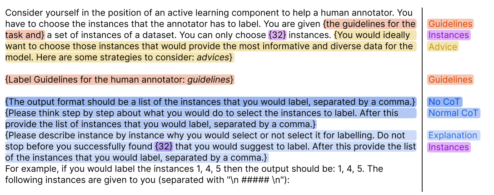
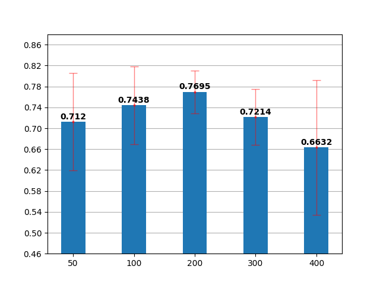
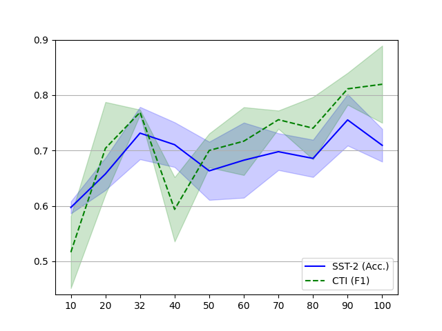
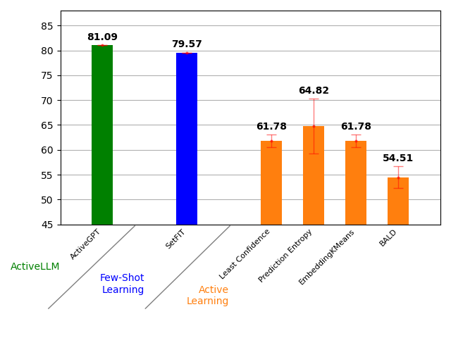
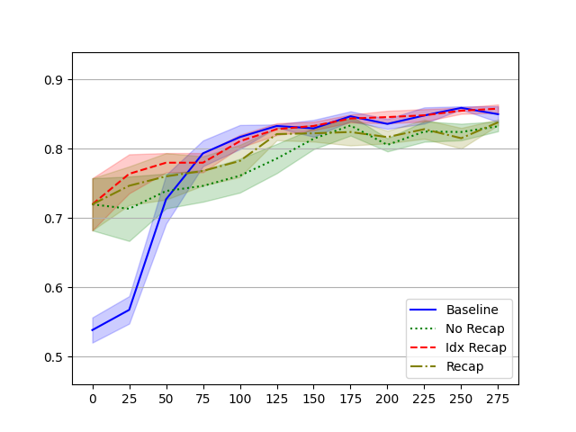
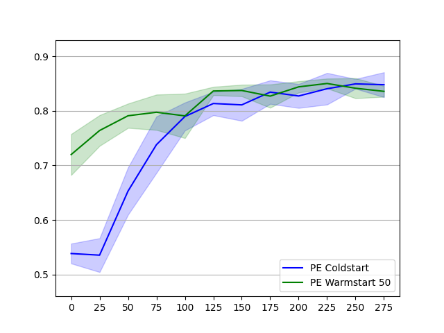
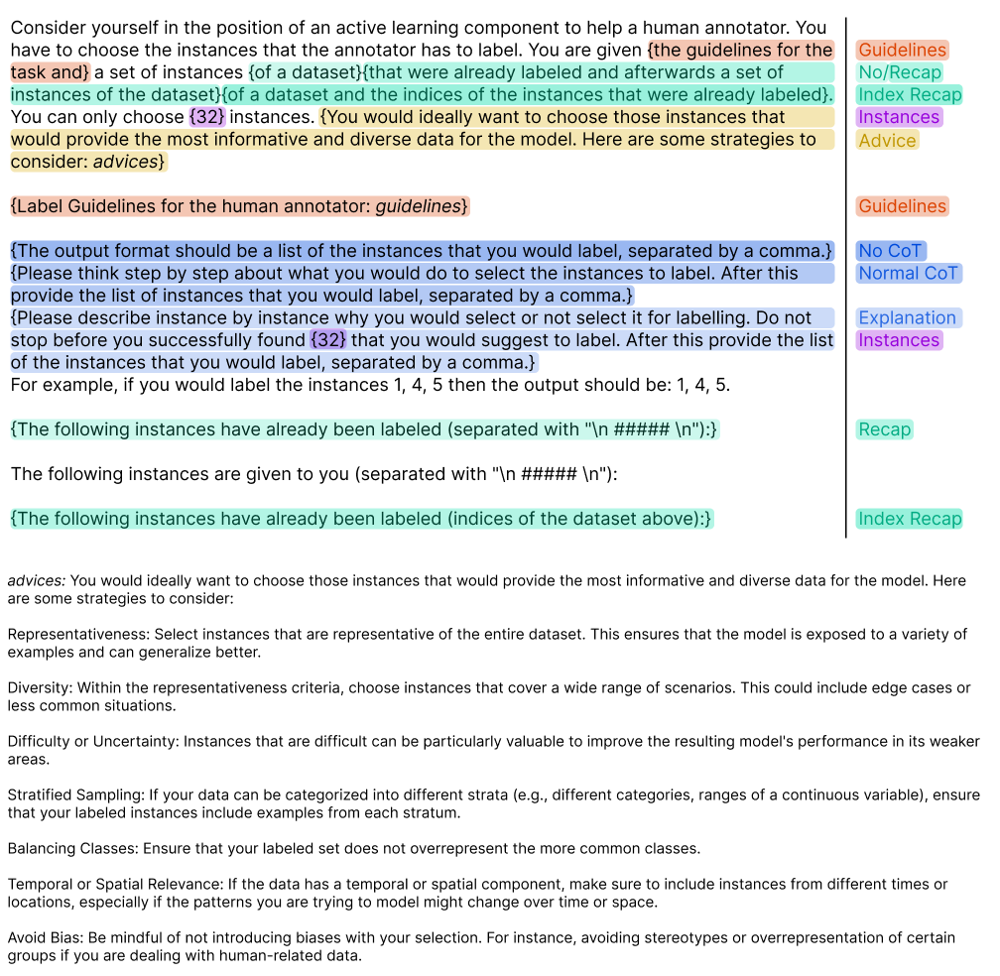

# ActiveLLM：大型语言模型驱动的主动学习，专为文本少量样本场景设计

发布时间：2024年05月17日

`Agent

理由：这篇论文介绍了一种名为ActiveLLM的新方法，它利用大型语言模型（如GPT-4、Llama 3和Mistral Large）来选择关键的学习实例，以提高主动学习的效果。这种方法涉及到使用智能代理（Agent）来优化学习过程，因此归类为Agent。虽然它也涉及到大型语言模型的应用，但主要关注点是通过这些模型作为工具来优化学习策略，而不是直接探讨LLM的理论或应用。` `机器学习`

> ActiveLLM: Large Language Model-based Active Learning for Textual Few-Shot Scenarios

# 摘要

> 主动学习通过优先处理关键实例来减少标注负担，但许多策略在初期因数据不足而效果不佳。针对这一挑战，我们推出了ActiveLLM，一种利用GPT-4、Llama 3和Mistral Large等大型语言模型的新方法，用于精准挑选学习实例。实验证明，ActiveLLM在少量样本条件下大幅提升了BERT分类器的性能，超越了传统方法和SetFit。不仅如此，ActiveLLM还适用于多样的学习场景，并能助力其他策略克服初期的数据瓶颈。我们的研究揭示，ActiveLLM是提升模型性能的强大工具，适用于多种学习环境。

> Active learning is designed to minimize annotation efforts by prioritizing instances that most enhance learning. However, many active learning strategies struggle with a 'cold start' problem, needing substantial initial data to be effective. This limitation often reduces their utility for pre-trained models, which already perform well in few-shot scenarios. To address this, we introduce ActiveLLM, a novel active learning approach that leverages large language models such as GPT-4, Llama 3, and Mistral Large for selecting instances. We demonstrate that ActiveLLM significantly enhances the classification performance of BERT classifiers in few-shot scenarios, outperforming both traditional active learning methods and the few-shot learning method SetFit. Additionally, ActiveLLM can be extended to non-few-shot scenarios, allowing for iterative selections. In this way, ActiveLLM can even help other active learning strategies to overcome their cold start problem. Our results suggest that ActiveLLM offers a promising solution for improving model performance across various learning setups.

[Arxiv](https://arxiv.org/abs/2405.10808)