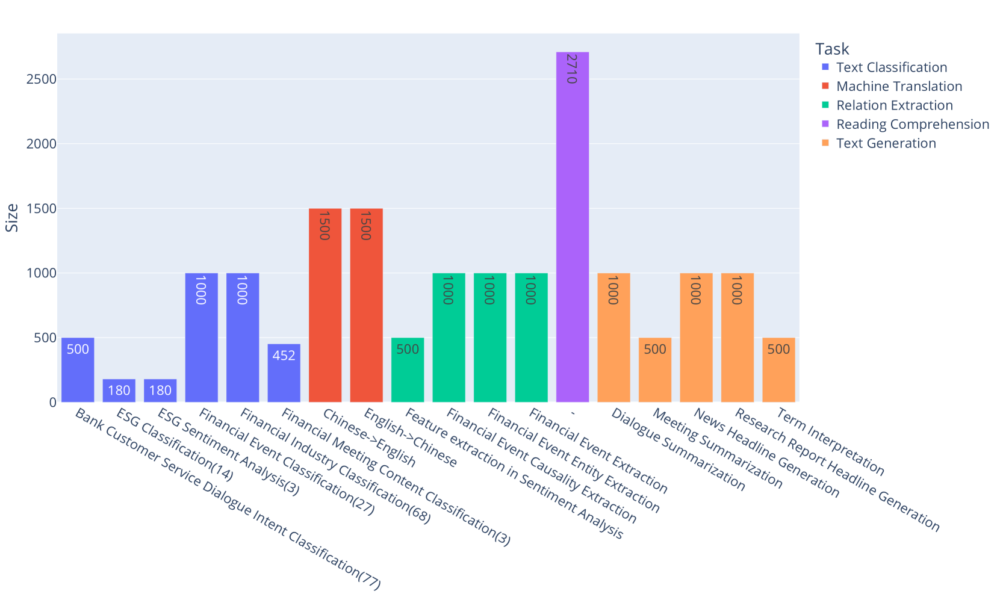
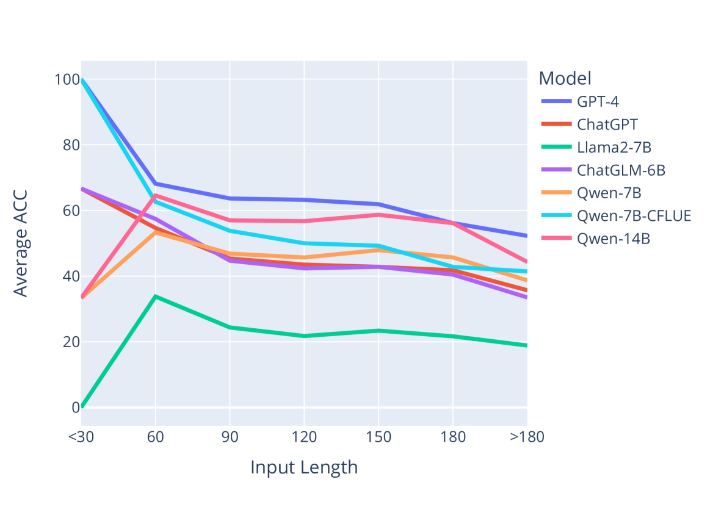

# 大型语言模型在中文金融语言理解评估数据集CFLUE上的性能基准测试。

发布时间：2024年05月17日

`LLM应用

理由：这篇论文介绍了CFLUE——一个专门为评估大型语言模型（LLMs）在中文金融领域的性能而设计的新评估基准。它包含了多个数据集和任务，旨在全面测试LLMs的能力，并提供了实际的评估结果。这种类型的研究直接应用于LLMs的性能评估和改进，属于LLM应用的范畴。`

> Benchmarking Large Language Models on CFLUE -- A Chinese Financial Language Understanding Evaluation Dataset

# 摘要

> 随着大型语言模型（LLMs）在自然语言处理（NLP）领域的革新，我们急需新的评估基准以跟上LLMs的迅猛发展。为此，我们推出了CFLUE——中文金融语言理解评估基准，专门设计来全面检验LLMs的能力。CFLUE包含两大数据集：知识评估集和应用评估集。知识评估集提供超过38,000道选择题及其解析，旨在同时测试答案预测和问题推理能力。应用评估集则覆盖16,000多个实例，涉及文本分类、机器翻译等多种NLP任务。通过CFLUE的评估，我们发现仅有GPT-4和GPT-4-turbo在知识评估中达到60%以上的准确率，显示出LLMs仍有巨大提升空间。在应用评估中，虽然GPT-4和GPT-4-turbo表现最佳，但它们与轻量级LLMs的差距已显著缩小。CFLUE的所有资源均可在https://github.com/aliyun/cflue免费获取。

> In light of recent breakthroughs in large language models (LLMs) that have revolutionized natural language processing (NLP), there is an urgent need for new benchmarks to keep pace with the fast development of LLMs. In this paper, we propose CFLUE, the Chinese Financial Language Understanding Evaluation benchmark, designed to assess the capability of LLMs across various dimensions. Specifically, CFLUE provides datasets tailored for both knowledge assessment and application assessment. In knowledge assessment, it consists of 38K+ multiple-choice questions with associated solution explanations. These questions serve dual purposes: answer prediction and question reasoning. In application assessment, CFLUE features 16K+ test instances across distinct groups of NLP tasks such as text classification, machine translation, relation extraction, reading comprehension, and text generation. Upon CFLUE, we conduct a thorough evaluation of representative LLMs. The results reveal that only GPT-4 and GPT-4-turbo achieve an accuracy exceeding 60\% in answer prediction for knowledge assessment, suggesting that there is still substantial room for improvement in current LLMs. In application assessment, although GPT-4 and GPT-4-turbo are the top two performers, their considerable advantage over lightweight LLMs is noticeably diminished. The datasets and scripts associated with CFLUE are openly accessible at https://github.com/aliyun/cflue.

[Arxiv](https://arxiv.org/abs/2405.10542)