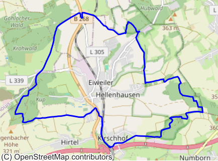
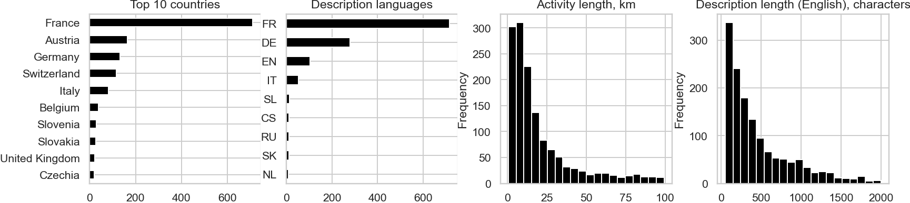

# CC-GPX：挖掘Common Crawl中的宝藏——高质量地理空间数据标注

发布时间：2024年05月17日

`Agent

理由：这篇论文介绍了一种从Common Crawl语料库中提取地理空间数据的方法，并创建了一个多模态数据集。这种方法和数据集的创建涉及到数据处理和模型开发，这些都是Agent（代理）领域的典型活动。虽然这项工作可能间接支持大型语言模型（LLM）的训练，但其主要关注点是数据提取和处理，而不是直接涉及LLM的理论或应用。因此，将其归类为Agent更为合适。` `地理信息系统` `户外活动`

> CC-GPX: Extracting High-Quality Annotated Geospatial Data from Common Crawl

# 摘要

> Common Crawl (CC) 语料库，作为最大的开放网络数据集，自2008年起已积累超过9.5 PB的数据，对大型语言模型的训练至关重要。尽管其内容已被研究并提炼为特定领域的数据集，但据我们所知，尚未有研究专门探讨其作为地理空间数据源的潜力。本文介绍了一种高效方法，从CC中的GPX文件提取用户生成的带注释轨迹，并创建了一个包含1,416对人类描述与矢量数据的多模态数据集。此数据集不仅揭示了人们的户外活动模式，还反映了他们描述户外经历的语言，为轨迹生成和注释模型的开发提供了宝贵资源。

> The Common Crawl (CC) corpus is the largest open web crawl dataset containing 9.5+ petabytes of data captured since 2008. The dataset is instrumental in training large language models, and as such it has been studied for (un)desirable content, and distilled for smaller, domain-specific datasets. However, to our knowledge, no research has been dedicated to using CC as a source of annotated geospatial data. In this paper, we introduce an efficient pipeline to extract annotated user-generated tracks from GPX files found in CC, and the resulting multimodal dataset with 1,416 pairings of human-written descriptions and MultiLineString vector data. The dataset can be used to study people's outdoor activity patterns, the way people talk about their outdoor experiences, and for developing trajectory generation or track annotation models.

[Arxiv](https://arxiv.org/abs/2405.11039)