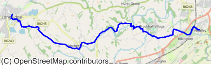

# CC-GPX：挖掘Common Crawl，提炼精准地理标注数据

发布时间：2024年05月17日

`Agent

理由：这篇论文主要探讨了如何从Common Crawl语料库中提取和利用地理空间数据，以创建一个多模态数据集，用于分析人们的户外活动模式和叙述方式。这个过程涉及到数据提取、处理和应用，更偏向于构建和使用数据集来支持特定的应用场景，如轨迹生成和注释模型的开发。这与Agent相关的研究领域相符，因为Agent通常涉及到数据处理和应用，以实现特定的任务或目标。` `地理信息系统` `户外活动`

> CC-GPX: Extracting High-Quality Annotated Geospatial Data from Common Crawl

# 摘要

> Common Crawl (CC) 语料库，作为最大的开放网络数据集，自2008年起已积累逾9.5拍字节的数据，对大型语言模型的训练至关重要。尽管其内容已被评估并精炼为特定领域的数据集，但据我们所知，尚未有研究专门探讨CC作为地理空间数据注释源的潜力。本文提出了一种高效流程，从CC中的GPX文件提取用户生成的带注释轨迹，并创建了一个包含1,416对人类描述与矢量数据的多模态数据集。此数据集不仅揭示了人们的户外活动模式，还反映了人们如何叙述户外经历，同时为轨迹生成和注释模型的开发提供了宝贵资源。

> The Common Crawl (CC) corpus is the largest open web crawl dataset containing 9.5+ petabytes of data captured since 2008. The dataset is instrumental in training large language models, and as such it has been studied for (un)desirable content, and distilled for smaller, domain-specific datasets. However, to our knowledge, no research has been dedicated to using CC as a source of annotated geospatial data. In this paper, we introduce an efficient pipeline to extract annotated user-generated tracks from GPX files found in CC, and the resulting multimodal dataset with 1,416 pairings of human-written descriptions and MultiLineString vector data. The dataset can be used to study people's outdoor activity patterns, the way people talk about their outdoor experiences, and for developing trajectory generation or track annotation models.

[Arxiv](https://arxiv.org/abs/2405.11039)