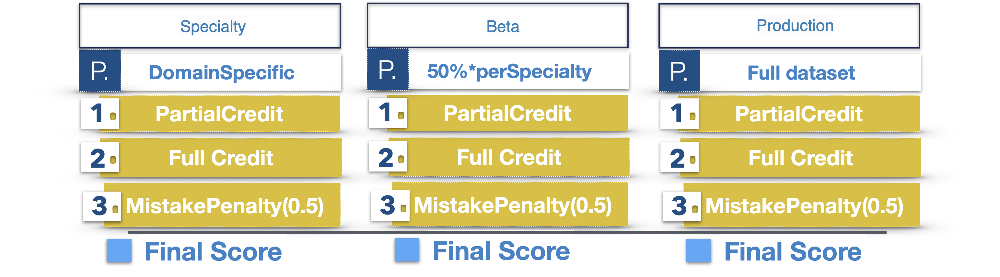

# COGNET-MD，专为医学领域大型语言模型基准设计的评估框架与数据集

发布时间：2024年05月17日

`LLM应用

这篇论文介绍了医学领域的认知网络评估工具包（COGNET-MD），这是一个专门用于评估大型语言模型（LLMs）解读医学文本能力的评估基准。它提出了一种难度递增的评分框架，并附带了一个由医学专家构建的多选题数据库，涵盖多个医学领域。这表明该论文关注的是LLM在特定领域（医学）的应用，因此应归类为LLM应用。` `人工智能评估`

> COGNET-MD, an evaluation framework and dataset for Large Language Model benchmarks in the medical domain

# 摘要

> 大型语言模型（LLMs）作为一项前沿的人工智能技术，正迅速发展，并有望在医学诊断中发挥作用，无论是辅助医生还是模拟复杂的医生工作流程。本文介绍了医学领域的认知网络评估工具包（COGNET-MD），这是一个创新的LLM评估基准。我们提出了一种难度递增的评分框架，专门用于评估LLMs解读医学文本的能力，并附带了一个由多位医学专家合作构建的多选题数据库，涵盖了精神病学、牙科学、肺科学、皮肤病学和内分泌学等领域，并将不断扩展以纳入更多医学领域，确保与当前医学趋势同步，提升其安全性、实用性和适用性。

> Large Language Models (LLMs) constitute a breakthrough state-of-the-art Artificial Intelligence (AI) technology which is rapidly evolving and promises to aid in medical diagnosis either by assisting doctors or by simulating a doctor's workflow in more advanced and complex implementations. In this technical paper, we outline Cognitive Network Evaluation Toolkit for Medical Domains (COGNET-MD), which constitutes a novel benchmark for LLM evaluation in the medical domain. Specifically, we propose a scoring-framework with increased difficulty to assess the ability of LLMs in interpreting medical text. The proposed framework is accompanied with a database of Multiple Choice Quizzes (MCQs). To ensure alignment with current medical trends and enhance safety, usefulness, and applicability, these MCQs have been constructed in collaboration with several associated medical experts in various medical domains and are characterized by varying degrees of difficulty. The current (first) version of the database includes the medical domains of Psychiatry, Dentistry, Pulmonology, Dermatology and Endocrinology, but it will be continuously extended and expanded to include additional medical domains.

[Arxiv](https://arxiv.org/abs/2405.10893)