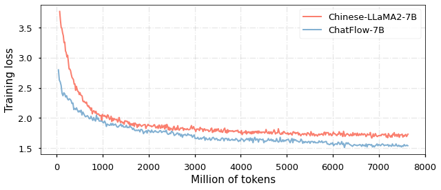
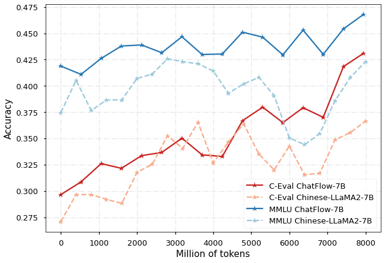
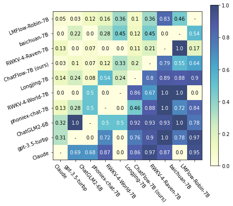

# 大型语言模型中跨语言迁移学习的动态数据采样策略

发布时间：2024年05月17日

`LLM应用

这篇论文介绍了一种名为ChatFlow的新型大型语言模型（LLM），它利用跨语言迁移技术来经济高效地训练大型中文语言模型。论文中提到的关键技术包括混合使用中文、英文及并行语料库，以及动态数据采样技术，这些都是为了优化模型性能并促进知识向中文模型的转移。这些内容表明该论文主要关注于LLM的实际应用，特别是在跨语言环境下的模型训练和优化，因此将其归类为LLM应用。` `跨语言技术`

> Dynamic data sampler for cross-language transfer learning in large language models

# 摘要

> 大型语言模型（LLMs）在NLP领域因其广泛应用而备受瞩目，但为非英语语言训练这些模型却困难重重，主要是因为获取大规模语料库和计算资源不易。为此，我们提出了ChatFlow，一种基于跨语言迁移的LLM，旨在经济高效地训练大型中文语言模型。我们通过混合使用中文、英文及并行语料库，持续优化LLaMA2模型，以期实现跨语言表示的对齐，并促进知识向中文模型的转移。同时，我们采用动态数据采样技术，引导模型从无监督预训练平稳过渡到有监督微调。实验证明，这一策略不仅加速了模型收敛，还显著提升了性能。在多个中文和英文基准测试中，ChatFlow的表现超越了其他基于LLaMA-2-7B后训练的中文模型。

> Large Language Models (LLMs) have gained significant attention in the field of natural language processing (NLP) due to their wide range of applications. However, training LLMs for languages other than English poses significant challenges, due to the difficulty in acquiring large-scale corpus and the requisite computing resources. In this paper, we propose ChatFlow, a cross-language transfer-based LLM, to address these challenges and train large Chinese language models in a cost-effective manner. We employ a mix of Chinese, English, and parallel corpus to continuously train the LLaMA2 model, aiming to align cross-language representations and facilitate the knowledge transfer specifically to the Chinese language model. In addition, we use a dynamic data sampler to progressively transition the model from unsupervised pre-training to supervised fine-tuning. Experimental results demonstrate that our approach accelerates model convergence and achieves superior performance. We evaluate ChatFlow on popular Chinese and English benchmarks, the results indicate that it outperforms other Chinese models post-trained on LLaMA-2-7B.

[Arxiv](https://arxiv.org/abs/2405.10626)