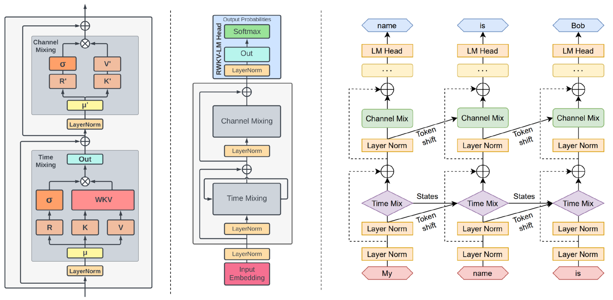

# 多模态大型语言模型的高效性研究：一份综述

发布时间：2024年05月17日

`LLM应用

这篇论文摘要讨论了多模态大型语言模型（MLLMs）的效率问题，特别是在视觉问答、理解和推理等任务中的应用。它关注的是如何使这些模型更加高效和轻量，以便在学术和工业界更广泛地应用，尤其是在边缘计算领域。论文综述了当前高效MLLMs的现状，包括模型的发展、高效结构与策略的研究进展及应用实例，并指出了现有研究的局限性和未来的发展方向。这表明论文主要关注的是LLM在实际应用中的优化和改进，因此属于LLM应用分类。` `边缘计算` `人工智能`

> Efficient Multimodal Large Language Models: A Survey

# 摘要

> 过去一年，多模态大型语言模型（MLLMs）在视觉问答、理解和推理等任务上大放异彩。但庞大的模型和昂贵的训练推理成本，使其在学术与工业界的普及受阻。因此，探索高效轻量的MLLMs，尤其是在边缘计算领域，潜力巨大。本综述全面梳理了高效MLLMs的现状，包括代表性模型的发展历程、高效结构与策略的研究进展及应用实例。最后，我们探讨了现有研究的局限，并展望了未来的发展方向。更多细节，请访问我们的GitHub仓库：https://github.com/lijiannuist/Efficient-Multimodal-LLMs-Survey。

> In the past year, Multimodal Large Language Models (MLLMs) have demonstrated remarkable performance in tasks such as visual question answering, visual understanding and reasoning. However, the extensive model size and high training and inference costs have hindered the widespread application of MLLMs in academia and industry. Thus, studying efficient and lightweight MLLMs has enormous potential, especially in edge computing scenarios. In this survey, we provide a comprehensive and systematic review of the current state of efficient MLLMs. Specifically, we summarize the timeline of representative efficient MLLMs, research state of efficient structures and strategies, and the applications. Finally, we discuss the limitations of current efficient MLLM research and promising future directions. Please refer to our GitHub repository for more details: https://github.com/lijiannuist/Efficient-Multimodal-LLMs-Survey.

[Arxiv](https://arxiv.org/abs/2405.10739)