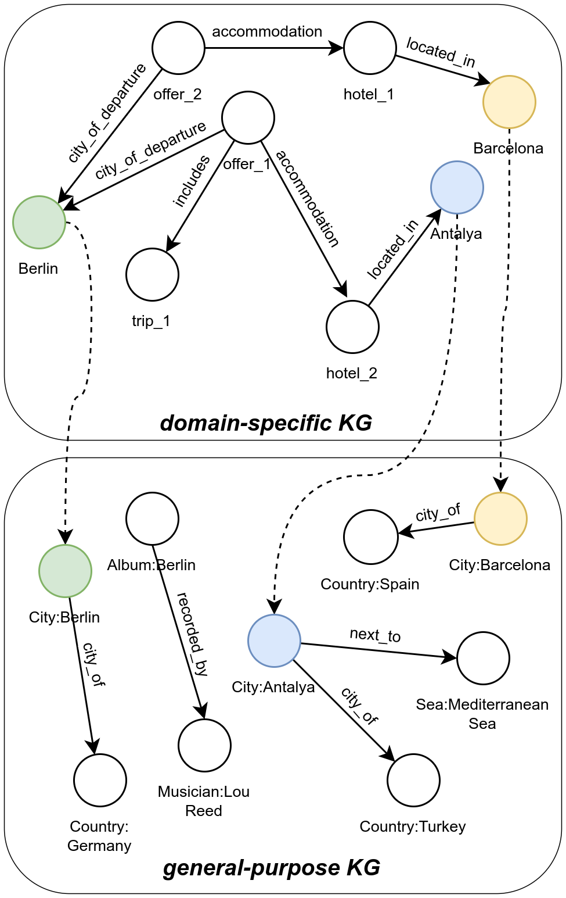
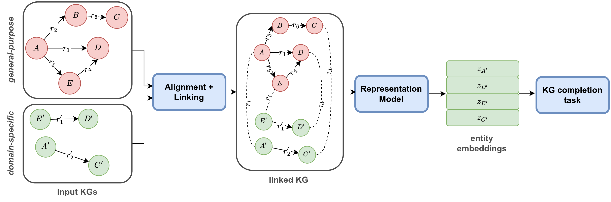
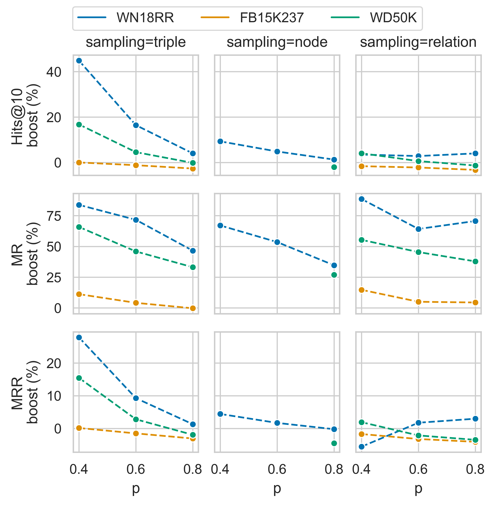
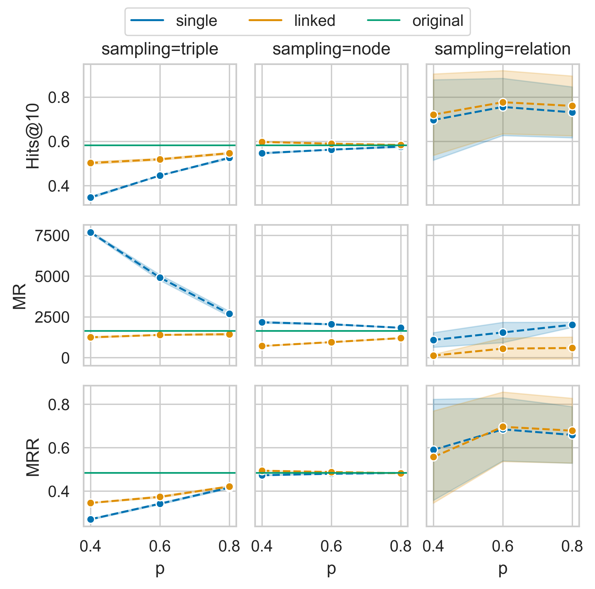
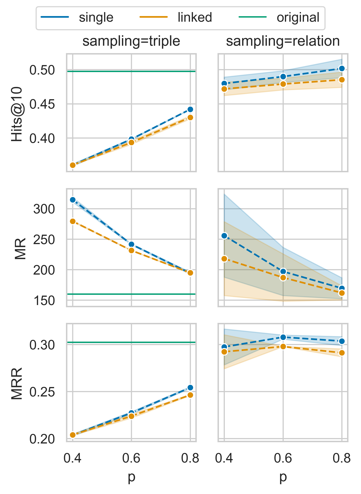
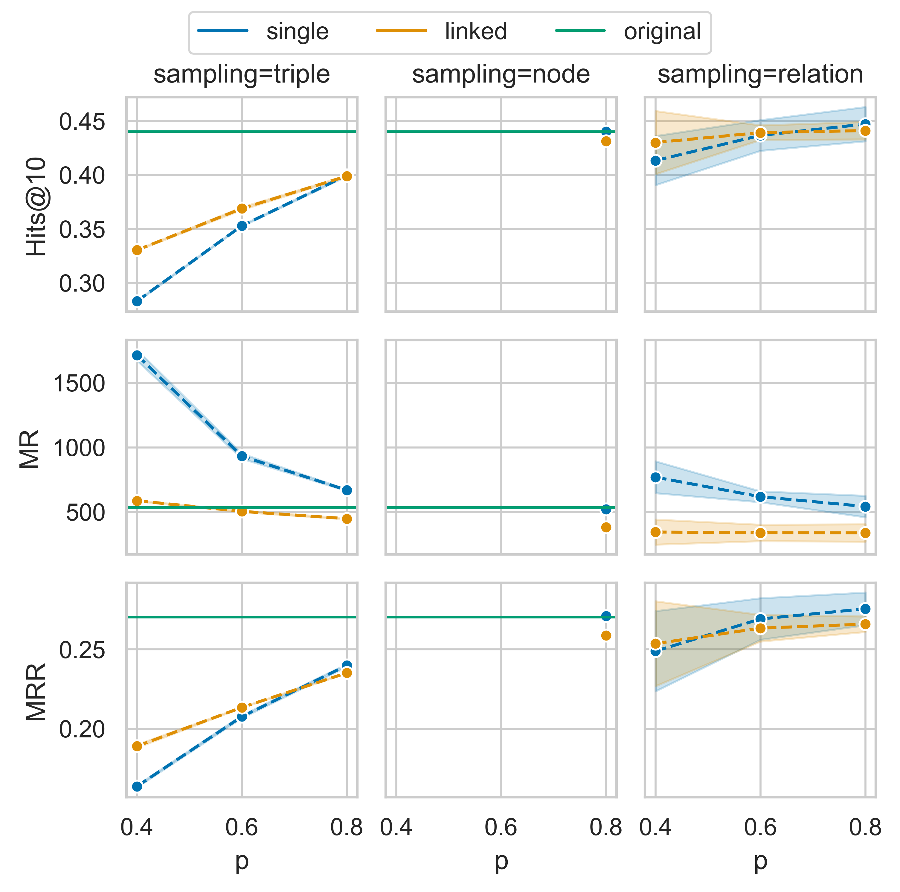
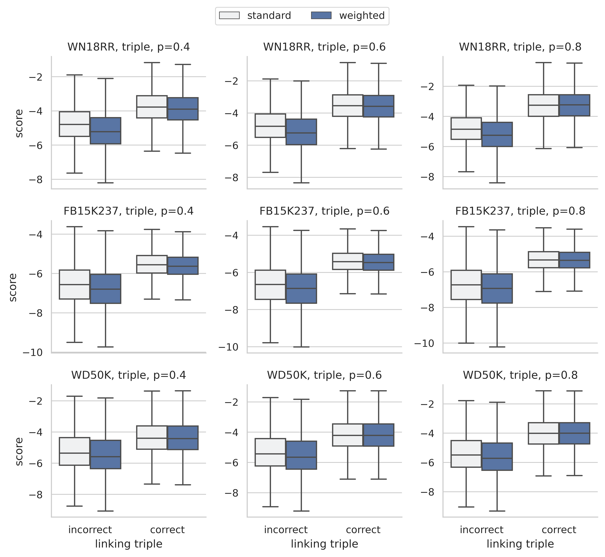

# 小型知识图谱的强化策略：借助通用知识图谱，提升嵌入丰富度

发布时间：2024年05月17日

`RAG

理由：这篇论文主要探讨了如何通过知识图谱增强大型语言模型（LLMs）以提高知识密集型任务的性能。它提出了一种框架，通过连接小型特定领域知识图谱与大型通用目的知识图谱来增强嵌入，从而提升下游任务的性能。这种方法与检索增强生成（RAG）的概念相似，即通过外部知识源增强模型的生成能力。因此，这篇论文更适合归类于RAG。` `知识密集型任务` `机器学习`

> Empowering Small-Scale Knowledge Graphs: A Strategy of Leveraging General-Purpose Knowledge Graphs for Enriched Embeddings

# 摘要

> 知识密集型任务对机器学习技术构成挑战，大型语言模型等常用方法在此类任务中常显局限。为此，研究者们正通过知识图谱增强LLMs，以缓解这一问题。尽管知识图谱在知识表示上优势明显，但其高昂的开发成本限制了其广泛应用。为此，我们提出了一种框架，通过通用目的知识图谱来增强小型特定领域知识图谱的嵌入。实验表明，当特定领域KG与大型通用目的KG相连时，下游任务性能可提升高达44%。这一研究方向有望推动知识图谱在知识密集型任务中的更广泛应用，从而实现更稳健、可靠的机器学习解决方案，减少幻觉现象。关键词：知识图谱，知识图谱补全，实体对齐，表示学习，机器学习

> Knowledge-intensive tasks pose a significant challenge for Machine Learning (ML) techniques. Commonly adopted methods, such as Large Language Models (LLMs), often exhibit limitations when applied to such tasks. Nevertheless, there have been notable endeavours to mitigate these challenges, with a significant emphasis on augmenting LLMs through Knowledge Graphs (KGs). While KGs provide many advantages for representing knowledge, their development costs can deter extensive research and applications. Addressing this limitation, we introduce a framework for enriching embeddings of small-scale domain-specific Knowledge Graphs with well-established general-purpose KGs. Adopting our method, a modest domain-specific KG can benefit from a performance boost in downstream tasks when linked to a substantial general-purpose KG. Experimental evaluations demonstrate a notable enhancement, with up to a 44% increase observed in the Hits@10 metric. This relatively unexplored research direction can catalyze more frequent incorporation of KGs in knowledge-intensive tasks, resulting in more robust, reliable ML implementations, which hallucinates less than prevalent LLM solutions.
  Keywords: knowledge graph, knowledge graph completion, entity alignment, representation learning, machine learning

[Arxiv](https://arxiv.org/abs/2405.10745)