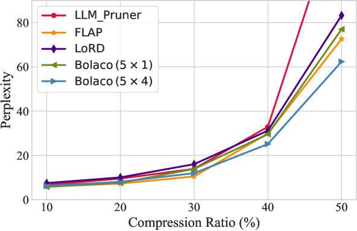

# 利用贝叶斯优化实现大型语言模型的特征驱动低秩压缩

发布时间：2024年05月17日

`LLM理论

理由：这篇论文主要探讨了大型语言模型（LLMs）的低秩压缩技术，这是一种理论上的优化方法，旨在减少模型参数的同时保持性能。论文中提出的创新方法涉及低秩因式分解、特征分布的估计以及低秩维度的优化分配，这些都是理论研究的内容，而非具体的应用实例或Agent的设计。因此，这篇论文更适合归类于LLM理论。` `模型优化`

> Feature-based Low-Rank Compression of Large Language Models via Bayesian Optimization

# 摘要

> 近年来，大型语言模型（LLMs）在自然语言处理领域取得了显著进展，但其规模的扩大也带来了计算负担的增加，迫使我们在效率与性能之间寻求平衡。低秩压缩技术，通过分解权重矩阵为两个低秩矩阵，有效减少了非必要参数，展现出巨大潜力。然而，其在LLMs中的应用尚未得到广泛研究。低秩压缩的核心在于低秩因式分解及维度的合理分配。为此，我们针对LLMs的低秩特性进行了深入研究，并提出了一种创新的低秩压缩方法。该方法利用合并协方差矩阵精准估计特征分布，并通过贝叶斯优化策略优化低秩维度的分配。实验结果显示，在LLaMA-2模型上，我们的方法在保持相同压缩比的情况下，显著优于现有的强结构化剪枝和低秩压缩技术，有效维持了模型性能。

> In recent years, large language models (LLMs) have driven advances in natural language processing. Still, their growing scale has increased the computational burden, necessitating a balance between efficiency and performance. Low-rank compression, a promising technique, reduces non-essential parameters by decomposing weight matrices into products of two low-rank matrices. Yet, its application in LLMs has not been extensively studied. The key to low-rank compression lies in low-rank factorization and low-rank dimensions allocation. To address the challenges of low-rank compression in LLMs, we conduct empirical research on the low-rank characteristics of large models. We propose a low-rank compression method suitable for LLMs. This approach involves precise estimation of feature distributions through pooled covariance matrices and a Bayesian optimization strategy for allocating low-rank dimensions. Experiments on the LLaMA-2 models demonstrate that our method outperforms existing strong structured pruning and low-rank compression techniques in maintaining model performance at the same compression ratio.

[Arxiv](https://arxiv.org/abs/2405.10616)