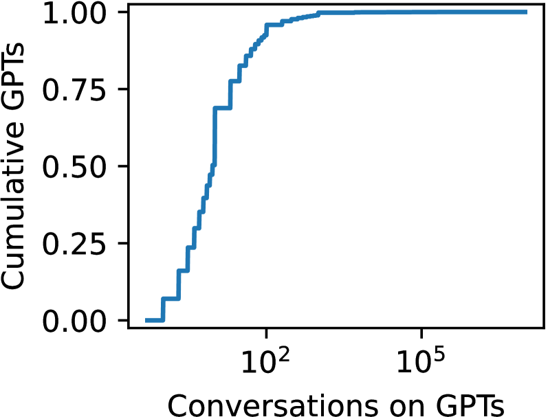
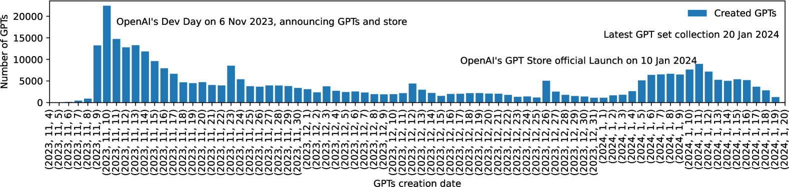
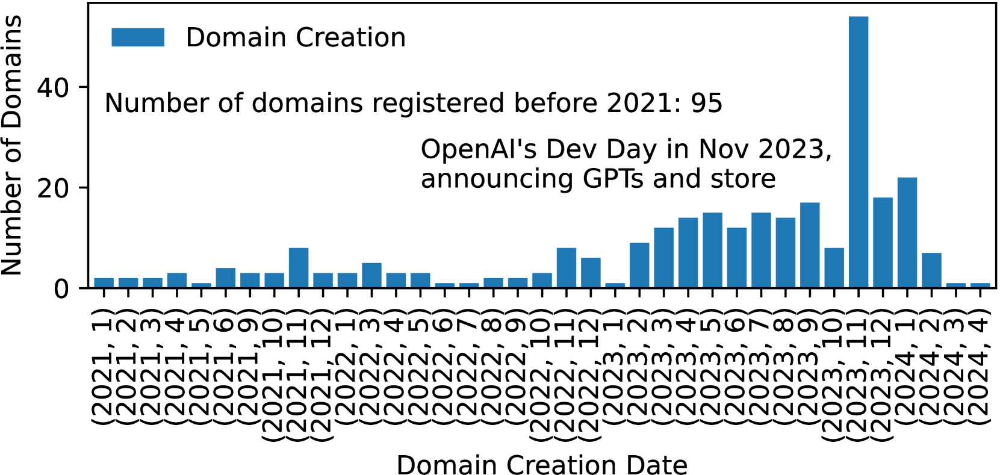
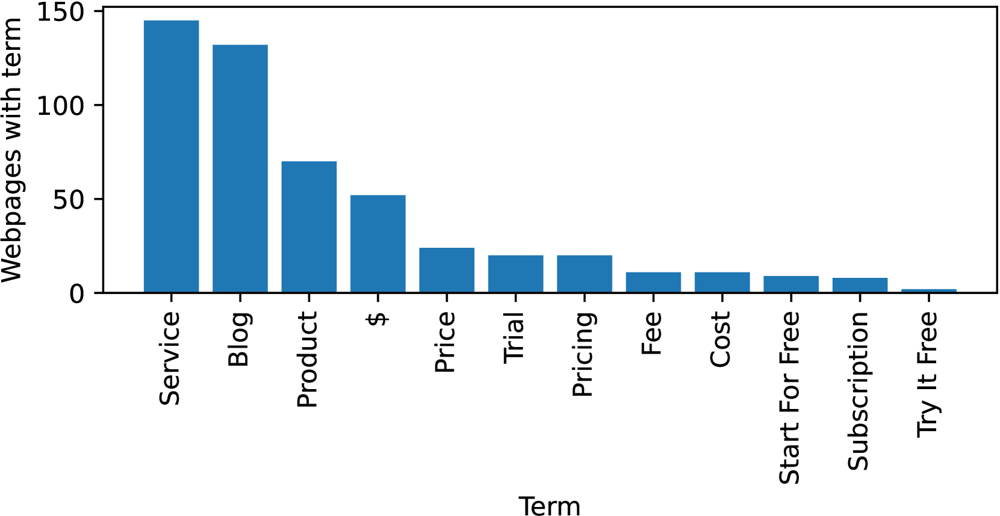
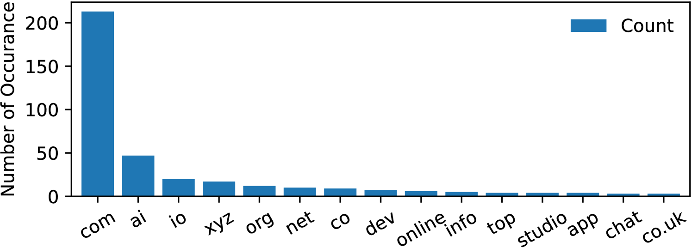
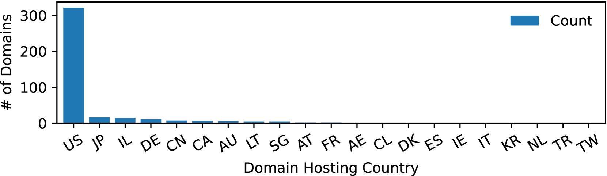
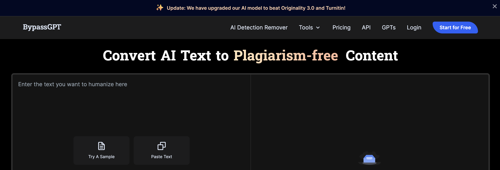

# GPT的探索之旅：定制ChatGPT模型领域的深度剖析

发布时间：2024年05月17日

`LLM应用

这篇论文摘要主要讨论了OpenAI的ChatGPT及其对大型语言模型（LLMs）领域的影响，特别是GPT商店的推出和其对用户创造和分享定制GPT模型的影响。这涉及到LLMs的具体应用和社区参与，因此最合适的分类是LLM应用。` `人工智能` `社区开发`

> GPTs Window Shopping: An analysis of the Landscape of Custom ChatGPT Models

# 摘要

> OpenAI的ChatGPT以其强大的能力，在大型语言模型（LLMs）领域掀起了一股技术革新浪潮。这一成就促使各大机构纷纷推出自己的进步和模型，以突破LLM性能的极限。OpenAI的成功部分得益于降低了参与门槛，让任何拥有互联网设备的人都能接触到LLMs。曾经只有少数拥有必要资源的研发人员才能涉足的领域，如今已向大众开放。为了满足个性化需求，OpenAI推出了GPT商店，一个供用户创造和分享定制GPT模型的平台。在这里，用户可以通过提示调优、资源分析、网络浏览和API交互等方式进行个性化定制，并有机会分享收益。本研究深入探讨了GPT商店的影响，从社区感知、GPT详情到作者信息进行了全面分析，并特别关注了第三方商店中用户提交的GPT，探究在缺乏OpenAI收益分享机制的情况下，创作者是否寻求通过其作品实现盈利。

> OpenAI's ChatGPT initiated a wave of technical iterations in the space of Large Language Models (LLMs) by demonstrating the capability and disruptive power of LLMs. OpenAI has prompted large organizations to respond with their own advancements and models to push the LLM performance envelope. OpenAI has prompted large organizations to respond with their own advancements and models to push the LLM performance envelope. OpenAI's success in spotlighting AI can be partially attributed to decreased barriers to entry, enabling any individual with an internet-enabled device to interact with LLMs. What was previously relegated to a few researchers and developers with necessary computing resources is now available to all. A desire to customize LLMs to better accommodate individual needs prompted OpenAI's creation of the GPT Store, a central platform where users can create and share custom GPT models. Customization comes in the form of prompt-tuning, analysis of reference resources, browsing, and external API interactions, alongside a promise of revenue sharing for created custom GPTs. In this work, we peer into the window of the GPT Store and measure its impact. Our analysis constitutes a large-scale overview of the store exploring community perception, GPT details, and the GPT authors, in addition to a deep-dive into a 3rd party storefront indexing user-submitted GPTs, exploring if creators seek to monetize their creations in the absence of OpenAI's revenue sharing.

[Arxiv](https://arxiv.org/abs/2405.10547)