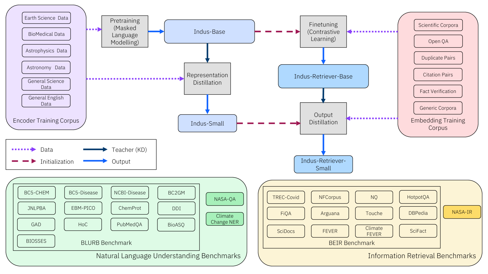

# INDUS：科学应用中的高效与有效语言模型

发布时间：2024年05月17日

`LLM应用

这篇论文介绍了INDUS，一套专为特定科学领域定制的大型语言模型（LLMs），并强调了其在专业任务上的优越性能。论文中提到的INDUS包括针对自然语言理解任务的领域特定编码器模型、用于信息检索任务的基于对比学习的通用文本嵌入模型，以及针对资源受限应用的小型模型版本。此外，论文还推出了三个新的科学基准数据集，以推动跨学科研究。这些内容表明，该论文主要关注于LLM在特定领域的应用，因此应归类为LLM应用。` `科学研究`

> INDUS: Effective and Efficient Language Models for Scientific Applications

# 摘要

> 在通用领域语料库上训练的大型语言模型（LLMs）在自然语言处理（NLP）任务上表现出色。但研究表明，专注于特定领域的语料库训练的LLMs在专业任务上更为出色。基于此，我们开发了INDUS，一套专为地球科学、生物学、物理学等科学领域定制的LLMs，利用精选的科学语料库进行训练。INDUS包括：一个针对自然语言理解任务的领域特定编码器模型；一个用于信息检索任务的基于对比学习的通用文本嵌入模型；以及针对资源受限应用的小型模型版本。此外，我们还推出了三个新的科学基准数据集，以推动跨学科研究。实验证明，INDUS在这些新任务及现有基准任务上，均超越了通用编码器RoBERTa和领域特定编码器SciBERT。

> Large language models (LLMs) trained on general domain corpora showed remarkable results on natural language processing (NLP) tasks. However, previous research demonstrated LLMs trained using domain-focused corpora perform better on specialized tasks. Inspired by this pivotal insight, we developed INDUS, a comprehensive suite of LLMs tailored for the Earth science, biology, physics, heliophysics, planetary sciences and astrophysics domains and trained using curated scientific corpora drawn from diverse data sources. The suite of models include: (1) an encoder model trained using domain-specific vocabulary and corpora to address natural language understanding tasks, (2) a contrastive-learning-based general text embedding model trained using a diverse set of datasets drawn from multiple sources to address information retrieval tasks and (3) smaller versions of these models created using knowledge distillation techniques to address applications which have latency or resource constraints. We also created three new scientific benchmark datasets namely, CLIMATE-CHANGE-NER (entity-recognition), NASA-QA (extractive QA) and NASA-IR (IR) to accelerate research in these multi-disciplinary fields. Finally, we show that our models outperform both general-purpose encoders (RoBERTa) and existing domain-specific encoders (SciBERT) on these new tasks as well as existing benchmark tasks in the domains of interest.

[Arxiv](https://arxiv.org/abs/2405.10725)