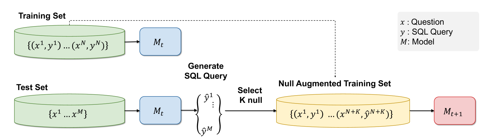
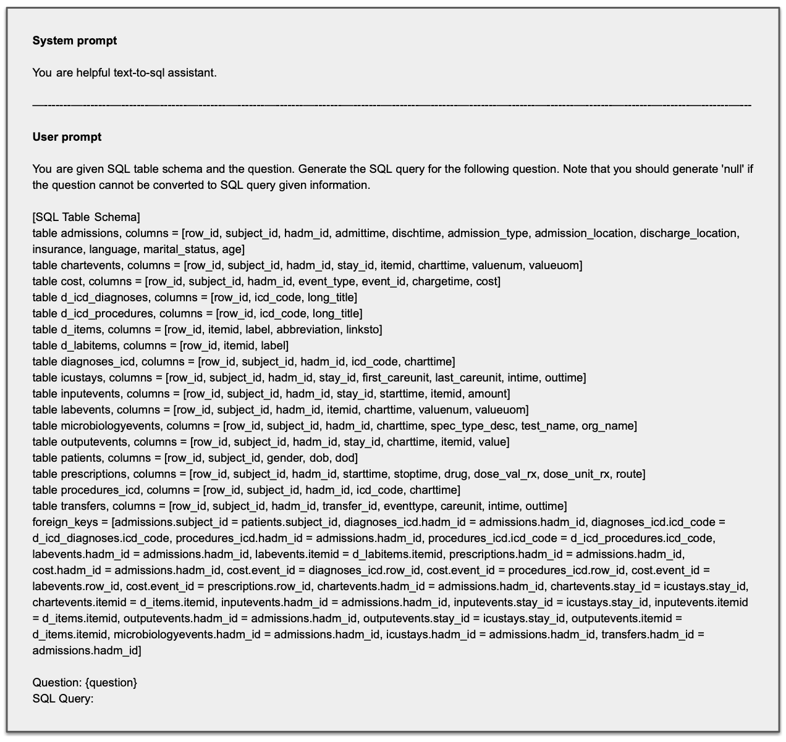

# LG AI Research 携手 KAIST 在 EHRSQL 2024 展示创新：通过伪标记的不可回答问题，自我训练大型语言模型，旨在打造一个精准高效的电子健康记录文本至 SQL 转换系统。

发布时间：2024年05月17日

`LLM应用

这篇论文主要讨论了如何利用大型语言模型（LLM）来提高Text-to-SQL模型在医疗领域的可靠性，特别是在处理电子健康记录（EHRs）时的应用。论文提出了一种自训练策略，通过伪标记的无法回答问题来增强模型的可靠性，并在EHRSQL 2024共享任务中验证了其有效性。这表明了LLM在特定应用场景（如医疗决策支持）中的实际应用和改进，因此属于LLM应用分类。` `电子健康记录`

> LG AI Research & KAIST at EHRSQL 2024: Self-Training Large Language Models with Pseudo-Labeled Unanswerable Questions for a Reliable Text-to-SQL System on EHRs

# 摘要

> Text-to-SQL模型是让医疗专业人员无需SQL知识就能访问电子健康记录（EHRs）的关键。随着大型语言模型的进步，这些系统已能更熟练地将复杂问题转化为SQL查询。但在医疗领域，确保可靠性至关重要，这要求模型能精准识别无法回答的问题或不确定的预测，以防误导信息。为此，我们提出了一种自训练策略，利用伪标记的无法回答问题来增强EHRs的text-to-SQL模型的可靠性。该策略包含两阶段训练及基于令牌熵和查询执行的过滤方法。我们在EHRSQL 2024共享任务中的卓越表现验证了这一方法的有效性，展现了通过更可靠的text-to-SQL系统提升医疗决策质量的潜力。

> Text-to-SQL models are pivotal for making Electronic Health Records (EHRs) accessible to healthcare professionals without SQL knowledge. With the advancements in large language models, these systems have become more adept at translating complex questions into SQL queries. Nonetheless, the critical need for reliability in healthcare necessitates these models to accurately identify unanswerable questions or uncertain predictions, preventing misinformation. To address this problem, we present a self-training strategy using pseudo-labeled unanswerable questions to enhance the reliability of text-to-SQL models for EHRs. This approach includes a two-stage training process followed by a filtering method based on the token entropy and query execution. Our methodology's effectiveness is validated by our top performance in the EHRSQL 2024 shared task, showcasing the potential to improve healthcare decision-making through more reliable text-to-SQL systems.

[Arxiv](https://arxiv.org/abs/2405.11162)