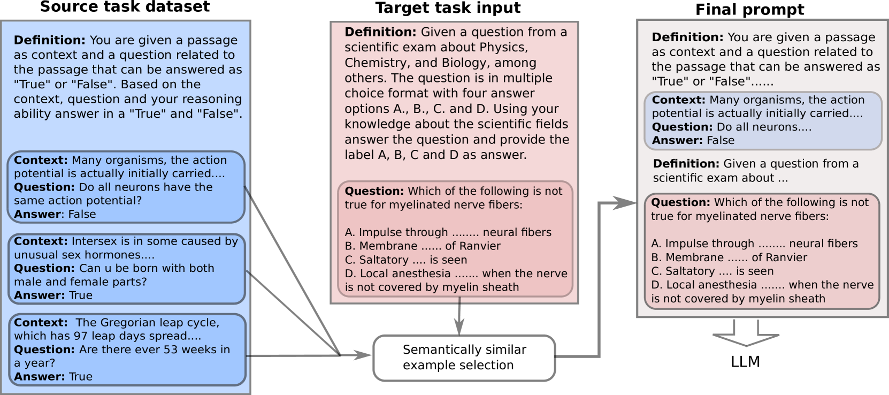

# 语言模型通过跨任务的上下文学习，能够有效应对数据稀缺的新任务挑战。

发布时间：2024年05月17日

`LLM应用

这篇论文探讨了大型语言模型（LLMs）如何通过预定义任务的标记示例泛化至新任务，并研究了跨任务信息共享的可能性。通过实验，论文展示了LLMs在缺乏目标任务示例的上下文中仍能显著提升性能，这对于开发更有效的自动化助手具有重要意义。因此，这篇论文属于LLM应用类别，因为它关注的是LLMs在实际应用中的性能提升和泛化能力。` `自动化助手`

> Language Models can Exploit Cross-Task In-context Learning for Data-Scarce Novel Tasks

# 摘要

> 大型语言模型（LLMs）凭借其卓越的上下文学习（ICL）能力，已彻底改变自然语言处理（NLP）。基于LLMs的自动化助手日益流行，但适应新任务仍具挑战。虽然巨型模型在零-shot性能上表现卓越，但其高计算需求限制了普及，小型模型则缺乏上下文支持。本文探讨LLMs能否从预定义任务的标记示例泛化至新任务。受生物神经元启发，结合Transformer架构的机械解释，我们探索跨任务信息共享的可能性。通过设计跨任务提示实验，我们发现，即使上下文中无目标任务示例，LLMs仍能显著提升性能。跨任务提示使LLaMA-2 7B性能提升107%，LLaMA-2 13B提升18.6%，GPT 3.5平均提升3.2%，超越零-shot提示，与标准上下文学习媲美。本文还展示了为任务内示例生成伪标签的有效性，并揭示了跨任务示例影响与模型在源和目标输入令牌激活相似性之间的紧密关联。这是首次深入探讨LLMs如何利用不同任务示例的上下文信号解决新任务。

> Large Language Models (LLMs) have transformed NLP with their remarkable In-context Learning (ICL) capabilities. Automated assistants based on LLMs are gaining popularity; however, adapting them to novel tasks is still challenging. While colossal models excel in zero-shot performance, their computational demands limit widespread use, and smaller language models struggle without context. This paper investigates whether LLMs can generalize from labeled examples of predefined tasks to novel tasks. Drawing inspiration from biological neurons and the mechanistic interpretation of the Transformer architecture, we explore the potential for information sharing across tasks. We design a cross-task prompting setup with three LLMs and show that LLMs achieve significant performance improvements despite no examples from the target task in the context. Cross-task prompting leads to a remarkable performance boost of 107% for LLaMA-2 7B, 18.6% for LLaMA-2 13B, and 3.2% for GPT 3.5 on average over zero-shot prompting, and performs comparable to standard in-context learning. The effectiveness of generating pseudo-labels for in-task examples is demonstrated, and our analyses reveal a strong correlation between the effect of cross-task examples and model activation similarities in source and target input tokens. This paper offers a first-of-its-kind exploration of LLMs' ability to solve novel tasks based on contextual signals from different task examples.

[Arxiv](https://arxiv.org/abs/2405.10548)