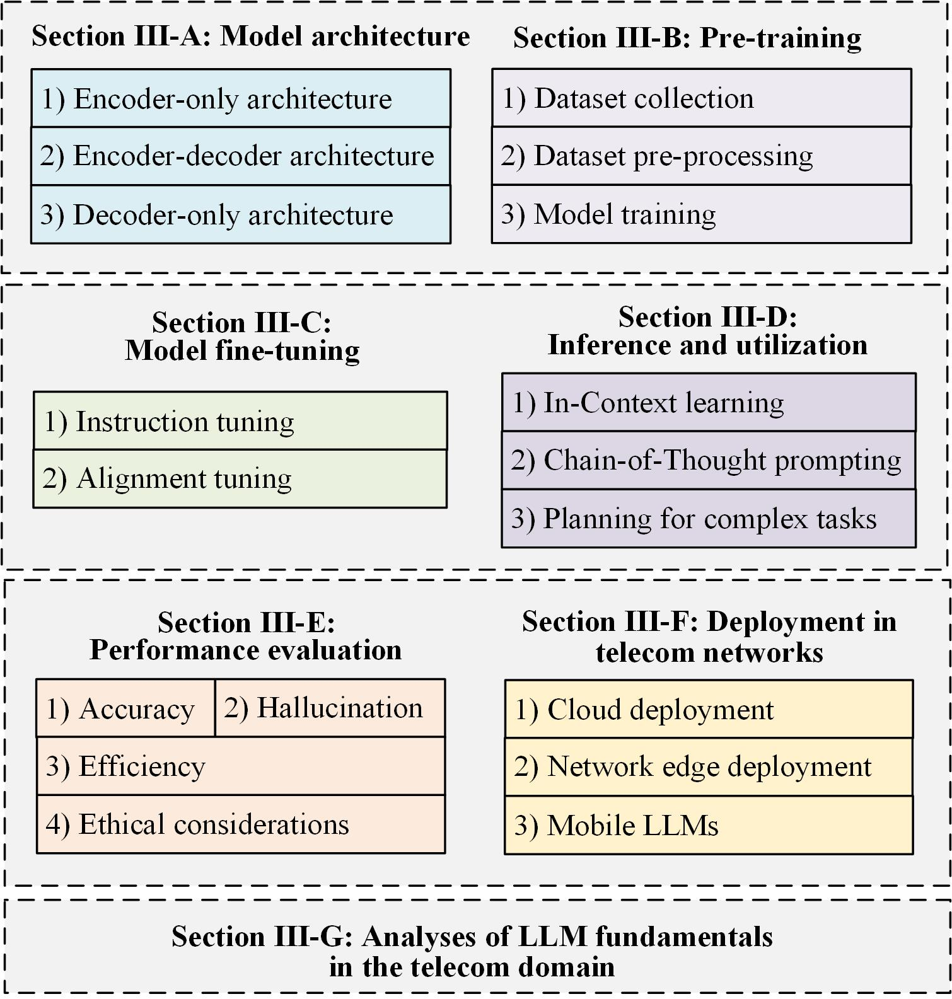

# 电信领域的大型语言模型（LLM）：原理、关键技术与机遇的全面探讨

发布时间：2024年05月17日

`LLM应用

这篇论文摘要详细介绍了大型语言模型（LLMs）在电信网络中的应用，包括模型架构、预训练、微调、推理、模型评估以及在电信领域的具体应用，如生成、分类、优化和预测等。这些内容主要集中在LLM的实际应用层面，而非理论探讨或Agent的设计与实现，因此最合适的分类是LLM应用。` `人工智能`

> Large Language Model (LLM) for Telecommunications: A Comprehensive Survey on Principles, Key Techniques, and Opportunities

# 摘要

> 大型语言模型（LLMs）因其卓越的理解和推理能力，在多个领域取得了显著进展，并因其自动化电信领域任务的潜力而备受瞩目。经过预训练和微调，LLMs能够根据人类指令执行多样化的下游任务，为实现支持人工通用智能（AGI）的6G奠定基础。本文旨在全面概述LLM在电信网络中的应用。首先，我们介绍了LLM的核心要素，包括模型架构、预训练、微调、推理、模型评估及电信部署。接着，我们探讨了LLM在电信领域的关键技术和应用，涵盖生成、分类、优化和预测等方面。例如，LLM能够生成电信领域知识、代码和网络配置；在分类应用中，LLM可用于网络安全、文本、图像和流量分类。此外，我们还介绍了LLM在优化技术中的应用，如强化学习中的自动奖励函数设计。对于预测问题，我们讨论了时间序列预测模型和多模态预测问题。最后，我们指出了LLM在电信网络中面临的挑战，并展望了未来的发展方向。

> Large language models (LLMs) have received considerable attention recently due to their outstanding comprehension and reasoning capabilities, leading to great progress in many fields. The advancement of LLM techniques also offers promising opportunities to automate many tasks in the telecommunication (telecom) field. After pre-training and fine-tuning, LLMs can perform diverse downstream tasks based on human instructions, paving the way to artificial general intelligence (AGI)-enabled 6G. Given the great potential of LLM technologies, this work aims to provide a comprehensive overview of LLM-enabled telecom networks. In particular, we first present LLM fundamentals, including model architecture, pre-training, fine-tuning, inference and utilization, model evaluation, and telecom deployment. Then, we introduce LLM-enabled key techniques and telecom applications in terms of generation, classification, optimization, and prediction problems. Specifically, the LLM-enabled generation applications include telecom domain knowledge, code, and network configuration generation. After that, the LLM-based classification applications involve network security, text, image, and traffic classification problems. Moreover, multiple LLM-enabled optimization techniques are introduced, such as automated reward function design for reinforcement learning and verbal reinforcement learning. Furthermore, for LLM-aided prediction problems, we discussed time-series prediction models and multi-modality prediction problems for telecom. Finally, we highlight the challenges and identify the future directions of LLM-enabled telecom networks.

[Arxiv](https://arxiv.org/abs/2405.10825)