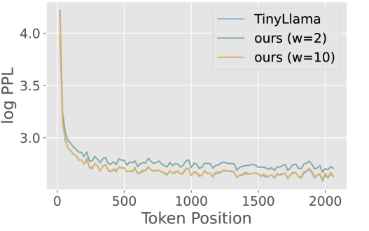

# 层压缩 KV 缓存：大型语言模型的高效推理之道

发布时间：2024年05月17日

`LLM理论

理由：这篇论文主要探讨了大型语言模型（LLM）中的Transformer架构在实际应用中的内存消耗问题，并提出了一种创新的解决方案来优化内存使用和提升推理速度。这涉及到LLM的核心理论和技术改进，因此属于LLM理论分类。论文中的方法和实验结果展示了理论在实际中的应用和优化，但核心贡献在于理论层面的创新和改进，而非直接的应用案例或Agent的设计。` `高性能计算`

> Layer-Condensed KV Cache for Efficient Inference of Large Language Models

# 摘要

> 在实际应用中部署高吞吐量的大型语言模型，其巨大的内存消耗一直是个难题。Transformer架构中注意力机制的关键-值缓存，尤其是层数增多时，更是加剧了这一问题。为此，我们提出了一种创新方法，仅对少数几层进行KV计算和缓存，大幅降低了内存需求，并提升了推理速度。实验证明，我们的方法不仅在吞吐量上比标准Transformer高出26倍，而且在语言建模及下游任务中表现出色。此外，该方法与现有内存优化技术兼容，可无缝集成，进一步提升推理效率。相关代码已公开在https://github.com/whyNLP/LCKV。

> Huge memory consumption has been a major bottleneck for deploying high-throughput large language models in real-world applications. In addition to the large number of parameters, the key-value (KV) cache for the attention mechanism in the transformer architecture consumes a significant amount of memory, especially when the number of layers is large for deep language models. In this paper, we propose a novel method that only computes and caches the KVs of a small number of layers, thus significantly saving memory consumption and improving inference throughput. Our experiments on large language models show that our method achieves up to 26$\times$ higher throughput than standard transformers and competitive performance in language modeling and downstream tasks. In addition, our method is orthogonal to existing transformer memory-saving techniques, so it is straightforward to integrate them with our model, achieving further improvement in inference efficiency. Our code is available at https://github.com/whyNLP/LCKV.

[Arxiv](https://arxiv.org/abs/2405.10637)