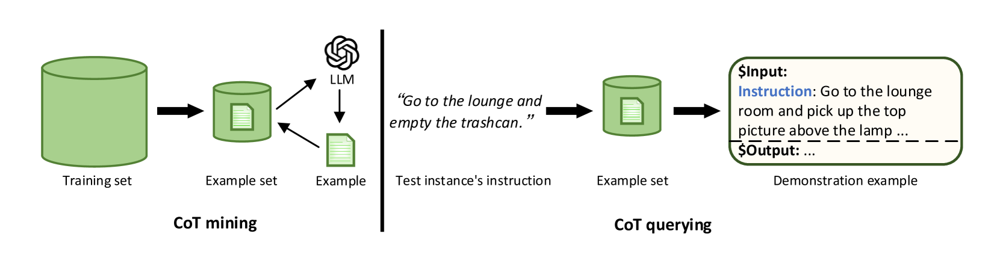
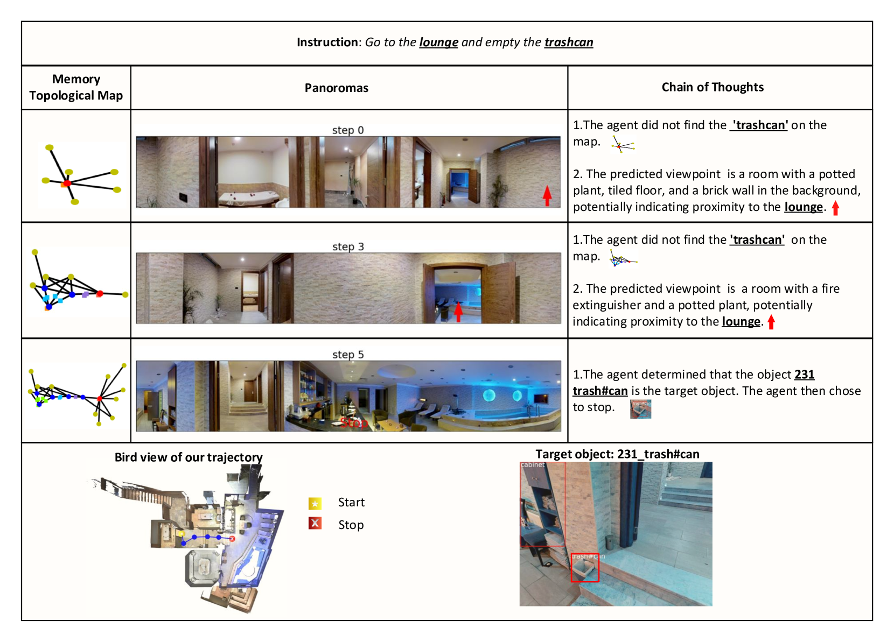

# MC-GPT：借助记忆地图与推理链，提升视觉与语言导航的智能水平

发布时间：2024年05月17日

`Agent

理由：这篇论文主要关注的是在视觉与语言导航（VLN）任务中，如何利用大型语言模型（LLMs）来提高代理的导航能力。论文中提出了一系列创新技术，包括拓扑图维护方法、“导航思维链”模块以及集成导航记忆、策略与感知预测的流程，这些都是为了增强代理在遵循自然语言指令进行导航时的性能和透明度。因此，这篇论文更符合Agent分类，因为它主要探讨了如何通过技术改进来增强代理（Agent）在特定任务中的表现。` `机器人导航`

> MC-GPT: Empowering Vision-and-Language Navigation with Memory Map and Reasoning Chains

# 摘要

> 在视觉与语言导航（VLN）任务中，代理需遵循自然语言指令导航至目的地。尽管基于学习的方法是主流解决方案，但它们训练成本高且缺乏透明度。大型语言模型（LLMs）凭借其卓越的泛化能力，成为VLN的新希望。然而，现有LLM方法在记忆构建和策略多样性上存在局限。为此，我们提出了一系列创新技术：首先，我们开发了一种拓扑图维护方法，记录导航历史，包括视点、物体及其空间关系，并作为全局动作空间；其次，我们设计了“导航思维链”模块，通过人类导航示例丰富策略多样性；最后，我们构建了一个集成导航记忆、策略与感知预测的流程。实验证明，我们的方法不仅提升了LLM的导航能力，还增强了导航推理的透明度。

> In the Vision-and-Language Navigation (VLN) task, the agent is required to navigate to a destination following a natural language instruction. While learning-based approaches have been a major solution to the task, they suffer from high training costs and lack of interpretability. Recently, Large Language Models (LLMs) have emerged as a promising tool for VLN due to their strong generalization capabilities. However, existing LLM-based methods face limitations in memory construction and diversity of navigation strategies. To address these challenges, we propose a suite of techniques. Firstly, we introduce a method to maintain a topological map that stores navigation history, retaining information about viewpoints, objects, and their spatial relationships. This map also serves as a global action space. Additionally, we present a Navigation Chain of Thoughts module, leveraging human navigation examples to enrich navigation strategy diversity. Finally, we establish a pipeline that integrates navigational memory and strategies with perception and action prediction modules. Experimental results on the REVERIE and R2R datasets show that our method effectively enhances the navigation ability of the LLM and improves the interpretability of navigation reasoning.

[Arxiv](https://arxiv.org/abs/2405.10620)