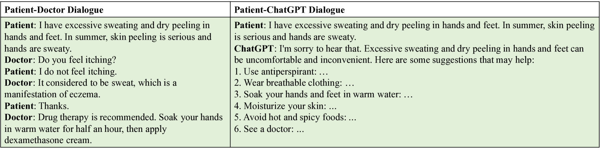

# 医疗对话综览：探索其类别、方法、评估及面临的挑战

发布时间：2024年05月17日

`LLM应用

这篇论文摘要主要关注医疗对话系统的研究，并特别强调了大型语言模型（LLM）在医疗对话系统中的应用及其面临的挑战。虽然论文中提到了对医疗对话系统的分类、方法及评估的分析，但其核心焦点在于LLM在医疗领域的应用，以及这些应用所面临的特定技术挑战。因此，将这篇论文归类为LLM应用是合适的。`

> Medical Dialogue: A Survey of Categories, Methods, Evaluation and Challenges

# 摘要

> 本文对医疗对话系统的研究进行了全面梳理，这一领域虽重要却充满挑战。虽然医学界已从应用角度审视过这些系统，但严格技术层面的系统性回顾却鲜见。这导致了对医疗对话系统的分类、方法及评估的了解不足，限制了该领域的进步。为此，我们从知名计算机科学和自然语言处理出版物中精选了325篇论文进行深入分析。大型语言模型近期在下游任务中展现出卓越能力，为医疗对话系统带来了革新。尽管其实用价值显著，但这些系统仍面临诸多挑战。本文特此列举了这些挑战，尤其是与大型语言模型相关的难题。

> This paper surveys and organizes research works on medical dialog systems, which is an important yet challenging task. Although these systems have been surveyed in the medical community from an application perspective, a systematic review from a rigorous technical perspective has to date remained noticeably absent. As a result, an overview of the categories, methods, and evaluation of medical dialogue systems remain limited and underspecified, hindering the further improvement of this area. To fill this gap, we investigate an initial pool of 325 papers from well-known computer science, and natural language processing conferences and journals, and make an overview. Recently, large language models have shown strong model capacity on downstream tasks, which also reshaped medical dialog systems' foundation. Despite the alluring practical application value, current medical dialogue systems still suffer from problems. To this end, this paper lists the grand challenges of medical dialog systems, especially of large language models.

[Arxiv](https://arxiv.org/abs/2405.10630)