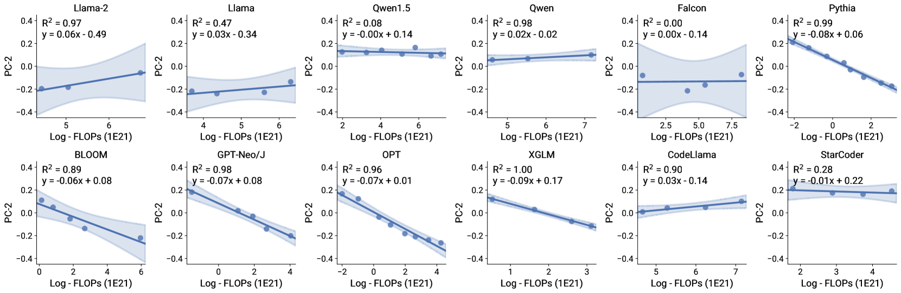
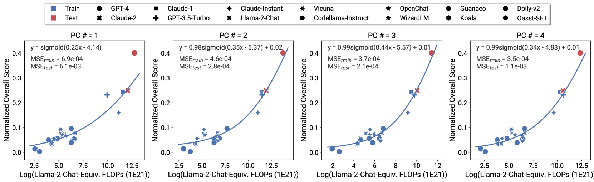

# 语言模型性能的可预测性：观察性缩放定律的探索

发布时间：2024年05月17日

`LLM理论

这篇论文主要探讨了语言模型性能随规模变化的，并提出了一种观察方法来构建规模定律。它研究了不同模型家族在训练计算效率和能力上的差异，并揭示了复杂规模现象的可预测性。这些内容更偏向于理论研究，因此将其归类为LLM理论。` `机器学习`

> Observational Scaling Laws and the Predictability of Language Model Performance

# 摘要

> 理解语言模型性能如何随规模变化的至关重要，这对于基准测试和算法开发都具有重要意义。我们提出了一种观察方法，该方法利用约80个公开模型的数据，无需模型训练即可构建规模定律。尽管不同模型家族在训练计算效率和能力上存在差异，我们发现这些差异与一个简单的广义规模定律一致，该定律表明语言模型性能是低维能力空间的函数，而模型家族仅在转换训练计算为能力方面的效率上有所不同。通过这种方法，我们揭示了复杂规模现象的可预测性：我们发现多个涌现现象遵循平滑的S形行为，并可从小型模型中预测；我们精确预测了GPT-4等模型的代理性能；我们还展示了如何预测随着语言模型能力的提高，如思维链和自我一致性等训练后干预措施的影响。

> Understanding how language model performance varies with scale is critical to benchmark and algorithm development. Scaling laws are one approach to building this understanding, but the requirement of training models across many different scales has limited their use. We propose an alternative, observational approach that bypasses model training and instead builds scaling laws from ~80 publically available models. Building a single scaling law from multiple model families is challenging due to large variations in their training compute efficiencies and capabilities. However, we show that these variations are consistent with a simple, generalized scaling law where language model performance is a function of a low-dimensional capability space, and model families only vary in their efficiency in converting training compute to capabilities. Using this approach, we show the surprising predictability of complex scaling phenomena: we show that several emergent phenomena follow a smooth, sigmoidal behavior and are predictable from small models; we show that the agent performance of models such as GPT-4 can be precisely predicted from simpler non-agentic benchmarks; and we show how to predict the impact of post-training interventions like Chain-of-Thought and Self-Consistency as language model capabilities continue to improve.

[Arxiv](https://arxiv.org/abs/2405.10938)