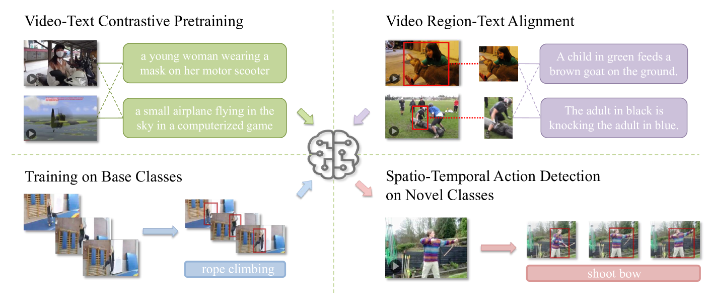

# 开放词汇下的时空动作识别

发布时间：2024年05月17日

`Agent

这篇论文主要关注的是时空动作检测（STAD）任务中的开放词汇时空动作检测（OV-STAD）问题，特别是在处理未预见的新动作类别时的挑战。论文提出了一种方法，该方法利用预训练的视频-语言模型（VLM）并通过微调来增强模型对动作的理解，以及通过融合局部和全局特征来提升检测性能。这种方法可以被视为一种智能体（Agent），因为它在视频理解任务中执行特定的功能，即检测和识别视频中的动作，即使在面对新的、未知的动作类别时也能进行泛化。因此，这篇论文更符合Agent分类，因为它描述了一种在特定任务中执行智能行为的系统或模型。` `视频理解` `动作检测`

> Open-Vocabulary Spatio-Temporal Action Detection

# 摘要

> 时空动作检测（STAD）是视频理解的精细任务，现有技术需预先为所有动作类别提供标注。但在实际应用中，常会遇到训练时未涵盖的新动作类别，因动作类别繁多且难以预见。传统方法对新类别的数据标注和模型训练成本高昂，需重新标注并从头训练。本文提出开放词汇时空动作检测（OV-STAD），旨在模拟开放世界中的动作检测挑战。该方法在有限基类上训练模型，期望其能泛化至新类别。我们基于现有数据集建立了两个基准，并利用预训练的视频-语言模型（VLM）开发了一种简单有效的方法。通过在局部视频区域-文本对上精心微调VLM，增强了其对动作的理解，促进了视频与文本间的精准匹配。此外，融合局部与全局特征，引入全局上下文，进一步提升了检测性能。我们的方法在新类别上展现了良好的前景。

> Spatio-temporal action detection (STAD) is an important fine-grained video understanding task. Current methods require box and label supervision for all action classes in advance. However, in real-world applications, it is very likely to come across new action classes not seen in training because the action category space is large and hard to enumerate. Also, the cost of data annotation and model training for new classes is extremely high for traditional methods, as we need to perform detailed box annotations and re-train the whole network from scratch. In this paper, we propose a new challenging setting by performing open-vocabulary STAD to better mimic the situation of action detection in an open world. Open-vocabulary spatio-temporal action detection (OV-STAD) requires training a model on a limited set of base classes with box and label supervision, which is expected to yield good generalization performance on novel action classes. For OV-STAD, we build two benchmarks based on the existing STAD datasets and propose a simple but effective method based on pretrained video-language models (VLM). To better adapt the holistic VLM for the fine-grained action detection task, we carefully fine-tune it on the localized video region-text pairs. This customized fine-tuning endows the VLM with better motion understanding, thus contributing to a more accurate alignment between video regions and texts. Local region feature and global video feature fusion before alignment is adopted to further improve the action detection performance by providing global context. Our method achieves a promising performance on novel classes.

[Arxiv](https://arxiv.org/abs/2405.10832)