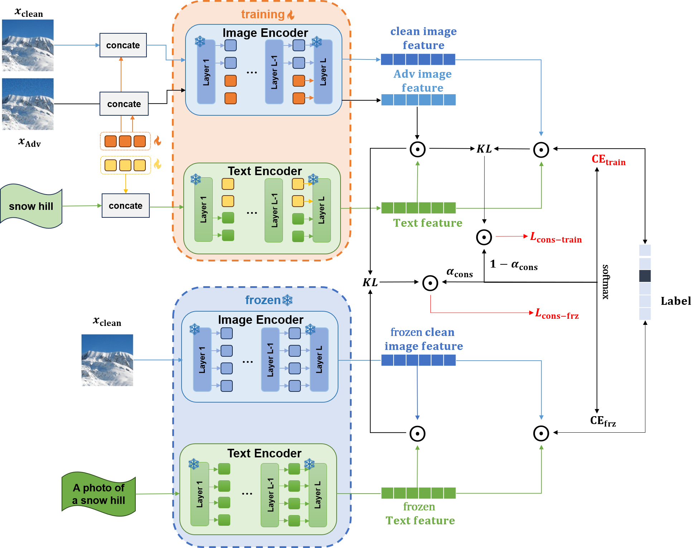

# 再探对抗性提示调整的鲁棒泛化之谜

发布时间：2024年05月17日

`LLM应用

这篇论文主要探讨了大规模预训练视觉-语言模型（如CLIP）在面对对抗性攻击时的脆弱性，并提出了一种新的防御机制——自适应的一致性引导对抗性提示调优（CAPT）框架。该框架旨在提高模型在对抗性样本上的鲁棒性，同时保持对下游任务的适应性。论文通过实验验证了CAPT框架在提升模型对抗鲁棒性和泛化能力方面的有效性。由于论文的核心内容是关于如何应用LLM（大型语言模型）来提高模型的安全性和鲁棒性，因此将其归类为LLM应用。` `计算机视觉`

> Revisiting the Robust Generalization of Adversarial Prompt Tuning

# 摘要

> 理解如CLIP这样的大规模预训练视觉-语言模型对抗对抗性攻击的脆弱性至关重要，这关系到它们在多种下游任务上的零-shot泛化能力。当前的防御机制多采用提示学习进行对抗性微调，旨在提升模型的对抗鲁棒性，同时保持对下游任务的适应性。然而，这种做法易导致过拟合，限制了模型在干净与对抗性样本上的泛化能力提升。为此，我们提出了一种自适应的一致性引导对抗性提示调优（CAPT）框架，通过多模态提示学习加强对抗性样本中图像与文本特征的对齐，并借助预训练的CLIP模型的强大泛化能力，指导模型在保持干净样本准确性的同时，增强对抗性样本的鲁棒泛化。此外，我们还设计了一种新颖的自适应一致性目标函数，以平衡微调模型与预训练模型在对抗性与干净输入间的一致性。通过在14个数据集和4种数据稀疏性方案（从1-shot到全训练数据设置）上进行广泛实验，我们证明了CAPT在分布内性能及面对输入分布变化和跨数据集泛化方面的卓越表现。

> Understanding the vulnerability of large-scale pre-trained vision-language models like CLIP against adversarial attacks is key to ensuring zero-shot generalization capacity on various downstream tasks. State-of-the-art defense mechanisms generally adopt prompt learning strategies for adversarial fine-tuning to improve the adversarial robustness of the pre-trained model while keeping the efficiency of adapting to downstream tasks. Such a setup leads to the problem of over-fitting which impedes further improvement of the model's generalization capacity on both clean and adversarial examples. In this work, we propose an adaptive Consistency-guided Adversarial Prompt Tuning (i.e., CAPT) framework that utilizes multi-modal prompt learning to enhance the alignment of image and text features for adversarial examples and leverage the strong generalization of pre-trained CLIP to guide the model-enhancing its robust generalization on adversarial examples while maintaining its accuracy on clean ones. We also design a novel adaptive consistency objective function to balance the consistency of adversarial inputs and clean inputs between the fine-tuning model and the pre-trained model. We conduct extensive experiments across 14 datasets and 4 data sparsity schemes (from 1-shot to full training data settings) to show the superiority of CAPT over other state-of-the-art adaption methods. CAPT demonstrated excellent performance in terms of the in-distribution performance and the generalization under input distribution shift and across datasets.

[Arxiv](https://arxiv.org/abs/2405.11154)