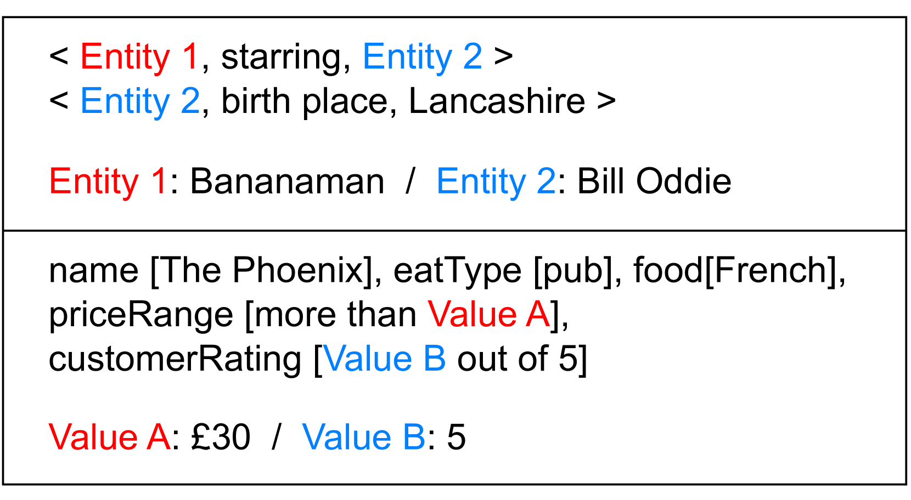

# SPOR：全面实用的数据到文本生成组合泛化评估方法

发布时间：2024年05月17日

`LLM理论

这篇论文主要探讨了大型语言模型（LLMs）在组合泛化方面的能力，并提出了一种新的评估方法SPOR，该方法涵盖了系统性、生产性、顺序不变性和规则可学习性四个维度。这种研究更偏向于理论层面，因为它关注的是语言模型的内在能力和评估方法，而不是具体的应用场景或Agent的行为。因此，将其归类为LLM理论是合适的。` `数据到文本生成` `语言模型评估`

> SPOR: A Comprehensive and Practical Evaluation Method for Compositional Generalization in Data-to-Text Generation

# 摘要

> 组合泛化是语言模型的关键能力，其表现形式多样。在数据到文本生成领域，以往研究仅关注单一的系统性表现，未充分考虑大型语言模型（LLMs），难以全面应对实际应用。为此，我们提出了SPOR，一种全面且实用的组合泛化评估方法，涵盖系统性、生产性、顺序不变性和规则可学习性四个维度，无需额外人工标注即可进行高质量评估。通过在两个数据集上的应用，我们评估了包括LLMs在内的多种语言模型，发现它们在多个方面仍有提升空间。本研究强调了对数据到文本生成中组合泛化不同表现形式进行全面研究的必要性，并提供了一个评估框架。

> Compositional generalization is an important ability of language models and has many different manifestations. For data-to-text generation, previous research on this ability is limited to a single manifestation called Systematicity and lacks consideration of large language models (LLMs), which cannot fully cover practical application scenarios. In this work, we propose SPOR, a comprehensive and practical evaluation method for compositional generalization in data-to-text generation. SPOR includes four aspects of manifestations (Systematicity, Productivity, Order invariance, and Rule learnability) and allows high-quality evaluation without additional manual annotations based on existing datasets. We demonstrate SPOR on two different datasets and evaluate some existing language models including LLMs. We find that the models are deficient in various aspects of the evaluation and need further improvement. Our work shows the necessity for comprehensive research on different manifestations of compositional generalization in data-to-text generation and provides a framework for evaluation.

[Arxiv](https://arxiv.org/abs/2405.10650)